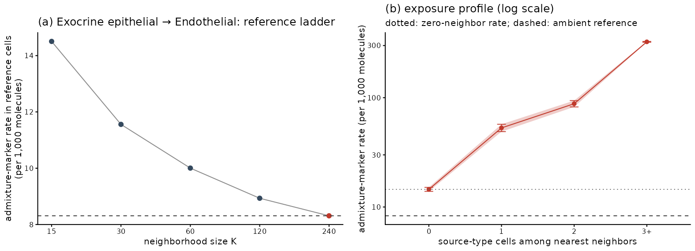

# Benchmarking admixture cleanup

Admixture correction removes individual molecules from cells, yet no ground
truth marks which molecules actually leaked between cells — so how well a
correction works is ordinarily a matter of judgment. This report builds an
evaluation benchmark from the spatial structure of admixture itself: a
target cell can only be contaminated by a cell type it physically borders,
so the content of source-specific genes in target cells must rise with the
number of source-type neighbors, while target cells with no such neighbors
provide an internal negative control. Comparing exposed cells against that
control gives, for every ordered cell-type pair (source → target), an
estimate of the pair's admixture rate and of its number of admixed
molecules. Applying the same measurement before and after correction
scores how much of the admixture a cleanup removed, in terms of estimated
sensitivity and specificity. We use the benchmark to compare cellAdmix's factorization
variants and scoring methods across three datasets, to expose the strong
seed-to-seed stochasticity of single-fit corrections, and to derive an
ensemble correction whose vote threshold acts as a calibrable
sensitivity/specificity dial. The harness lives in
`analysis/cleanup_benchmark/`.

## The neighbor benchmark

For an ordered pair of cell types — a *source* S and a *target* T — each
cell of type T has an *exposure*: the number of type-S cells among its 15
nearest cells (the adjacency principle of Mitchel et al., 2025, and of
the pipeline's native-factor check). The cells of T are stratified into
exposure bins (0, 1, 2, 3+); the zero-exposure bin is the internal
reference.

For each cell-type pair we select up to 20 *source markers*: genes whose
top expresser is S, ranked by their expression in S relative to
zero-exposure cells of T — rank-based, since an absolute baseline cutoff
would itself be skewed by contamination. Candidate genes are screened for
proximity-induced transcription: transferred material samples the source
transcriptome, so a gene's exposure-linked excess should be proportional
to its share of the source expression profile, and a gene whose excess far
exceeds that share reflects the target's own transcriptional response to
source proximity (on pancreas: CXCL6, CFB — inflammatory response genes).
Screened-out genes are replaced by the next-ranked candidates, which are
screened in turn, and reported separately. The *strict tier* of the panel
holds genes essentially absent from reference cells of T (baseline under
5% of the source level), whose excess in exposed cells can only be leaked
material.

The estimation target for each pair is the admixture rate
$r_{S \to T}$: the fraction of all molecules in cells of type T that
leaked in from S. Writing $M_T$ for the total molecule count of the cells
of T, the corresponding leaked-molecule count is
$A_{S \to T} = r_{S \to T} \cdot M_T$. The estimator reaches
$\hat r_{S \to T}$ in three steps. All quantities in the steps refer to
the one pair under consideration; the pair subscript is written where a
variable is defined and dropped elsewhere.

*Step 1 — measure the dose-response on the pool.* Let $m_B$ be the number
of pool-gene molecules in the type-T cells of exposure bin $B$, and $M_B$
the total number of molecules (all genes) in those same cells. Each bin
gets one free rate under $m_B \sim \mathrm{Poisson}(\rho_B M_B)$,
estimated as $\hat\rho_B = m_B / M_B$ — the share of those cells'
molecules that come from pool genes; no form is assumed for the exposure
dependence, which is often non-linear (Figure 1a). The zero-exposure rate
$\hat\rho_0$ is the internal control: native expression plus ambient
background.

*Step 2 — count the demonstrated leakage.* The excess
$\hat\rho_B - \hat\rho_0$ of an exposed bin is the admixture rate visible
on the pool; multiplying by the bin total $M_B$ converts it into
molecules, and summing over exposed bins gives the pool leakage
$L_{S \to T}$:

$$L = \sum_{B>0} \max(\hat\rho_B - \hat\rho_0, 0) \cdot M_B$$

— the number of leaked pool-gene molecules directly observed in the data
(the gap between the observed curve and the dotted baseline in Figure 1a,
weighted by the bin totals). $L$ is the pool-visible portion of the
target count $A_{S \to T}$: the part carried by the genes we can watch.
It requires no modeling assumptions, and with $\hat\rho_0$ as the
reference it is a strict floor: contamination that reaches even unexposed
cells enters $\hat\rho_0$ and is not counted.

*The reference level.* Zero observed neighbors does not mean
contamination-free: a section is a thin slab, so a cell with no source
cells among its 15 nearest can sit directly above or below source cells
and carry their material — among zero-neighbor target cells, source-marker
content decays severalfold with lateral distance to the nearest source
cell and arrives as gene-diverse patches matching the source profile. The
audit therefore takes its reference from cells with zero source cells
among a progressively larger neighborhood — 30, 60, 120, 240 nearest
cells, a ~100 um lateral radius — using the largest one with enough
reference molecules (Figure 5). This bounds the reference cells' hidden
exposure by direct observation without comparing against distant tissue,
where same-type cells can be biologically different. The reference is a
monotone fit across the whole ladder, read at its deepest well-populated
rung - every rung contributes to the estimate's stability, and nothing
beyond the measured ladder is assumed (free-form extrapolation past the
deepest rung was tested and rejected: it changes the median reference by
under 3% while failing unpredictably on sparse pairs). A ladder still
declining at its deepest rung (as in Figure 5a) leaves the pair's
estimate conservative, and the per-pair decline over the final step is
reported so such pairs are visible. Content of any
target cell above this ambient level counts as leakage. On simulations
with planted contact, hidden out-of-section, and ambient contamination,
the base reference recovers 36% of the truth and the ladder 65%, always
conservatively — material arriving from beyond the ladder's radius stays
uncounted. Cleanup scores in this report use the $\hat\rho_0$ floor,
the most conservative scoring basis, and pair detection is gradient-based
under either reference.



**Figure 5. The ambient reference.** **(a)** The reference ladder for the
pancreas pair with the largest reference correction: points show the
marker rate among target cells with zero source cells among their K
nearest as K grows, the line is the monotone fit across the ladder, the
red point marks the chosen neighborhood, and the dashed line is the
resulting ambient reference. **(b)** The same pair's exposure profile:
the dotted line is the zero-neighbor rate (the old reference), the dashed
line the ambient reference; the gap between them is contamination carried
by cells with no visible source neighbors, which now counts as leakage.

*Step 3 — extrapolate from the pool to all genes.* Leaked molecules are
S-cell transcripts, and the pool genes account for a measurable share
$s_{S \to T}$ of the transcripts of S cells (their share of the S
pseudobulk). If leakage samples the source transcriptome proportionally —
the single modeling assumption of the construction — then the same share
$s$ of all leaked molecules falls on pool genes, i.e. $L = s \cdot
A_{S \to T}$. Solving for the target quantities:

$$\hat A_{S \to T} = \frac{L}{s}, \qquad
\hat r_{S \to T} = \frac{L}{s \cdot M_T}.$$

On pancreas the pools carry roughly half of their sources' transcript
output, so the extrapolation raises totals about 2× above the
demonstrable floor $L$; Figure 1b maps the resulting per-pair rates
$\hat r_{S \to T}$.

Dataset-wide cumulatives are sums of the per-pair counts over the
dataset's total molecule count $M$: the extrapolated burden
$\sum_{\text{pairs}} \hat A_{S \to T} / M$ (what the audit's
`plot_remaining` bars report) and its demonstrated floor
$\sum_{\text{pairs}} L / M$. Both are clean sums: each
gene belongs to the pool of its unique top-expressing type and each cell
to a single target type, so no molecule is counted by two pairs.


**Figure 1. The neighbor benchmark.** **(a)** Strict-tier
admixture-marker rates $\hat\rho_B$ in target cells, stratified by the number of source-type
neighbors, before (red, dashed) and after (blue) a standard cleanup (bare
ls-NMF fit, membrane scoring, pancreas dataset); the dotted line marks the
zero-exposure rate $\hat\rho_0$, the benchmark's scoring floor — nonzero
in general, since it includes residual native expression and ambient
contamination; only the excess above it counts as leakage. The rise with exposure reflects
contamination; cleanup quality is the degree to which the blue curve
flattens to the reference. Compare the near-complete flattening of
endocrine → endothelial with fibroblast → immune, where the curves
coincide exactly: the correction issued no removal rule for that pair, so
its molecules were untouched. **(b)** Estimated per-pair admixture rates
$\hat r_{S \to T}$ on pancreas, measured against each pair's ambient
reference (Figure 5): percent of the target type's molecules leaked in
from the source; blank cells: pair not detected. About a fifth of the
ductal/tumor-cell molecules are estimated to originate in exocrine
cells. **(c)** Estimated cleanup sensitivity for every detected
pair (bars), with each pair's estimated admixed-molecule count
$\hat A_{S \to T}$ overlaid (orange, log scale). Take-home: cleanup effectiveness is
measurable without molecule-level ground truth, and a standard single-fit
correction is highly uneven across cell-type pairs — including a
near-zero score on one of the largest leakage pairs (exocrine → ductal).

Pairs enter the benchmark when the exposed counts
exceed the $\hat\rho_0$ expectation by a one-sided Poisson test
(Benjamini–Hochberg $q < 0.01$) with $L \geq 200$: 39 of 42 candidate
pairs on pancreas, 13 on the breast crop, 27 on NSCLC, with no manual
curation.

A correction is scored by recomputing $L$ on the corrected counts and
taking $\mathrm{sensitivity} = 1 - L_{\mathrm{after}} /
L_{\mathrm{before}}$ (Figure 1a, blue versus red). Two details of the
recomputation matter. The bin totals $M_B$ are kept at their
pre-correction values, so that removing molecules lowers the measured
rates instead of shrinking the denominators. And the baseline
$\hat\rho_0$ is re-estimated on the corrected counts, which makes
sensitivity blind to over-removal by construction: a correction that
removes every molecule of a marker gene — native ones included — still
reaches sensitivity 1, and that damage is measured separately by the
specificity metrics below. The coverage factor $s$ cancels in the ratio,
so cleanup scores do not depend on the extrapolation step. Applied across
all detected pairs of a standard single-fit cleanup (Figure 1c),
sensitivity varies widely between pairs, and the largest pair
(exocrine → ductal, an estimated $\hat A \approx 380{,}000$ admixed
molecules) is missed entirely — a failure that aggregate statistics would
hide.

This design differs deliberately from the Bayesian per-molecule
contamination estimator of Mitchel et al. (2025), which classifies each
molecule using cell-type expression profiles from an scRNA-seq reference,
weighted by cell-type adjacency. That estimator counts as contamination
any expression the reference fails to predict for the target type, and —
decisive for benchmarking — it returns zero for a correction that deletes
all source-gene molecules from target cells, native molecules included.
The audit needs no reference; it requires the signal to rise with source
exposure, so native expression, however unexpected, is absorbed by the
unexposed baseline; and it cannot be satisfied by over-removal, which
instead appears in the own-marker false-removal rate.

## From excess removal to sensitivity and specificity

The benchmark's two headline metrics estimate standard classification
quantities, each on a subset of molecules whose true origin is nearly
certain:

- **Estimated sensitivity.** For strict-tier markers, the excess above the
  zero-exposure baseline estimates the number of truly leaked molecules, so
  the fraction of excess removed is an estimate of TP/(TP+FN) on that
  subset. Its bias: it samples leakage carried by source-specific genes —
  the *easiest* leakage to attribute — so the estimate is optimistic for
  any marker-driven method.
- **Estimated false-positive rate.** Molecules of a cell type's own marker
  genes, inside cells of that type, are almost surely genuine. The fraction
  of them a correction removes — below, the **own-marker false-removal
  rate** — therefore estimates the false-positive rate
  ($\mathrm{specificity} = 1 - \mathrm{FPR}$). Its bias runs the other
  way: it samples the molecules easiest to keep. A worst-case companion
  metric — the retained fraction on the most-affected cell-type pair —
  exposes losses of shared genes (e.g. CFTR, genuinely expressed by both
  exocrine and ductal cells) that pooled rates average away.

The two gene sets bracket the unmeasurable middle (shared and
non-distinctive genes), and all headline results below are reported in
these terms.

## Running the audit

The measurement ships in the package as the admixture audit, with the
ambient reference and induced-gene screening described above (the harness
in `analysis/cleanup_benchmark/` uses the $\hat\rho_0$ floor for its
sweeps). On pancreas the reference deepens for 36 of 39 pairs (median
correction 1.21x, total estimate 1.53M molecules) and the screening
removes inflammatory and shared genes (CXCL6, CFB; PROX1, CFTR, CA4 from
the exocrine panel) that had inflated estimates; on breast 5K all 29
pairs deepen and the estimate roughly doubles to 18.1M molecules (~22% of
the dataset). `evaluate()` warns from the corrected counts themselves: a
detected pair is flagged when its molecules were measurably not removed,
whatever the rule list claims. In R, each panel of Figure 1 corresponds
to one call:

```r
ds <- cellAdmix(bundle_dir, output_dir = "out", annotation = annotation)
fit <- ds$fit()

audit <- fit$audit_admixture()        # measure the exposure dose-response
audit$plot_map()                      # per-pair admixture-rate map (Figure 1b)

correction <- fit$correct(fit$score_membrane())  # molecule-vote ensemble cleanup

report <- audit$evaluate(correction)  # per-pair sensitivity, own-marker false removal
report$summary()
report$plot_cleanup()                 # sensitivity bars, molecule counts (Figure 1c)

audit$plot_exposure("Exocrine epithelial", "Endothelial",
  correction = correction)            # one pair's dose-response curves (Figure 1a)
audit$plot_remaining(list(membrane = correction))  # estimated admixture left
```

The Python bindings expose the same objects and methods —
`fit.audit_admixture()`, `audit.plot_map()`, `audit.evaluate(correction)`,
and so on; see [python-bindings.md](python-bindings.md) and the example
notebooks for both languages.

## Stochasticity of factorization and scoring

Rerunning the identical pipeline with a different random seed changes the
result at every level (Figure 2). The factorization itself is unstable
under invsqrt KL-NMF: factors matched across two runs agree only weakly in
which genes they own (median correlation 0.48, versus 0.92 for the dense
ls-NMF factors; Figure 2a). The instability originates in surplus rank:
with more factors than well-separated expression programs, each restart
settles on a different, near-equivalent split of the surplus. The training
objective neither distinguishes these solutions nor predicts their cleanup
quality, so selecting the best-objective restart does not help, and
neither does adding restarts. Downstream, the *lists* of removal decisions
(source → target rules) that survive scoring are comparatively
reproducible (Jaccard ≈ 0.83 between runs; Figure 2b). The remaining
disagreements, however, concentrate on a few high-leakage pairs — the
exocrine → ductal decision flips between runs and carries a quarter of
the dataset's estimated leakage — and the per-molecule labels that decisions act on vary
much more. The net effect: the final removed-molecule sets of two runs
share only about half their members (median Jaccard 0.56 invsqrt,
0.45 ls-NMF; Figure 2c) despite similar totals. Notably this holds for
ls-NMF despite its stable factors — there, the variation enters through
the per-molecule label assignments.


**Figure 2. Stochasticity of factorization and scoring (pancreas,
membrane scoring, ten random seeds).** Each dot compares two seeds; bars
mark medians. **(a)** Factor variability: gene-ownership correlation of
matched factors between two runs. **(b)** Scoring variability: overlap
(Jaccard index) of the kept removal-decision sets. **(c)** Net effect:
overlap of the final removed-molecule sets. Take-home: single-fit
corrections are irreproducible at the molecule level — only about half of
the removed molecules agree between two runs (c) — but the two variants
get there differently: invsqrt KL-NMF's factors themselves differ between
runs (a), while ls-NMF's factors and decision lists are largely stable
(a, b) and the variation enters through its weakly committed per-molecule
labels.

## Ensemble corrections by molecule voting

Since each seed's correction is a per-molecule decision, an ensemble is
natural: run the pipeline N times, count for each molecule how many runs
removed it, and remove molecules whose vote count reaches a threshold. The
threshold is a sensitivity/specificity dial; Figure 3 shows both sides of
the trade-off as the threshold varies.

Three properties stand out (Figure 3). First, the best operating point is
a *minority* vote — around 3 of 10 — not a majority: the factor structure
that correctly cleans a given pair arises in only a minority of restarts,
so demanding majority agreement discards genuine cleanup (sensitivity
halves between thresholds 3 and 5 on pancreas membrane scoring;
Figure 3a). Second, the threshold is also a necessary safety mechanism:
requiring a single vote (the union of all runs' removals) accumulates
every run's individual overcorrections — up to a 31% own-marker
false-removal rate in the worst case (ls-NMF, breast membrane) — which the
≥3 threshold cuts to about 1% at nearly the same sensitivity (Figure 3b).
Third, the vote count separates systematic removals from one-off ones:
retention on the worst-affected pair approaches 1 as the threshold rises,
showing that losses of shared genes are low-vote events contributed by one
or two runs, while genuine leakage removals gather as many votes as the
restart pool supplies.

A lighter-weight alternative — pooling only the removal *decisions* across
seeds and applying them with each fit's own labels, with imported decisions
re-vetted by the importing fit's native-factor check — repairs
decision-stage variance (it rescued every catastrophic seed on pancreas
membrane scoring: 0.40 → 0.85) but cannot supply labels a fit never
produced. The molecule-level vote subsumes it whenever at least the
threshold number of runs label the molecules correctly.


**Figure 3. The vote threshold is a sensitivity/false-removal dial
(10 seeds; the recommended variant for each scoring method).**
**(a)** Estimated sensitivity (strict tier) versus the number of votes
required to remove a molecule. **(b)** Own-marker false-removal rate
(log scale) versus the same threshold. The grey line marks the recommended
threshold of 3. Take-home: around 3 of 10 votes retains nearly all the
sensitivity of the most permissive setting while cutting false removals by
up to an order of magnitude; majority and stricter thresholds discard
genuine cleanup because correct removals are typically minority events
across restarts.

## Benchmarks across datasets and scoring methods

Figure 4 and Table 1 summarize the strict-tier sensitivity of the main
correction strategies across all dataset × scoring-method × variant
combinations. Three regularities emerge. The 3-of-10 molecule vote lands in
the upper half of the single-seed range in every combination — and above the
best individual seed in most — while removing
the seed dependence entirely, at own-marker false-removal rates of 0.03-3.2%. The
rule-level consensus captures much of the same benefit where failures
occur at the decision stage (it rescues ls-NMF bridge scoring on breast
from 0.34 to 0.78-0.84), but it cannot help when the failing fit never
labels the relevant molecules correctly in the first place. And no
correction strategy rescues a regime where the factorization family never
produces the needed structure: pancreas bridge scoring under invsqrt KL-NMF
stays at or below ~0.22 at every threshold — an argument for factorization-level
work (anchor-based recovery reached 0.52-0.67 there) rather than better
ensembling.

| dataset (scoring) | ls-NMF single fits | ls-NMF vote ≥3/10 (false-removal %) | invsqrt single fits | invsqrt vote ≥3/10 (false-removal %) |
|---|---|---|---|---|
| pancreas (membrane) | 0.38 – 0.44 | 0.45 (2.9%) | 0.40 – 0.88 | **0.86** (3.2%) |
| pancreas (bridge) | 0.14 – 0.53 | **0.55** (3.2%) | 0.15 – 0.17 | 0.19 (2.9%) |
| breast (membrane) | 0.73 – 0.85 | **0.81** (1.0%) | 0.77 – 0.80 | **0.81** (0.4%) |
| breast (bridge) | 0.34 – 0.69 | **0.75** (0.3%) | 0.26 – 0.76 | 0.71 (0.03%) |
| NSCLC (bridge) | 0.72 – 0.80 | **0.82** (1.0%) | 0.69 – 0.74 | 0.74 (0.2%) |

**Table 1. Strict-tier estimated sensitivity across the benchmark matrix.**
Single-fit columns give the min-max range over individually evaluated seed
refits; vote columns give the 3-of-10 molecule-vote ensemble (votes pooled
over ten seeds) with its own-marker false-removal rate in parentheses. Bold
marks the stronger vote-ensemble arm in each row.


**Figure 4. Cleanup across datasets, scoring methods, variants, and
correction strategies.** Each group shows, for one dataset × scoring
method, the two factorization variants (ls = ls-NMF, inv = invsqrt
KL-NMF): individual seed fits (grey), rule-level consensus applied per seed
(orange squares), and the 3-of-10 molecule-vote ensemble (red star).
Take-home: the molecule vote is the only strategy that is uniformly in the
upper range of the single fits while being deterministic given the restart pool;
under the vote, invsqrt KL-NMF is at least as good as ls-NMF for membrane
scoring in every case measured, and ls-NMF at least as good as invsqrt for
bridge scoring — the variant choice should follow the scoring method.

## Conclusions

The neighbor benchmark makes admixture cleanup measurable on real data, at
the resolution of cell-type pairs, in estimated sensitivity/specificity
terms, and with no manual curation — which in turn makes method comparison
and tuning an empirical exercise rather than a judgment call. Applied to
cellAdmix it yields three conclusions:

1. **Single-fit corrections are irreproducible.** Identical settings
   produce removal sets sharing only about half their molecules across
   seeds, with pair-level effectiveness flipping between complete and
   absent. Neither factorization variant escapes this: for invsqrt KL-NMF
   the variation arises in factor ownership, for ls-NMF in scoring
   decisions and molecule labels.
2. **Ensembling the correction fixes what selection cannot.** The restart
   objective does not identify good corrections, but the restarts jointly
   contain them: molecule-level voting across seeds dominates every
   single-fit arm, and its threshold is a transparent, per-dataset-calibrable
   sensitivity/specificity dial. Under the vote, the factorization choice
   resolves cleanly by scoring method — invsqrt KL-NMF for membrane-scored
   corrections, ls-NMF for bridge-scored ones — reflecting complementary
   failure modes: sharp invsqrt factors give membrane scoring its
   cleanest contrast, while the contact-based bridge statistic is blind to
   diffuse leakage regardless of variant and benefits from ls-NMF's
   concentrated per-type evidence. Pooling votes across scoring methods as
   well as restarts is a natural next step.
3. **Ensemble correction by molecule vote — the package's default.** Derive
   the correction from N independent restarts of the full
   fit-score-correct pipeline (the fit already computes such restarts
   internally for its stability diagnostic; the additional cost is N
   scoring passes, which parallelize trivially). Remove a molecule when at
   least ~30% of restarts remove it, with each restart's native-factor
   check retained as its own false-positive filter. This is what `correct()` does by
   default, voting over the fit's restart pool at `vote = 0.3`. Voting over
   raw single-init restarts matches voting over independent
   best-of-restart fits on membrane scoring and clearly exceeds it on
   bridge scoring (pancreas membrane under invsqrt
   KL-NMF: 0.848 vs 0.857 strict-tier sensitivity at equal false removal;
   ls-NMF bridge improves from 0.55 to 0.67 at 0.5% false removal;
   `results/pancreas_restart_vs_seed_members.csv`). On the
   benchmark this default achieves
   0.45-0.86 strict-tier sensitivity at 0.03-3.2% own-marker false removal,
   consistently in the upper range of the individual restarts, with the threshold
   exposed as the user's sensitivity/specificity dial — calibrable per
   dataset by exactly the sweep shown in Figure 3. Two known limits bound
   the approach: leakage carried on genes shared between source and target
   remains only partially removable by any current strategy,
   and regimes where the factorization never forms the needed factors
   (pancreas bridge under invsqrt KL-NMF) require factorization-level
   remedies — on small panels, anchor-based recovery is the most promising
   candidate measured here.

## References

Mitchel J., Gao T., Cole E., Petukhov V., Kharchenko P.V. Impact of
Segmentation Errors in Analysis of Spatial Transcriptomics Data. bioRxiv
2025.01.02.631135 (2025).
