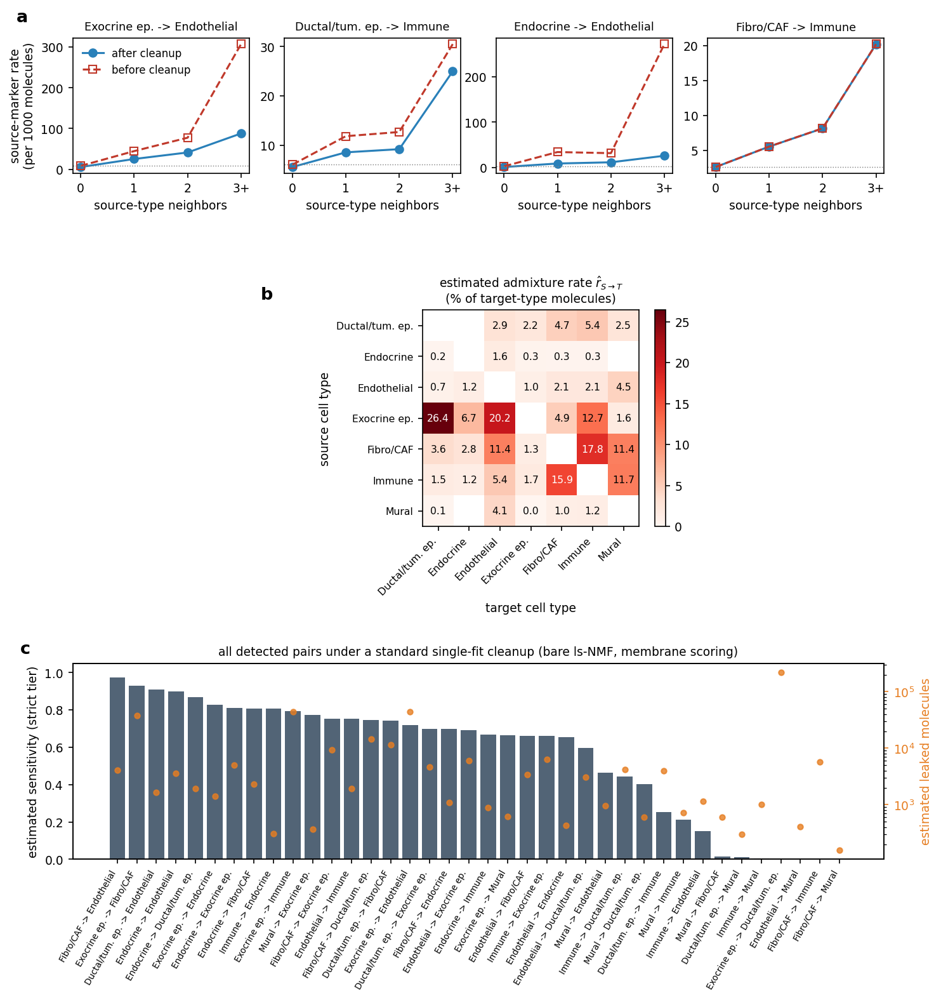
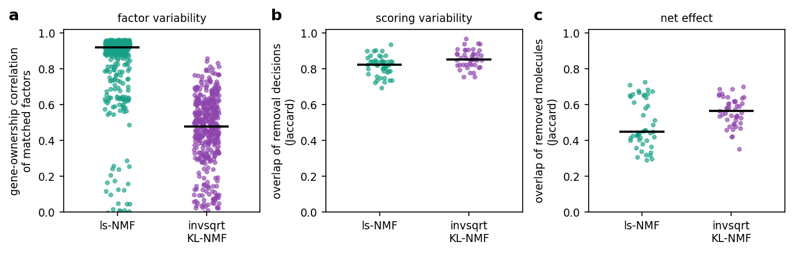
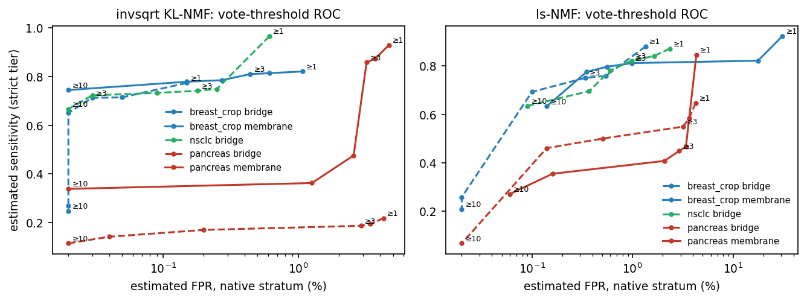
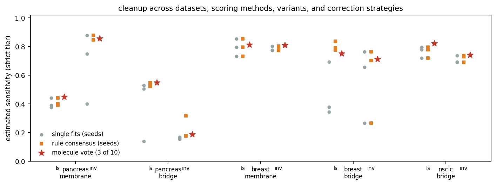

# Benchmarking admixture cleanup

Molecule-level admixture correction faces a basic evaluation problem: no
ground truth identifies which individual transcripts leaked between
neighboring cells. The benchmark described here exploits the defining
property of segmentation-driven admixture — that it is spatially structured.
Contamination of a cell by a given source cell type requires physical
adjacency to cells of that type, so the amount of foreign material scales
with a cell's exposure to source-type neighbors, while cells with no such
neighbors constitute an internal negative control. Any annotated dataset
thereby carries its own population-level ground truth. The same principle
underlies earlier cellAdmix diagnostics — the Bayesian admixture-probability
score built on cell-type adjacency, and the false-positive check based on
source-distant cells (Mitchel et al., 2025) — but those are per-cell or
per-rule diagnostics; here the principle is developed into a quantitative
benchmark of correction methods: per-pair estimates of the number of leaked
molecules, before/after scoring of corrections, and a translation into
estimated sensitivity and specificity. We apply it to cellAdmix's
factorization variants and scoring methods across three datasets, quantify
the run-to-run stochasticity of the correction pipeline, and evaluate
ensemble corrections that turn that stochasticity into a calibration dial.
The harness lives in `analysis/cleanup_benchmark/`.

## The neighbor benchmark

For an ordered pair of cell types — a *source* S and a *target* T — every
T cell is characterized by its *exposure*: the number of S cells among its
15 nearest cells (the same neighborhood definition used by the pipeline's
native-factor check). T cells are stratified into exposure bins
(0, 1, 2, 3+); the zero-exposure bin is the clean reference — whatever those
cells contain, a T cell contains on its own.

For each pair we select a panel of up to 20 *source markers*: genes whose
top expresser is S, ranked by the ratio of their expression rate in S to
their rate in zero-exposure T cells. Selection is rank-based on purpose —
an absolute baseline cutoff would itself be skewed by the contamination
being measured. Within the panel, the *strict tier* holds genes essentially
absent from reference T cells (baseline under 5% of the source level);
their excess in exposed T cells can only be leaked material.

The measurement treats the pooled marker count in each exposure bin as a
Poisson rate: m_B ∼ Poisson(ρ_B · M_B), where m_B is the number of panel
molecules and M_B the total number of molecules over all T cells in bin B
(the offset). This is a saturated rate model over bins — one rate per bin,
with no assumed functional form for the exposure dependence. The pair's
estimated leakage is the exceedance over the reference rate,

L = Σ_{B>0} max(ρ̂_B − ρ̂_0, 0) · M_B ,

i.e. the number of panel molecules in exposed cells beyond what the
zero-exposure rate predicts (Figure 1a, the gap between the red curve and
the dotted baseline). Pairs enter the benchmark when a one-sided Poisson
test of the pooled exposed counts against the ρ̂_0 expectation survives
Benjamini–Hochberg correction across candidate pairs (q < 0.01) and
L ≥ 200 molecules — 39 of 42 candidate pairs on the pancreas dataset, 13 on
the breast crop, 27 on NSCLC, with no manual curation.

A correction is scored by recomputing the exceedance on the corrected
counts — keeping the pre-correction offsets M_B, so that removal registers
as removal rather than being hidden by renormalization — and taking the
fraction eliminated: sensitivity = 1 − L_after / L_before. Two design
details matter. The corrected exceedance is measured against the
*corrected* zero-exposure rate, so uniformly deleting a gene everywhere
earns full credit for that gene's leakage (it does eliminate the exposure
dependence) but is charged separately by the specificity metrics below.
And because the exceedance is bin-wise rather than a fitted slope, monotone
but non-linear exposure responses (Figure 1a) are handled without
approximation. The per-pair profile for a standard single-fit cleanup
(Figure 1b) shows effectiveness to be highly heterogeneous across pairs,
with the largest pair by leakage mass (exocrine → ductal, over 200,000
molecules) missed entirely — a coverage failure invisible to aggregate
diagnostics.

**Figure 1. The neighbor benchmark.** **(a)** Pooled strict-tier
source-marker rates in target cells, stratified by the number of source-type
neighbors, before (red, dashed) and after (blue) a standard cleanup (bare
ls-NMF fit, membrane scoring, pancreas dataset); the dotted line marks the
zero-exposure reference rate ρ̂_0. The rise with exposure is contamination
made visible; cleanup quality is the degree to which the blue curve
flattens to the reference — compare the near-complete flattening of
endocrine → endothelial with the untouched fibroblast → immune pair, where
the curves coincide. **(b)** Estimated sensitivity for every detected pair
(bars), with each pair's estimated leaked-molecule count L overlaid
(orange, log scale). Take-home: cleanup effectiveness is measurable without
molecule-level ground truth, and a standard single-fit correction is highly
uneven across cell-type pairs — including a near-zero score on one of the
largest leakage pairs (exocrine → ductal).

## From excess removal to sensitivity and specificity

The benchmark's two axes are estimators of the standard classification
quantities, each computed on a stratum where the truth is nearly known:

- **Estimated sensitivity.** For strict-tier markers, the excess above the
  zero-exposure baseline estimates the number of truly leaked molecules, so
  the fraction of excess removed is an estimate of TP/(TP+FN) on that
  stratum. Its bias: it samples leakage carried by source-specific genes —
  the *easiest* leakage to attribute — so it is an optimistic stratum for any
  marker-driven method.
- **Estimated false-positive rate.** Molecules of a cell type's own marker
  genes, inside cells of that type, are almost surely genuine; their removal
  rate is a direct FPR estimate (specificity = 1 − FPR). Its bias runs the
  other way: it samples the molecules easiest to keep. A worst-case
  companion — the most-affected pair's retention — tracks the shared-gene
  erasures (e.g. CFTR, genuinely expressed by both exocrine and ductal cells)
  that pooled numbers hide.

The two strata bracket the unmeasurable middle (shared and non-distinctive
genes), and all headline results below are reported in these terms.

## Stochasticity of factorization and scoring

Rerunning the identical pipeline with different random seeds changes the
correction substantially (Figure 2). On the pancreas dataset, ten seeds of
the default membrane-scoring pipeline remove between 1.07 and 1.54 million
molecules (invsqrt KL-NMF; 0.42-0.80 million for ls-NMF), and the removal
*sets* of any two seeds share only ~57% of molecules (median Jaccard;
~45% for ls-NMF). At the pair level, sensitivity can swing from 0.9 to
near 0 across seeds (Figure 2c).

The source of this variability is structural, not numerical. KL-type NMF is
a mixture (topic) model; with the rank set above the number of well-separated
expression programs, the surplus factors face many near-equivalent choices —
duplicate a large program, split one, or form diffuse blends — and
multiplicative updates lock each restart into a different discrete gene
partition (81% of invsqrt loadings are zero; matched factors across seeds
share only ~43% of their owned genes). Restart objectives span ~2% while the
factor structures differ qualitatively, and the objective does not predict
cleanup quality — so best-objective selection among restarts cannot resolve
the ambiguity, and neither can more restarts (tripling the restart pool left the structural variation intact). Scoring inherits this
variability twice over: a pair's removal *decision* may fall below threshold
when its evidence is split across factors, and the removal *labels* may be
absent when no factor owns the leaked molecules. Dense ls-NMF factors are far
more reproducible (matched ownership correlation 0.90 vs 0.43) but commit
weakly to molecule labels, trading instability for insensitivity — the two
variants fail at different stages rather than one being uniformly better.

**Figure 2. Correction stochasticity across random seeds (pancreas,
membrane scoring).** **(a)** Total molecules removed by ten reruns of the
identical pipeline differing only in random seed. **(b)** Pairwise overlap
(Jaccard index) of the removal sets, invsqrt KL-NMF. **(c)** Per-pair
estimated sensitivity across seeds. Take-home: the single-fit correction is
effectively a lottery — comparable total removal, but only about half the
individual molecules agree between any two runs, and individual pairs flip
between fully cleaned and untouched.

## Ensemble corrections by molecule voting

Since each seed's correction is a per-molecule decision, an ensemble is
natural: run the pipeline N times, count for each molecule how many runs
removed it, and remove molecules whose vote count reaches a threshold. The
threshold is a sensitivity/specificity dial, and sweeping it traces an
estimated ROC curve (Figure 3).

Three properties of the resulting curves (Figure 3) are noteworthy. First,
the operating knee consistently sits at a *minority* vote — around 3 of
10 — not at majority: because factor ownership is a lottery, the factor
structure that correctly cleans a given pair arises in only a minority of
restarts, so demanding majority agreement discards genuine cleanup
(sensitivity halves between thresholds 3 and 5 on pancreas membrane
scoring). Second, the threshold is not merely a power dial but a necessary
safety mechanism: the permissive union (≥1 vote) accumulates every seed's
idiosyncratic overcorrections, reaching a 31% native-stratum FPR for ls-NMF
on the breast dataset, which the ≥3 threshold cuts to 1% at nearly the same
sensitivity. Third, the vote count separates systematic removals from
idiosyncratic ones: worst-case pair specificity rises toward 1 at unanimity,
meaning shared-gene erasures are low-vote events contributed by one or two
seeds, while genuine leakage removal accumulates votes up to its lottery
ceiling.

A lighter-weight alternative — pooling only the removal *decisions* across
seeds and applying them with each fit's own labels, with imported decisions
re-vetted by the importing fit's native-factor check — repairs
decision-stage variance (it rescued every catastrophic seed on pancreas
membrane scoring: 0.40 → 0.85) but cannot supply labels a fit never
produced. The molecule-level vote subsumes it whenever at least the
threshold number of runs label the molecules correctly.

**Figure 3. Vote-threshold ROC for ensemble corrections (10 seeds).**
Estimated sensitivity (strict tier) versus estimated native-stratum FPR
(log scale) as the required vote count varies from 1 (union, right end of
each curve) to 10 (unanimity, left end); selected thresholds annotated.
Solid lines: membrane scoring; dashed: bridge. Take-home: a vote fraction
near 30% (≥3 of 10) retains nearly all of the union's sensitivity at a
fraction of its false-positive cost — the union can be actively unsafe
(31% FPR, breast ls-NMF) — while majority and stricter thresholds are
miscalibrated because correct removals are typically minority events
across restarts.

## Benchmarks across datasets and scoring methods

Figure 4 and Table 1 summarize the strict-tier sensitivity of the main
correction strategies across all dataset × scoring-method × variant
combinations. Three regularities emerge. The 3-of-10 molecule vote matches
or exceeds the *best* individual seed in every combination while removing
the seed dependence entirely, at native-stratum FPR of 0.03-3.2%. The
rule-level consensus captures much of the same benefit where failures are
decision-stage (it rescues ls-NMF bridge scoring on breast from 0.34 to
0.78-0.84) but cannot help when no single fit labels the molecules
(invsqrt bridge on breast, seed 2). And no
correction strategy rescues a regime where the factorization family never
produces the needed structure: pancreas bridge scoring under invsqrt KL-NMF
stays below 0.2 at every threshold — an argument for factorization-level
work (anchor-based recovery reached 0.52-0.67 there) rather than better
ensembling.

| dataset (scoring) | ls-NMF single fits | ls-NMF vote ≥3/10 (FPR) | invsqrt single fits | invsqrt vote ≥3/10 (FPR) |
|---|---|---|---|---|
| pancreas (membrane) | 0.38 – 0.44 | 0.45 (2.9%) | 0.40 – 0.88 | **0.86** (3.2%) |
| pancreas (bridge) | 0.14 – 0.53 | **0.55** (3.2%) | 0.15 – 0.17 | 0.19 (2.9%) |
| breast (membrane) | 0.73 – 0.85 | **0.81** (1.0%) | 0.77 – 0.80 | **0.81** (0.4%) |
| breast (bridge) | 0.34 – 0.69 | **0.75** (0.3%) | 0.26 – 0.76 | 0.71 (0.03%) |
| NSCLC (bridge) | 0.72 – 0.80 | **0.82** (1.0%) | 0.69 – 0.74 | 0.74 (0.2%) |

**Table 1. Strict-tier estimated sensitivity across the benchmark matrix.**
Single-fit columns give the min-max range over individually evaluated seed
refits; vote columns give the 3-of-10 molecule-vote ensemble (votes pooled
over ten seeds) with its estimated native-stratum FPR in parentheses. Bold marks the strategy reaching the
best (or tied) sensitivity in each row.

**Figure 4. Cleanup across datasets, scoring methods, variants, and
correction strategies.** Each group shows, for one dataset × scoring
method, the two factorization variants (ls = ls-NMF, inv = invsqrt
KL-NMF): individual seed fits (grey), rule-level consensus applied per seed
(orange squares), and the 3-of-10 molecule-vote ensemble (red star).
Take-home: the molecule vote is the only strategy that is uniformly at or
above the best single fit while being deterministic given the restart pool;
under the vote, invsqrt KL-NMF is at least as good as ls-NMF for membrane
scoring in every case measured, and ls-NMF at least as good as invsqrt for
bridge scoring — the variant choice should follow the scoring method.

## Conclusions

The neighbor benchmark makes admixture cleanup measurable on real data, at
the resolution of cell-type pairs, in estimated sensitivity/specificity
terms, and with no manual curation — which in turn makes method comparison
and tuning an empirical exercise rather than a judgment call. Applied to
cellAdmix it yields three conclusions:

1. **Single-fit corrections are lotteries.** Identical settings produce
   removal sets sharing only about half their molecules across seeds, with
   pair-level effectiveness flipping between complete and absent. Neither
   factorization variant escapes this: invsqrt KL-NMF gambles on factor
   ownership, ls-NMF on scoring decisions.
2. **Ensembling the correction fixes what selection cannot.** The restart
   objective does not identify good corrections, but the restarts jointly
   contain them: molecule-level voting across seeds dominates every
   single-fit arm, and its threshold is a transparent, per-dataset-calibrable
   sensitivity/specificity dial. Under the vote, the factorization choice
   resolves cleanly by scoring method — invsqrt KL-NMF for membrane-scored
   corrections, ls-NMF for bridge-scored ones — reflecting complementary
   failure geometry: sharp invsqrt factors give membrane scoring its
   cleanest contrast, while the contact-based bridge statistic is blind to
   diffuse leakage regardless of variant and benefits from ls-NMF's
   concentrated per-type evidence. Pooling votes across scoring methods as
   well as restarts is the natural next increment.
3. **Recommended solution: ensemble correction by molecule vote.** Derive
   the correction from N independent restarts of the full
   fit-score-correct pipeline (the fit already computes such restarts
   internally for its stability diagnostic; the additional cost is N
   scoring passes, which parallelize trivially). Remove a molecule when at
   least ~30% of restarts remove it, keeping each restart's native-factor
   check as its internal safety vet. On the benchmark this default achieves
   0.45-0.86 strict-tier sensitivity at 0.03-3.2% native-stratum FPR,
   always at or above the best individual restart, with the threshold
   exposed as the user's sensitivity/specificity dial — calibrable per
   dataset by exactly the sweep shown in Figure 3. Two known limits bound
   the approach: leakage riding on genes shared between source and target
   remains only partially removable by any current strategy (the broad-tier
   gap), and regimes where the factorization never forms the needed factors
   (pancreas bridge under invsqrt KL-NMF) require factorization-level
   remedies — on small panels, anchor-based recovery is the most promising
   candidate measured here.

## References

Mitchel J., Gao T., Cole E., Petukhov V., Kharchenko P.V. Impact of
Segmentation Errors in Analysis of Spatial Transcriptomics Data. bioRxiv
2025.01.02.631135 (2025).
