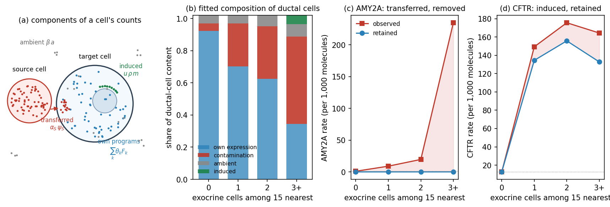
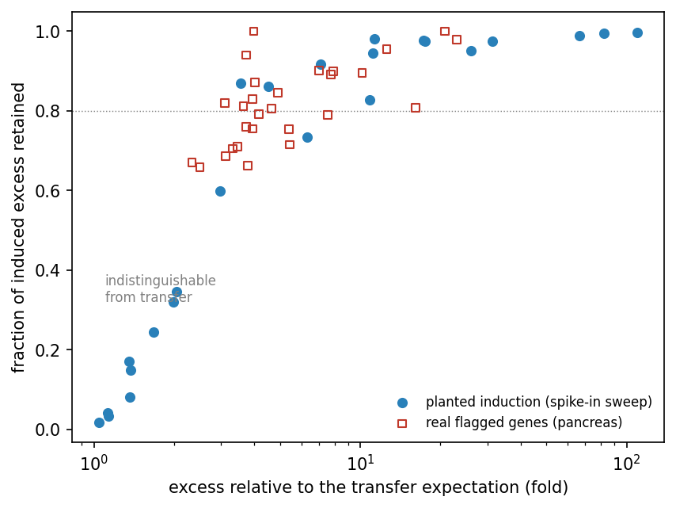

# Admixture and induced expression: a generative model

Admixture correction removes source-marker molecules whose content in
target cells rises with the number of source-type neighbors. But two
different realities produce such exposure-linked excess: molecules
physically transferred from neighboring cells (spilled fragments,
out-of-plane material, ambient background), and transcription by the
target cell itself that responds to its neighborhood — a cell switching
on an activation program at a tissue interface. A correction that
removes both flattens every gradient, at the cost of erasing exactly the
biology that spatial data is often collected to see: interface cell
states, induced programs, ligand–receptor signaling. This document
describes a generative model that decomposes each cell's counts into
origin components so that induced expression can be told apart from
transferred material and retained, the evidence for where that
separation is possible and where it is not, and the practical correction
that resulted. The complete experimental record lives in
`analysis/generative_model/` (model, evaluation scripts, findings) and
`analysis/audit_guided/` (the shared evaluation harness); the audit
vocabulary used throughout — exposure, marker pools, the ambient
reference — is defined in [benchmarks.md](benchmarks.md).

## The model

For each annotated target cell type, the observed count of cell $c$ at
gene $g$ is modeled as a Poisson draw with expected value

$$y_{cg} \sim \mathrm{Poisson}\Big(t_c \big[ \textstyle\sum_k \theta_{ck} F_{kg}
\;+\; \sum_S \alpha_{cS}\, \psi_{Sg} \;+\; \beta_c\, a_g \;+\;
\sum_S u_{cS}\, \rho_{cS}\, m_{Sg} \;+\; \epsilon_g \big]\Big)$$

where $t_c$ is the cell's total molecule count, so every bracketed
quantity is a fraction of the cell's content (Figure 1a). The
components, and where each one's parameters come from:

- **Own expression** ($\theta_{ck}$, $F_{kg}$): the target type's
  expression programs — gene profiles $F_k$ with per-cell weights
  $\theta_{ck}$, initialized from the profiles of factor-labeled
  molecules of the type's own NMF factors. The programs are re-estimated
  during fitting, but predominantly from lightly contaminated cells
  (each cell's contribution is down-weighted by its prior contamination
  fraction): without this, a program shared between source and target
  absorbs the transferred material as if it were a cell state, and the
  affected pair's removal collapses.
- **Contamination** ($\alpha_{cS}$, $\psi_{Sg}$): one term per detected
  source type. The profile $\psi_S$ is the cytoplasmic expression
  profile of the source cells that actually border the target type
  (within 30 µm, widening when sparse) — cell states are not uniform
  across a tissue, and material transferred from activated interface
  cells carries their elevated activation-gene share; against a global
  profile those genes would be misread as induced. The profile is zeroed
  on target-owned genes, where contamination is indistinguishable from
  own expression: it is deliberately left in place, which makes removal
  of the target's own markers structurally impossible. The per-cell
  fraction $\alpha_{cS}$ has a prior mean given by a monotone (isotonic)
  dose–response of marker content on the number of source neighbors, and
  its posterior update from the cell's own expression is bounded — at
  most five-fold the prior, exactly zero where the prior is zero — so
  removal stays anchored to the demonstrated spatial signal (with an
  unbounded update, the model keeps finding the true contamination even
  after the exposure covariate is destroyed, and the permutation control
  fails).
- **Ambient background** ($\beta_c$, $a_g$): restricted to the strict
  genes (essentially absent from the target natively), with profile and
  level measured on target cells far from any source cell, and a bounded
  per-cell scale. This is the component that removes the
  exposure-independent baseline of strict genes.
- **Induced expression** ($u_{cS}$, $\rho_{cS}$, $m_{Sg}$): a sparse
  term active only on genes selected by the proportionality screen
  (next section). The per-cell activity $\rho_{cS}$ concentrates the
  induced content in the cells that actually respond. This content is
  retained; the genes' proportional (transferred) share is still
  removed.
- **Uniform floor** ($\epsilon_g$): 0.2% of cell content spread over
  all genes, keeping the posterior split well-defined where every
  structured component is near zero.

**Figure 1. The components, fitted on the pancreas exocrine → ductal
pair.** **(a)** A target cell's observed counts are a mixture of its own
expression programs (blue), material transferred from bordering source
cells (red), ambient background (grey), and the cell's own transcription
induced by the neighborhood (green). **(b)** The fitted composition of
ductal-cell content, stratified by the number of exocrine cells among
the 15 nearest: at high exposure the model attributes most of the
cell's molecules to contamination, while the induced share appears
exactly where exposure is high. **(c)** AMY2A, the largest acinar
transfer channel: its entire exposure gradient — and its ambient
baseline, since ductal cells do not express it — is removed. **(d)**
CFTR, the duct-cell gene induced at acinar interfaces: its
fourteen-fold gradient is almost entirely retained, with only the
proportional transferred share removed. The same measurement that
flattens (c) preserves (d) — the separation the model exists to make.

## The induced-expression screen

The induced term's gene support is chosen by a proportionality test.
Transferred material samples the source transcriptome, so a gene's
exposure-linked excess in target cells should be proportional to its
share of the (interface-local) source profile. For each pair, the
per-gene excess is regressed on the profile, and the residual is
standardized by counting noise plus a multiplicative profile-uncertainty
term of 15%. The second term is the sparsity mechanism: a pure
counting-noise test flags large transfer channels for deviations of a
few percent — on pancreas it flagged AMY2A at 1.08-fold its expectation,
plain profile noise reaching formal significance only because the
channel is huge — while the real induced genes deviate 2.3- to 22-fold.
Genes past the threshold receive the induced term; their disproportionate
excess is retained where it occurs (the per-cell activity multiplier
concentrates it in the responding cells) while their proportional share
is still removed as transfer.

To be explicit about the reference of the comparison: each gene is
tested individually against the proportional fit to the *source-cell
profile* — there is no induced-profile template, and no correlation
among induced genes is assumed or used. Figure 2a shows the test on the
exocrine → ductal pair: the exposure-linked excess of the source-owned
genes lies on the proportional line across three orders of magnitude —
AMY2A, the largest transfer channel, sits exactly on it — while CFTR,
PROX1 and CA4 sit severalfold above it and are flagged. Figure 2b shows
why the profile must be interface-local: on the ductal → exocrine pair,
the excess of the activation genes CXCL6, CFB and PPP1R1B measures ten-
to twenty-fold disproportionate against the ductal-average profile, but
proportional (0.9- to 1.8-fold) against the profile of the ductal cells
that actually border exocrine tissue — their excess is transfer from
activated edge cells, and only the interface-local profile prices it
correctly.

**Figure 2. What the screen compares.** **(a)** Per-gene exposure-linked
excess in ductal cells against the expectation from proportional
exocrine transfer (interface-local profile); grey: source-owned genes on
the proportional line, red squares: genes flagged as induced. **(b)**
For the three activation genes of the ductal → exocrine pair, the ratio
of measured excess to the transfer expectation, computed two ways: from
the ductal-average profile (open red) and from the profile of the
ductal cells bordering exocrine tissue (filled green). The dashed line
marks proportionality: the apparent ten- to twenty-fold
disproportionality is an artifact of the average profile and vanishes
when the expectation reflects the cells the material actually comes
from.

A separate question is how a flagged gene is known to be induced rather
than admixed from a *different* source type. Three mechanisms address
it. First, each gene is screened in the pair of its own top-expressing
type: a gene owned by another type is tested against that type's
profile, in that type's pair, where its transfer reads as proportional.
Second, the fitted model is simultaneous over every detected source: a
target cell carries one contamination term per source, each anchored to
that source's own neighbor count, so molecules arriving from a second
source load onto that source's term — the induced term only receives
what no modeled source can explain. Third, what remains is the honest
residual risk: material from a source with no detected pair — an
unannotated or rare cell type — has no term to load onto, and its genes
could be misread as induced if their arrival correlates with a modeled
source's exposure. The screen's reports (`markers()` in the audit, the
per-pair induced tables here) name the flagged genes precisely so such
cases can be inspected.

This same screen, applied to the audit's marker panels, is how the
package excludes induced genes from admixture estimation (see
[benchmarks.md](benchmarks.md) and the binding documentation); flagged
genes and their measured disproportionality are reported by
`markers()`.

## The interface-activation finding

Whether the comparison profile is global or interface-local changes the
verdict for a whole class of genes. On pancreas, the inflammation genes
CXCL6, CFB and PPP1R1B show exposure-linked excess in cells near
ductal/tumor tissue at 4- to 20-fold their share of the *global* ductal
profile — reading as induction in the neighbors.
But the enrichment sits in the source cells themselves: ductal cells
within 30 µm of another cell type carry 1.1–1.6 times the ductal-average
cytoplasmic share of these genes (they are, plausibly, the inflamed
tumor edge), and against that interface-local profile the neighbors'
excess is largely proportional — transferred material made by activated
source cells, not a response by the receiving cells. The genes the
screen does flag as induced behave differently: their excess tracks
exposure but not the source-side composition shift, at folds of 2.3–22
(on pancreas, led by CFTR — the canonical duct gene, peaking in duct
cells at acinar interfaces, at 3.9-fold its transfer expectation —
with interface programs of fibroblasts, immune and endothelial/mural
cells behind it). The same screen applied across datasets flags
inflammatory and myoepithelial contractile programs on breast 5K (CCL2,
IL6, LIF; MYH11, MYLK, CNN1) and the classic stress and chemokine
programs on NSCLC (FOS, JUNB, HSPA1A/B, CCL3/4, CXCL2/3).

## Validation

All evaluation runs through the audit's gene-split harness: each pair's
20-gene marker pool is split in half, everything that guides the model
sees only the guide half, and performance is the fraction of
exposure-linked excess removed on the held-out half, weighted across the
39 detected pancreas pairs.

- **Held-out-gene generalization**: 0.974 (median 1.000), versus 0.906
  for an exposure-regression corrector guided by the same genes and
  0.961 for the default molecule-vote ensemble — the ensemble reaching
  its number at 7.5% own-marker false removal, the model at 0.000. A
  dose measured on half the markers generalizes to the other half best
  when delivered through a full source profile with per-cell posterior
  updates.
- **Production behavior**: 0.982 weighted removal, taking out 1.21M of
  the dataset's 6.19M cell-assigned molecules (the ensemble removes
  1.99M for the same downstream benefit). The flagged genes retain 79.5%
  of their exposure-linked excess in aggregate — for CFTR, 89k of its
  111k excess molecules stay in the ductal cells — while unflagged
  marker content is removed at 96–99%.
- **Spike-in test**: with four classes of molecules planted in one
  pair's exposed cells, the model removes 81–85% of in-plane fragments,
  out-of-plane fragments, and ambient singletons, at every setting of the
  planted induction. The planted induction itself is retained or removed
  depending on how far it exceeds the transfer expectation of its genes —
  the full sweep over gene ranks and planted amounts is shown in
  Figure 3 and discussed under the identifiability limit below.
- **Replication**: on the CosMx NSCLC dataset (98,002 cells, 960-gene
  panel, 27 detected pairs) the same configuration reaches 0.964 on
  held-out genes, removes 9.0% of the molecules, keeps own-marker
  removal at zero and the permutation control at 0.013 — and its screen
  flags the same kind of interface biology: heat-shock and
  immediate-early programs (HSPA1A/B, DUSP5, RGS2), macrophage
  activation (GLUL, SRGN), and collagen programs at
  endothelial–fibroblast borders. On the breast 5K dataset (688,099
  cells, 5,101-gene panel, 29 detected pairs) held-out accuracy is
  0.863 with 8.1% of molecules removed, the permutation control at
  0.008 and own-marker removal at zero. The lower figure has a specific
  anatomy: wherever a pair has strict-tier genes (essentially absent
  from the target), their leakage is removed completely (0.9996), and
  the shortfall concentrates in immune and stromal pairs whose held-out
  markers are shared between source and target on a panel this large —
  content the model deliberately attributes to the target's own
  expression rather than remove.
- **Controls**: permuting each pair's exposure values collapses removal
  to 0.018 (the dose prior, not a downstream threshold, carries the
  control); own-marker false removal is 0.000 pooled and for the worst
  type; downstream cell-type k-nearest-neighbor purity rises from 0.804
  to 0.963, within half a point of the ensemble's 0.968.

## The identifiability limit

Any method of this family — target counts modeled as own expression
plus transfer proportional to a source profile, driven by a spatial
covariate — can separate induction from admixture through only three
signals, and each has a floor. Disproportionality is bounded by how well
the source profile is known: with interface-composition effects alone
shifting profiles 10–60%, induction on a source's dominant expression
channels is invisible until it rivals the transfer itself (the planted
14% increment on the pancreas's top acinar genes is undetectable in
principle, while the same mass on mid-rank genes is recovered at 94%).
Spatial coherence — fragments arrive as gene-diverse patches, induced
molecules sit among the cell's own — is real but weak at
single-molecule resolution in dense tissue: per-molecule likelihood
ratios stay under an order of magnitude, against identity priors of
order a thousand to one. And cell-level concentration of induction can
sharpen a gene already flagged but cannot flag one hidden below the
disproportionality floor. The honest claim for this model and any
successor is therefore: induced expression is preserved when it is
disproportionate to the local source profile; induction proportionate
to a source's own top markers is indistinguishable from admixture at
count level and will be removed.

Figure 3 shows this boundary measured directly. Synthetic induced
expression was planted across a range of gene ranks and amounts, and
its retained fraction charted against the gene's total exposure-linked
excess relative to the transfer expectation: retention turns on where
the excess exceeds the expectation about three-fold and is essentially
complete beyond ten-fold, while excess below two-fold is removed as
transfer. The real flagged genes, plotted at their measured
disproportionality and their realized retained fractions, fall on the
same curve — the model treats real and planted induction alike, and
its largest real retention decision (CFTR, Figure 1d) sits well inside
the recoverable regime at 3.9-fold.

**Figure 3. The separation boundary.** Fraction of planted induced
expression retained, as a function of the gene's exposure-linked excess
relative to the transfer expectation (blue: spike-in sweep over planted
gene ranks and amounts, pancreas); red squares: the real flagged genes
at their measured disproportionality. The dotted line marks 80%
retention.

## A practical composite

The model's two transferable mechanisms — the interface-local
overdispersed screen and per-gene retention of the disproportionate
excess share — graft directly onto the much simpler exposure-regression
corrector: measure the removal dose on unflagged genes only, and cap
each flagged gene's removable content at its proportional (transferred)
share, leaving the induced share with the cell. Under the same harness
this composite removes transferred content at the regression corrector's
full power (0.992 on held-out genes excluding flagged ones, every pair
covered) while retaining 79.6% of the flagged-gene excess — against
8.4% when the retention cap is ablated, and matching the full model's
79.5% — at zero own-marker removal and a clean permutation control. The
same script reproduces every gate on the CosMx NSCLC dataset (0.998 on
non-flagged content, 80.1% retention). Scripts and per-pair tables:
`analysis/audit_guided/17_composite.R` and
`analysis/audit_guided/results/`.

The three correctors order naturally by need. The exposure-regression
corrector is the simplest and fastest way to flatten exposure-linked
marker gradients, at the known cost of removing induced and interface
expression along with transfer. The composite adds retention of
identified induced genes at essentially no cost in removal power or
complexity. The full generative model additionally offers the best
held-out-gene generalization and per-cell, per-component decompositions
(contamination fraction per source, ambient share, induced activity) as
outputs in their own right, at the cost of more machinery and minutes of
runtime.
