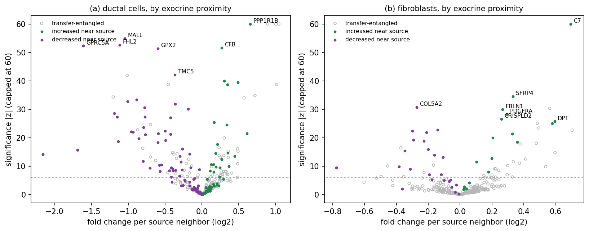

# Admixture and induced expression: a generative model

Admixture correction removes source-marker molecules whose content in
target cells rises with the number of source-type neighbors. But two
different realities produce such exposure-linked excess: molecules
physically transferred from neighboring cells (spilled fragments,
out-of-plane material, ambient background), and transcription by the
target cell itself that responds to its neighborhood — a cell switching
on an activation program at a tissue interface. A correction that
removes both flattens every gradient, at the cost of erasing exactly the
biology that spatial data is often collected to see: interface cell
states, induced programs, ligand–receptor signaling. This document
describes a generative model that decomposes each cell's counts into
origin components so that induced expression can be told apart from
transferred material and retained, the evidence for where that
separation is possible and where it is not, and the practical correction
that resulted. The complete experimental record lives in
`analysis/generative_model/` (model, evaluation scripts, findings) and
`analysis/audit_guided/` (the shared evaluation harness); the audit
vocabulary used throughout — exposure, marker pools, the ambient
reference — is defined in [benchmarks.md](benchmarks.md).

## The model

For each annotated target cell type, the observed count of cell $c$ at
gene $g$ is modeled as a Poisson draw with expected value

$$y_{cg} \sim \mathrm{Poisson}\Big(t_c \big[ \textstyle\sum_k \theta_{ck} F_{kg}
\;+\; \sum_S \alpha_{cS}\, \psi_{Sg} \;+\; \beta_c\, a_g \;+\;
\sum_S u_{cS}\, \rho_{cS}\, m_{Sg} \;+\; \epsilon_g \big]\Big)$$

where $t_c$ is the cell's total molecule count, so every bracketed
quantity is a fraction of the cell's content (Figure 1a). The
components, and where each one's parameters come from:

- **Own expression** ($\theta_{ck}$, $F_{kg}$): the target type's
  expression programs — gene profiles $F_k$ with per-cell weights
  $\theta_{ck}$, initialized from the profiles of factor-labeled
  molecules of the type's own NMF factors. The programs are re-estimated
  during fitting, but predominantly from lightly contaminated cells
  (each cell's contribution is down-weighted by its prior contamination
  fraction): without this, a program shared between source and target
  absorbs the transferred material as if it were a cell state, and the
  affected pair's removal collapses.
- **Contamination** ($\alpha_{cS}$, $\psi_{Sg}$): one term per detected
  source type. The profile $\psi_S$ is the cytoplasmic expression
  profile of the source cells that actually border the target type
  (within 30 µm, widening when sparse) — cell states are not uniform
  across a tissue, and material transferred from activated interface
  cells carries their elevated activation-gene share; against a global
  profile those genes would be misread as induced. The profile is zeroed
  on target-owned genes (a gene is *owned* by the cell type in which it
  makes up the largest share of the transcriptome, counting over all the
  type's cells together), where contamination is indistinguishable from own
  expression: it is deliberately left in place, which makes removal
  of the target's own markers structurally impossible. The per-cell
  fraction $\alpha_{cS}$ has a prior mean given by a monotone (isotonic)
  dose–response of marker content on the number of source neighbors, and
  its posterior update from the cell's own expression is bounded — at
  most five-fold the prior, exactly zero where the prior is zero — so
  removal stays anchored to the demonstrated spatial signal (with an
  unbounded update, the model keeps finding the true contamination even
  after the exposure values are scrambled, and the permutation control
  fails).
- **Ambient background** ($\beta_c$, $a_g$): restricted to the strict
  genes (essentially absent from the target natively), with profile and
  level measured on target cells far from any source cell, and a bounded
  per-cell scale. This is the component that removes the
  exposure-independent baseline of strict genes.
- **Induced expression** ($u_{cS}$, $\rho_{cS}$, $m_{Sg}$): a sparse
  term active only on genes selected by the proportionality screen
  (next section). The per-cell activity $\rho_{cS}$ concentrates the
  induced content in the cells that actually respond. This content is
  retained; the genes' proportional (transferred) share is still
  removed.
- **Uniform floor** ($\epsilon_g$): 0.2% of cell content spread over
  all genes, keeping the division of each count well-defined where every
  structured component is near zero.

**Figure 1. The components, fitted on the pancreas exocrine → ductal
pair.** **(a)** A target cell's observed counts are a mixture of its own
expression programs (blue), material transferred from bordering source
cells (red), ambient background (grey), and the cell's own transcription
induced by the neighborhood (green). **(b)** The fitted composition of
ductal-cell content, stratified by the number of exocrine cells among
the 15 nearest: with three or more exocrine neighbors, the model
attributes most of a ductal cell's molecules to contamination, and the
induced share appears in exactly those cells. **(c)** AMY2A, the largest acinar
transfer channel: its entire exposure gradient — and its ambient
baseline, since ductal cells do not express it — is removed. **(d)**
CFTR, the duct-cell gene induced at acinar interfaces: its
fourteen-fold gradient is almost entirely retained, with only the
proportional transferred share removed. The same measurement that
flattens (c) preserves (d) — the separation the model exists to make.

## The induced-expression screen

The induced term's gene support is chosen by a proportionality test.
Transferred material samples the source transcriptome, so a gene's
exposure-linked excess in target cells should be proportional to its
share of the (interface-local) source profile. For each pair, the
per-gene excess is regressed on the profile, and the residual is
standardized by counting noise plus a multiplicative profile-uncertainty
term of 15%. The second term is the sparsity mechanism: a pure
counting-noise test flags large transfer channels for deviations of a
few percent — on pancreas it flagged AMY2A at 1.08-fold its expectation,
plain profile noise reaching formal significance only because the
channel is huge — while the real induced genes deviate 2.3- to 22-fold.
Genes past the threshold receive the induced term; their disproportionate
excess is retained where it occurs (the per-cell activity multiplier
concentrates it in the responding cells) while their proportional share
is still removed as transfer.

To be explicit about the reference of the comparison: each gene is
tested individually against the proportional fit to the *source-cell
profile* — there is no induced-profile template, and no correlation
among induced genes is assumed or used. Figure 2a shows the test on the
exocrine → ductal pair. Each point is one exocrine-owned gene; its
vertical position is the measured excess — how many extra molecules of
that gene appear in ductal cells as exocrine neighbors accumulate — and
its horizontal position is how many extra molecules proportional
transfer would deliver, given the gene's share of the exocrine profile.
A gene on the diagonal is fully accounted for by transfer. The genes
line up on the diagonal across three orders of magnitude — AMY2A, the
largest channel, sits exactly on it — while CFTR, PROX1 and CA4 carry
several times more excess than transfer can deliver, and are flagged.

Figure 2b asks the same question for the reverse admixture direction:
ductal cells are now the source, exocrine cells the targets, and the
plot shows the excess of ductal-owned genes found in exocrine cells —
are the CXCL6, CFB and PPP1R1B molecules appearing in exocrine cells
near ductal tissue induced in the exocrine cells, or transferred from
the ductal cells? The answer depends on which ductal cells define the
transfer expectation. The grey points are all ductal-owned genes with
the expectation computed from the bordering ductal cells — these are
the data the proportional fit is made from, and they line up on the
diagonal. The activation genes CXCL6, CFB and PPP1R1B are drawn twice:
an open circle at the expectation computed from the average ductal
cell, and a filled point at the expectation computed from the ductal
cells that border exocrine tissue, with an arrow connecting the two
positions of the same gene. The measured excess — the vertical position
— is the same in both cases; only the expectation moves. Against the
average profile the three genes appear to carry ten to twenty times
more excess than transfer could deliver, and would be called induced;
against the profile of the bordering cells, the same excess is exactly
what transfer delivers, and the genes land on the diagonal: transfer,
not induction. The length of the shift is itself a measurement: it
shows how much richer in each of these transcripts the material shed by
the bordering ductal cells is, compared with material from an average
ductal cell — about ten-fold.

The two panels also explain why each shows different genes, although
both concern transcriptional changes in ductal cells at the exocrine
border. The elevated expression of CXCL6, CFB and PPP1R1B is a genuine
induced change *of the ductal cells* — but in the ductal cells these
are the cells' own genes, which the audit never counts as admixture and
the model structurally cannot remove (contamination profiles are zeroed
on target-owned genes), so it needs no flag and appears in no screen.
Its only risk of misinterpretation arises in the neighbors that receive
the transferred products, which is panel (b). The screens therefore
examine only source-owned genes — the genes whose excess could be
mistaken for transferred source material — and panel (a)'s flagged
genes are the genuinely confusable case: CFTR, PROX1 and CA4 are
assigned to exocrine by top expression yet switched on by ductal cells
at the border, so their induced excess looks exactly like exocrine
admixture and must be flagged to be retained. For CFTR the ownership
call is a near-tie (71,145 per million in exocrine versus 70,475 in
ductal), but either assignment preserves the gene: owned by exocrine,
its ductal excess is flagged and retained; owned by ductal, it would be
a target-owned gene and untouchable in ductal cells by construction.

**Figure 2. What the screen compares.** **(a)** *Induced changes
deviate from the transfer expectation.* Each point is one
exocrine-owned gene in the exocrine → ductal pair: measured excess in
ductal cells (vertical) against the excess that proportional transfer
would deliver given the gene's share of the interface-local exocrine
profile (horizontal). The diagonal means "fully accounted for by
transfer"; the dashed curve marks the largest excess still consistent
with proportional transfer, allowing counting noise and a 15% error in
the profile itself, with a wide safety margin — the genes above it
(CFTR, PROX1, CA4) are flagged as induced. As in (b), both expectations
are drawn for these genes — from the average exocrine cell (open red)
and from the bordering exocrine cells (filled green) — and here the two
coincide within 1%, so the markers superimpose: the exocrine
composition is the same at the border, and the border-state effect of
(b) is a property of the ductal cells rather than a general feature of
interfaces. No lower bound is drawn: at this safety margin the
allowance exceeds the expectation itself, so a shortfall can never be
flagged and the screen acts only on excess. **(b)** The
same plot for the reverse admixture direction, ductal → exocrine. Grey:
all ductal-owned genes under the expectation from the bordering ductal
cells — the data the proportional fit is made from; the dashed curve is
the same significance bound as in (a). CXCL6, CFB and PPP1R1B appear
twice, connected by an arrow: at the expectation from the average
ductal profile (open red, above the bound — they would be flagged as
induced) and from the bordering ductal cells (filled green, within
it).
Their measured excess does not change between the two — only the
expectation does — and with the profile of the cells the material
actually comes from, all three sit on the diagonal; the horizontal
shift shows how much richer in each transcript the material shed by the
bordering ductal cells is than material from an average ductal cell.

A separate question is how a flagged gene is known to be induced rather
than admixed from a *different* source type. Three mechanisms address
it. First, each gene is screened in the pair of its own top-expressing
type: a gene owned by another type is tested against that type's
profile, in that type's pair, where its transfer reads as proportional.
Second, the fitted model is simultaneous over every detected source: a
target cell carries one contamination term per source, each anchored to
that source's own neighbor count, so molecules arriving from a second
source load onto that source's term — the induced term only receives
what no modeled source can explain. Third, what remains is the honest
residual risk: material from a source with no detected pair — an
unannotated or rare cell type — has no term to load onto, and its genes
could be misread as induced if their arrival correlates with a modeled
source's exposure. The screen's reports (`markers()` in the audit, the
per-pair induced tables here) name the flagged genes precisely so such
cases can be inspected.

This same screen, applied to the audit's marker panels, is how the
package excludes induced genes from admixture estimation (see
[benchmarks.md](benchmarks.md) and the binding documentation); flagged
genes and their measured disproportionality are reported by
`markers()`.

## The interface-activation finding

Figure 2b's three genes exemplify a general finding: what looks like
induction in a cell's neighbors can be activation of the cell itself,
carried over by transfer. The direct evidence sits in the source cells'
own cytoplasm, measured independently of any target: ductal cells
within 30 µm of another cell type carry 1.1–1.6 times the
ductal-average share of CXCL6, CFB and PPP1R1B — they are, plausibly,
the inflamed tumor edge — and that elevation, compounded across the
transferred material, accounts for the neighbors' excess. The genes the
screen does flag as induced behave differently: their excess tracks
exposure but not the source-side composition shift, at 2.3- to 22-fold
their transfer expectation (on pancreas, led by CFTR — the canonical
duct gene, peaking in duct cells at acinar interfaces — with interface
programs of fibroblasts, immune and endothelial/mural cells behind it).
The same screen applied across datasets flags inflammatory and
myoepithelial contractile programs on breast 5K (CCL2, IL6, LIF; MYH11,
MYLK, CNN1) and the classic stress and chemokine programs on NSCLC
(FOS, JUNB, HSPA1A/B, CCL3/4, CXCL2/3).

## Validation

All evaluation runs through the audit's gene-split harness: each pair's
20-gene marker pool is split in half, everything that guides the model
sees only the guide half, and performance is the fraction of
exposure-linked excess removed on the held-out half, weighted across the
39 detected pancreas pairs.

- **Held-out-gene generalization**: 0.974 (median 1.000), versus 0.906
  for an exposure-regression corrector guided by the same genes and
  0.961 for the default molecule-vote ensemble — the ensemble reaching
  its number at 7.5% own-marker false removal, the model at 0.000. A
  dose measured on half the markers generalizes to the other half best
  when delivered through a full source profile with per-cell posterior
  updates.
- **Production behavior**: 0.982 weighted removal, taking out 1.21M of
  the dataset's 6.19M cell-assigned molecules (the ensemble removes
  1.99M for the same downstream benefit). The flagged genes retain 79.5%
  of their exposure-linked excess in aggregate — for CFTR, 89k of its
  111k excess molecules stay in the ductal cells — while unflagged
  marker content is removed at 96–99%.
- **Spike-in test**: with four classes of molecules planted in one
  pair's exposed cells, the model removes 81–85% of in-plane fragments,
  out-of-plane fragments, and ambient singletons, at every setting of the
  planted induction. The planted induction itself is retained or removed
  depending on how far it exceeds the transfer expectation of its genes —
  the full sweep over gene ranks and planted amounts is shown in
  Figure 3 and discussed under the identifiability limit below.
- **Replication**: on the CosMx NSCLC dataset (98,002 cells, 960-gene
  panel, 27 detected pairs) the same configuration reaches 0.964 on
  held-out genes, removes 9.0% of the molecules, keeps own-marker
  removal at zero and the permutation control at 0.013 — and its screen
  flags the same kind of interface biology: heat-shock and
  immediate-early programs (HSPA1A/B, DUSP5, RGS2), macrophage
  activation (GLUL, SRGN), and collagen programs at
  endothelial–fibroblast borders. On the breast 5K dataset (688,099
  cells, 5,101-gene panel, 29 detected pairs) held-out accuracy is
  0.863 with 8.1% of molecules removed, the permutation control at
  0.008 and own-marker removal at zero. The lower figure has a specific
  anatomy: wherever a pair has strict-tier genes (essentially absent
  from the target), their leakage is removed completely (0.9996), and
  the shortfall concentrates in immune and stromal pairs whose held-out
  markers are shared between source and target on a panel this large —
  content the model deliberately attributes to the target's own
  expression rather than remove.
- **Controls**: permuting each pair's exposure values collapses removal
  to 0.018 (the dose prior, not a downstream threshold, carries the
  control); own-marker false removal is 0.000 pooled and for the worst
  type; downstream cell-type k-nearest-neighbor purity rises from 0.804
  to 0.963, within half a point of the ensemble's 0.968.

## The identifiability limit

Any method of this family — target counts modeled as own expression
plus transfer proportional to a source profile, with the amount of
transfer tied to a spatial measurement such as the neighbor count — can
separate induction from admixture through only three signals, and each
has a floor. Disproportionality is bounded by how well
the source profile is known: with interface-composition effects alone
shifting profiles 10–60%, induction on a source's dominant expression
channels is invisible until it rivals the transfer itself (the planted
14% increment on the pancreas's top acinar genes is undetectable in
principle, while the same mass on mid-rank genes is recovered at 94%).
Spatial coherence — fragments arrive as gene-diverse patches, induced
molecules sit among the cell's own — is real but weak at
single-molecule resolution in dense tissue: per-molecule likelihood
ratios stay under an order of magnitude, against prior odds — of
order a thousand to one — that a strict-tier molecule in an exposed
cell is contamination. And cell-level concentration of induction can
sharpen a gene already flagged but cannot flag one hidden below the
disproportionality floor. The honest claim for this model and any
successor is therefore: induced expression is preserved when it is
disproportionate to the local source profile; induction proportionate
to a source's own top markers is indistinguishable from admixture at
count level and will be removed.

Figure 3 shows this boundary measured directly. Synthetic induced
expression was planted across a range of gene ranks and amounts, and
its retained fraction charted against the gene's total exposure-linked
excess relative to the transfer expectation: retention turns on where
the excess exceeds the expectation about three-fold and is essentially
complete beyond ten-fold, while excess below two-fold is removed as
transfer. The real flagged genes, plotted at their measured
disproportionality and their realized retained fractions, fall on the
same curve — the model treats real and planted induction alike, and
its largest real retention decision (CFTR, Figure 1d) sits well inside
the recoverable regime at 3.9-fold.

**Figure 3. The separation boundary.** Fraction of planted induced
expression retained, as a function of the gene's exposure-linked excess
relative to the transfer expectation (blue: spike-in sweep over planted
gene ranks and amounts, pancreas); red squares: the real flagged genes
at their measured disproportionality. The dotted line marks 80%
retention.

## Induced changes across all genes

The screens above serve admixture estimation, and so examine only
source-owned genes. The corrected counts enable the general question:
for each source and target type, which genes — of any ownership, in
either direction — change their expression in the target cells with
that source's proximity? On the retained counts (transfer and ambient
removed), each gene of a target type is fitted with a Poisson
regression on all sources' exposures jointly, so that spatially
correlated neighborhoods do not attribute one source's effect to
another; the error estimates are widened by the variability actually
measured in the residuals, and a change is reported at a deviation of
six such errors with at least a 4% change per neighboring cell
(`06_induced_general.py`).

Two safeguards accompany every reported gene. Rerunning the identical
fit with the exposure values permuted across cells — one joint
permutation, preserving the correlation between sources — yields zero
reported changes across all seven pancreas target types, against 672
observed. And each gene carries the fraction of its content the model
removed as transfer, together with its share of the source's transfer
profile: genes with essentially nothing removed (55% of the reported
changes, including half on the target's own genes) are pure expression
changes, while the remainder are entangled with the transfer split and
inherit its uncertainty — CFTR is in this second tier by construction,
since a sixth of its content in ductal cells is removed as transfer,
and its retention rests on the separately validated split of Figure 1d.

The pancreas results (Figure 4) extend the interface picture in both
directions. Ductal cells near exocrine tissue not only gain the induced
program (PPP1R1B, CFB, CXCL2 among the unambiguous tier) but lose part
of their identity program — GPRC5A, MALL, FHL2, GPX2 and TMC5 fall
one-and-a-half to three-fold per exocrine neighbor. Exocrine cells near
ductal tissue induce CFTR, PROX1 and CA4 reciprocally: the duct-gene
program is a property of the epithelial boundary, expressed on both of
its sides. Fibroblasts near exocrine tissue mount a complement and
matrix program (C7 at 1.6-fold per neighbor, SFRP4, FBLN1, PDGFRA,
DPT), and ductal/tumor cells adjacent to fibroblasts suppress their
proliferation program (MKI67, CDK1, CCNB2, CENPF). One reading caveat:
under a coarse annotation, a shift of subtype composition within the
target class reads as expression change — the immune rows near tumor
(macrophage markers rising, T-cell markers falling) are most naturally
composition, not per-cell state.

**Figure 4. Neighborhood-associated expression changes on the corrected
counts.** Each point is one gene of the target type: fold change per
source neighbor (horizontal, log scale) against the significance of the
association (vertical). Filled points are the unambiguous tier —
essentially none of the gene's content was removed as transfer — green
increasing near the source, purple decreasing; open grey points are
entangled with the transfer split. **(a)** Ductal cells by exocrine
proximity: the induced interface program on the right, the loss of the
ductal identity program on the left. **(b)** Fibroblasts by exocrine
proximity: the complement and matrix program.

## Circular reasoning, and the measurements that check it

Several of the model's inputs are estimated from the same contaminated
data the model is meant to explain, so each loop deserves a named check.

*Gene ownership.* Ownership is computed from the observed per-type
expression profiles, and contamination between two types is part of why
their rates for a shared gene are close. Recomputing ownership on the
corrected counts changes the owner of 8 of the panel's 377 genes — all
near-ties with margins of a few percent, none among the genes any
result here rests on. The loop is real but confined to genes whose
ownership was a coin flip either way.

*Source profiles.* The transfer profile of each source is measured from
its bordering cells, which are themselves the most contaminated members
of their type. The fit breaks this loop by iterating: after all types
are fitted once, each profile is cleaned by its own type's fitted
own-expression fraction per gene, and the fit repeats — so a profile
progressively sheds the contamination it carried.

*The dose.* Each pair's contamination dose is measured against its own
source's neighbor count, but neighborhoods are correlated — where there
are mural cells there are endothelial cells — so a marginal measurement
books some of one source's material to another. Re-estimating every
pair's dose jointly across all sources' exposures shifts the median
pair by 12% (the marginal estimate being the larger), with one pair
beyond 1.5-fold: mural → ductal, whose mural dose halves once the
accompanying vessel cells are accounted for. The simultaneous fit
already limits the damage — molecules are attributed by competition
among all sources at the count level — and replacing the marginal dose
measurement with the joint one is the identified next improvement.

*Detection on the model's own output.* The induced-change test of the
previous section runs on retained counts, so an error in the transfer
split could manufacture or erase a change. Two measurements bound this.
The per-gene guard already reported: 55% of the changes are on genes
with essentially nothing removed, where no split error is possible. And
rerunning the identical test on the raw, uncorrected counts: 79% of the
reported changes are visible there too, with 96% agreement in direction
in the unambiguous tier. The changes visible only after correction are
rescues, not artifacts, and for a stated reason: contamination inflates
the total molecule count of exposed cells, which deflates every gene's
rate there and masks genuine changes — CFB's induction in ductal cells
measures z = 3.8 on raw counts and z = 52 on corrected ones. An
uncorrected neighborhood analysis is confounded twice over: transferred
molecules add false positives, and inflated totals hide true changes.

## A practical composite

The model's two transferable mechanisms — the screen, with its
bordering-cell profiles and its allowance for profile error, and the
per-gene retention of the disproportionate excess share — graft
directly onto the much simpler exposure-regression corrector: measure the removal dose on unflagged genes only, and cap
each flagged gene's removable content at its proportional (transferred)
share, leaving the induced share with the cell. Under the same harness
this composite removes transferred content at the regression corrector's
full power (0.992 on held-out genes excluding flagged ones, every pair
covered) while retaining 79.6% of the flagged-gene excess — against
8.4% when the retention cap is ablated, and matching the full model's
79.5% — at zero own-marker removal and a clean permutation control. The
same script reproduces every gate on the CosMx NSCLC dataset (0.998 on
non-flagged content, 80.1% retention). Scripts and per-pair tables:
`analysis/audit_guided/17_composite.R` and
`analysis/audit_guided/results/`.

The model ships in the package with the fit separated from the
correction, and with no dependence on a factorization anywhere in the
chain: `ds$audit_admixture()` measures the admixture straight from the
dataset (the audit needs only counts, cell positions, and the
annotation), and `audit$fit_generative()` in R — `audit.fit_generative()`
in Python — fits the model on the detected pairs through a shared C++
implementation (both bindings marshal the same inputs to the same code,
so their results are identical). `fit$audit_admixture()` remains as the
same audit computed from a fitted run's counts. The fitted model exposes the per-cell
decomposition (`composition()`), the retained induced genes
(`induced`), and per-pair summaries (`pairs`), and derives corrections
without refitting: `model$correct()` keeps the induced expression,
`model$correct(retain_induced = FALSE)` removes the fitted induced
share along with the contamination — the direct demonstration of what
retention protects. `correct_generative()` remains as the one-call
convenience. The fit reproduces the reference implementation exactly
(the removed-molecule totals agree to the last count on all three
datasets) and runs in 20 seconds on the pancreas dataset, 50 seconds on
NSCLC, and about four minutes on breast 5K.

The expression programs that represent each type's own states are an
initialization, selected by the `init` argument: `"clusters"` (the
default) derives them by clustering each type's cells with weights
favoring lightly dosed ones, an NMF fit supplies them from its
factor-labeled molecules, `"pseudobulk"` uses one pooled profile per
type, and a named set of profile matrices supplies them explicitly —
for example from an external reference. On the removal side the choice
matters little: across pancreas, NSCLC, and breast 5K the
initializations agree at the removal-entry level to 0.91–1.00, with
sensitivities within a few points of each other and zero own-marker
removal in every case — the model's constraints (the dose-anchored
contamination, the target-owned-gene protection, and the
contamination-weighted program learning) determine where the fit
converges far more than its starting point. Where the initialization
does matter is retention on large panels: on breast 5K the
factor-initialized model flags 180 induced genes and keeps 78% of their
excess, against 129 genes and 62% under the simpler initializations —
richer starting programs let the model separate more induced structure
from transfer. The practical guidance: on focused panels any
initialization serves; on large panels, passing the NMF fit as `init`
preserves the most induced biology.

The three correctors order naturally by need. The exposure-regression
corrector is the simplest and fastest way to flatten exposure-linked
marker gradients, at the known cost of removing induced and interface
expression along with transfer. The composite adds retention of
identified induced genes at essentially no cost in removal power or
complexity. The full generative model additionally offers the best
held-out-gene generalization and per-cell, per-component decompositions
(contamination fraction per source, ambient share, induced activity) as
outputs in their own right, at the cost of more machinery and minutes of
runtime.
