Minimal cellAdmix CosMx Example
================

-   <a href="#overview" id="toc-overview">Overview</a>
-   <a href="#data-preparation" id="toc-data-preparation">Data
    Preparation</a>
-   <a href="#prepared-inputs" id="toc-prepared-inputs">Prepared Inputs</a>
-   <a href="#celladmix-fit" id="toc-celladmix-fit">cellAdmix Fit</a>
-   <a href="#admixture-audit" id="toc-admixture-audit">Admixture Audit</a>
-   <a href="#bridge-scoring" id="toc-bridge-scoring">Bridge Scoring</a>
-   <a href="#cleanup" id="toc-cleanup">Cleanup</a>
-   <a href="#verify-cleanup" id="toc-verify-cleanup">Verify Cleanup</a>
-   <a href="#correction-diagnostics"
    id="toc-correction-diagnostics">Correction Diagnostics</a>

## Overview

This notebook illustrates the basic cellAdmix workflow on a CosMx NSCLC
example. The goal is to identify molecular factors that describe local
transcript neighborhoods, annotate those factors with likely source cell
types, detect source-target admixture patterns, and produce corrected
cell-by-gene counts after removing molecules assigned to likely
admixture.

At a high level, the user-facing workflow is:

``` r
ds <- cellAdmix(molecules_file, output_dir = output_dir, annotation = cell_annotation)
fit <- ds$fit()
score <- fit$score_bridge()
rules <- score$rules()
correction <- score$correct(rules = rules)
corrected_counts <- correction$counts()
```

The constructor records where the input files and output cache live,
validates the configuration, and stores lightweight cell-level metadata.
It does not load the full molecule table into R memory. The
computational work starts with `fit()`, which builds neighborhood
composition vectors, fits NMF factors, and assigns molecules to factors.
Scoring then interprets these factors as possible source-target
admixture patterns, and correction removes rule-supported admixture
molecules to produce corrected counts, by default through a
molecule-vote ensemble across the fit’s NMF restarts.

## Data Preparation

cellAdmix itself works with generic molecule tables and optional cell
metadata. The raw inputs for this example are more dataset-specific: a
Giotto object with cell metadata, a CosMx transcript CSV, and a small
curated annotation table. We keep that conversion outside the main
notebook so that the vignette focuses on the standard cellAdmix API
rather than on one dataset’s loading details.

To regenerate the prepared files, download the raw example files from
`http://pklab.org/peterk/cellAdmix/examples/cosmx_nsclc/` and place them
in a local folder named `data/` next to this notebook:

-   `data/SMI_Giotto_Object.RData`
-   `data/Lung5_Rep1_tx_file.csv.gz`
-   `data/annotation_adj.csv.gz`

Then run the conversion script from the `examples/cosmx_nsclc_giotto`
directory:

`Rscript prepare_cosmx_tabular.R --input data --output prepared`

The script writes gzip-compressed tabular files under `prepared/`:

-   `prepared/molecules_all.csv.gz`: one molecule per row, with spatial
    coordinates, gene identity, and assigned cell ID.
-   `prepared/cell_metadata_all.csv.gz`: one row per cell, with cell
    type labels, spatial centroids, and a few diagnostic columns used
    later for illustration.

The conversion does not require the Giotto package to be installed. It
loads the saved Giotto object and reads only the object attributes
containing cell-level metadata and raw spatial cell centroids. The
curated annotation table supplies the cell-type labels and diagnostic
region labels. The transcript CSV supplies the molecule coordinates,
genes, FOV IDs, and raw cell IDs; the script filters out unassigned
cells and negative probes, converts CosMx pixel coordinates to microns,
and writes the standard tabular molecule file consumed by cellAdmix.

The rest of the notebook starts from those prepared files. This is the
same input pattern that can be used for other tabular molecule datasets.

## Prepared Inputs

We first point the notebook at the prepared molecule and cell-metadata
files, then load the small cell metadata table into R for annotation
summaries and plotting.

``` r
molecules_file <- file.path("prepared", "molecules_all.csv.gz")
cell_metadata_file <- file.path("prepared", "cell_metadata_all.csv.gz")

cell_meta <- read.csv(cell_metadata_file, stringsAsFactors = FALSE)
rownames(cell_meta) <- cell_meta$cell

table(cell_meta$cell_type_coarse)
```

    ## 
    ##  endothelial   epithelial   fibroblast immune other   macrophage    malignant 
    ##         7613         4098        13151        47131         7409        18600

The spatial plot below is not part of the core algorithm. It is a quick
check that the prepared annotations and cell coordinates are aligned
with the tissue layout.

``` r
celladmix_plot_spatial(cell_meta, color_by = "cell_type_coarse")
```

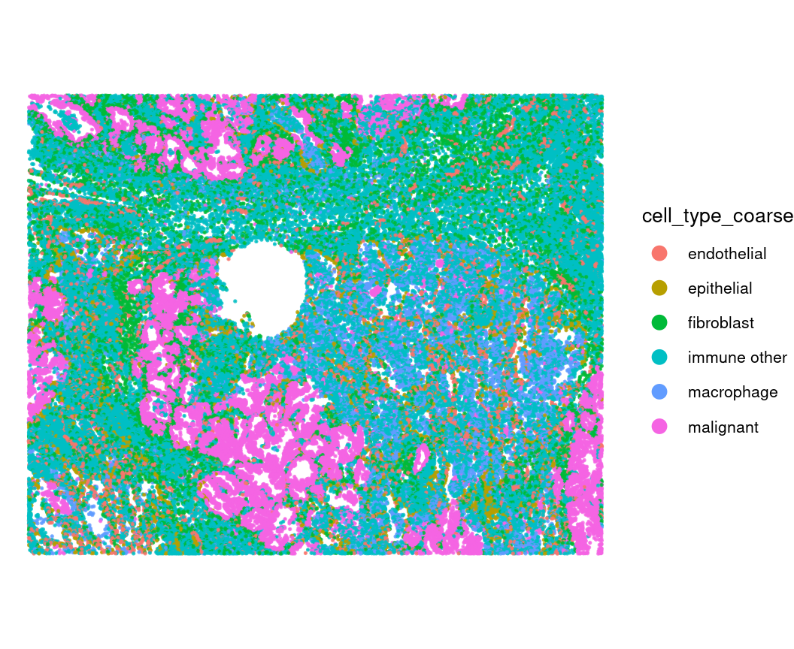

## cellAdmix Fit

The `cellAdmix()` constructor records the input files and creates an
output directory for reusable caches and analysis results. The coarse
cell annotation is passed as a named vector, where names are cell IDs
and values are cell-type labels. The molecule CSV is not loaded into R
memory at construction time; it is streamed into a cellAdmix store as
needed by downstream steps.

``` r
output_dir <- "out"
cell_annotation <- setNames(cell_meta$cell_type_coarse, cell_meta$cell)

ds <- cellAdmix(molecules_file, output_dir = output_dir, annotation = cell_annotation)

ds
```

    ## cellAdmix dataset
    ##   format: tabular 
    ##   output cache: configured
    ##   threads: 10 
    ##   molecules: molecules_all.csv.gz 
    ##   annotation:manual (98002 cells, 6 labels)

The fit call constructs neighborhood composition vectors around
molecules, factorizes them, and assigns each molecule to a factor. By
default, the rank is chosen from the number of annotation labels, the
neighborhood size is resolved from the panel and cell sizes, NMF uses
the weighted least-squares (`ls_nmf`) formulation, molecule scoring uses
gene loadings, and at least 10 NMF restarts are run. The default variant
is the right choice here: this dataset carries no membrane stain, so
cleanup will use bridge scoring, which pairs best with `ls_nmf` factors
(see [docs/benchmarks.md](../../docs/benchmarks.md)).

``` r
fit <- ds$fit()
score_pairs_width <- 9.6
score_pairs_height <- max(6, ceiling(fit$rank / 2) * 4.9)

fit
```

    ## cellAdmix fit
    ##   run: fit_manual_rank8_ls_nmf 
    ##   annotation: manual 
    ##   rank: 8 
    ##   NMF: ls_nmf 
    ##   molecule scoring: gene_loadings 
    ##   cells: 98002 
    ##   transcripts: 30245074

Top gene loadings help interpret each factor. These are the genes most
strongly associated with each fitted factor, so they are the first place
to look for native cell-type signatures or possible admixture
signatures.

``` r
fit$plot_loadings()
```

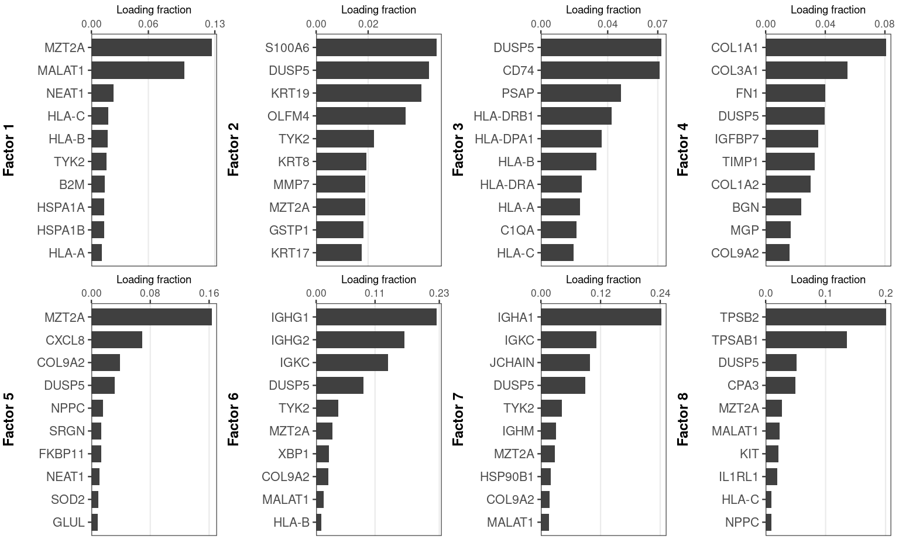

The stability plot summarizes how reproducible factors were across the
random NMF starts. Stability is the matched correlation of each factor’s
gene-ownership profile against independent restarts: unrelated factors
score near zero, and values above 0.3 indicate a reproducibly re-found
factor. Factor importance (the x-axis, echoed by dot size) is the share
of all assigned molecules that carry the factor’s label, so large dots
mark factors that dominate the tissue-wide signal. Stable,
high-importance factors are easier to interpret; low-stability factors
are seed-dependent, which is why the default correction votes across the
restarts rather than trusting any single fit.

``` r
fit$plot_stability()
```

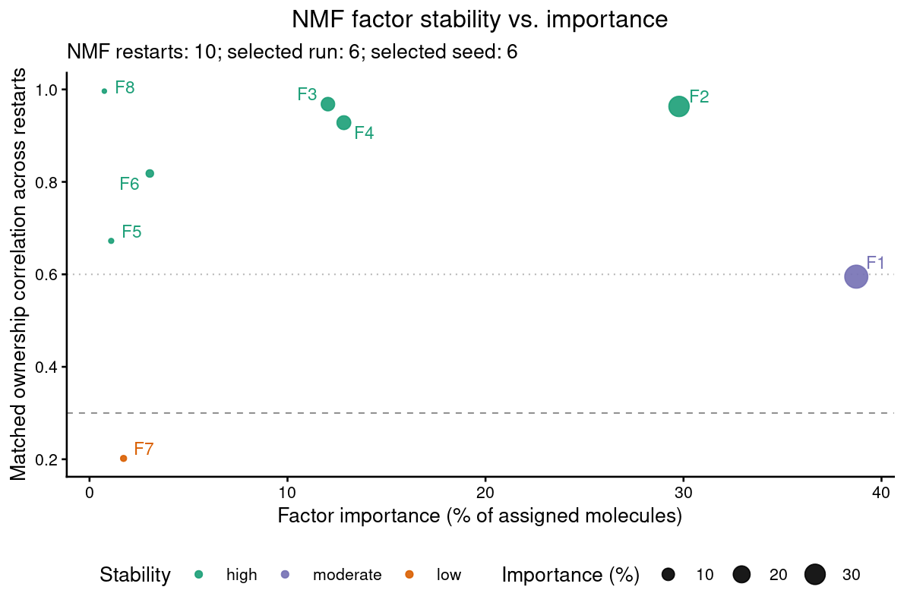

As another quick sanity check, we can show the dominant factor
assignment for each cell in tissue coordinates.

``` r
cell_factors <- fit$cell_factors()
celladmix_plot_spatial(cell_factors, color_by = "dominant_factor") +
  ggplot2::ggtitle("Dominant factor by cell")
```

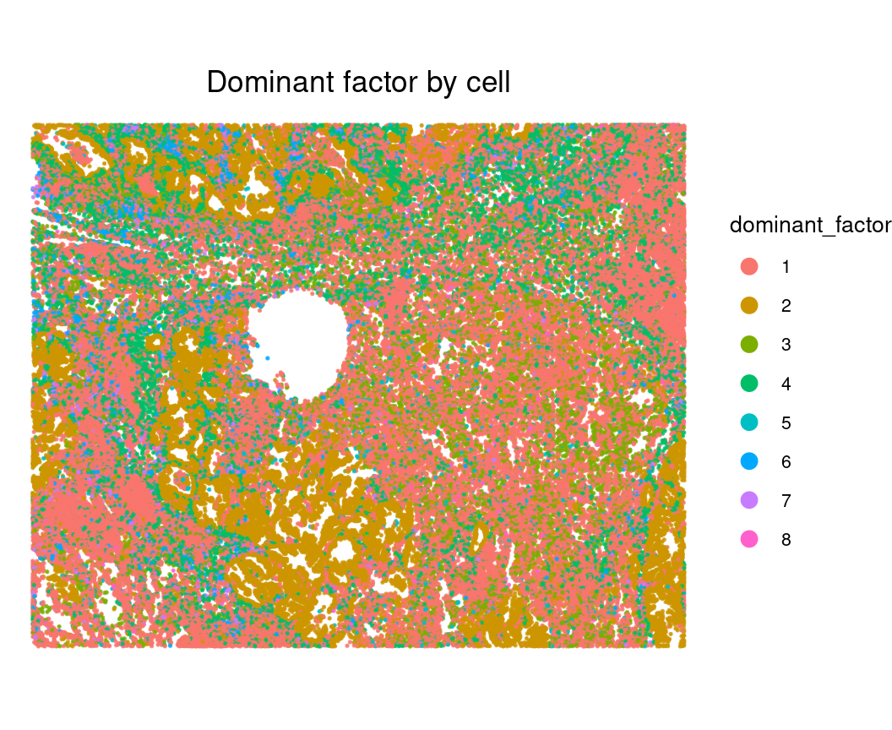

## Admixture Audit

Before correcting anything, the audit measures how much admixture the
dataset carries and between which cell types, using only the spatial
exposure structure (source-marker content in target cells rises with
source-type neighbor exposure; unexposed target cells are the internal
negative control). Each cell of the map shows a detected source → target
pair’s estimated admixture rate: the percent of the target type’s
molecules that leaked in from the source, extrapolated from a directly
measured (and conservative) marker excess.

``` r
audit <- fit$audit_admixture()
audit$plot_map()
```

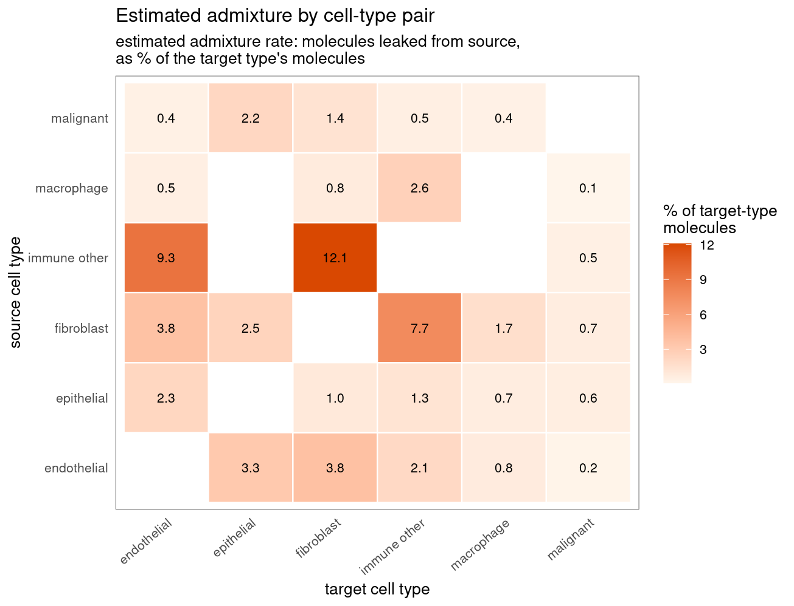

## Bridge Scoring

Bridge scoring asks whether molecules assigned to a factor in a target
cell type are spatially connected to plausible source cell types. This
converts the unlabeled factors into candidate source-target correction
rules.

``` r
bridge <- fit$score_bridge()
```

The score object is then converted into correction rules. Each row
indicates a factor, its inferred source cell type, and a target cell
type where that factor is called as potential admixture. We only print
the first few columns and rows to avoid dumping a large table.

Each rule also passes a native-factor false-positive check: target cells
with no source-type cells among their nearest neighbors are examined,
and rules whose factor persists in those source-distant cells are
flagged (`keep = FALSE`, with the reason in `native_check`) and skipped
by correction. This guards against removing factors that are genuinely
native to a related target type — on this dataset, the malignant-cell
factor in epithelial cells is the canonical case: epithelial cells far
from any malignant cell still express it, so it should not be removed
from them.

``` r
rules <- bridge$rules()
rules[, c("factor", "source_cell_type", "target_cell_type", "p_value",
  "keep", "native_check", "native_distant_median")]
```

    ##    factor source_cell_type target_cell_type      p_value  keep   native_check
    ## 1       1      endothelial     immune other 6.995937e-02 FALSE  native_median
    ## 2       1      endothelial       macrophage 3.048003e-02 FALSE  native_median
    ## 3       2        malignant      endothelial 8.531269e-11  TRUE           pass
    ## 4       2        malignant       epithelial 1.855005e-02 FALSE  native_median
    ## 5       2        malignant       fibroblast 1.391428e-23  TRUE           pass
    ## 6       2        malignant     immune other 4.025633e-13  TRUE           pass
    ## 7       2        malignant       macrophage 6.042786e-05  TRUE           pass
    ## 8       3       macrophage      endothelial 1.700665e-04  TRUE           pass
    ## 9       3       macrophage       epithelial 1.787109e-04  TRUE           pass
    ## 10      3       macrophage       fibroblast 4.582377e-14  TRUE           pass
    ## 11      3       macrophage     immune other 2.595039e-16  TRUE           pass
    ## 12      3       macrophage        malignant 1.442815e-04  TRUE           pass
    ## 13      4       fibroblast      endothelial 2.170745e-07 FALSE native_outlier
    ## 14      4       fibroblast       epithelial 2.942484e-18  TRUE           pass
    ## 15      4       fibroblast     immune other 1.100015e-22  TRUE           pass
    ## 16      4       fibroblast       macrophage 1.020267e-13  TRUE           pass
    ## 17      4       fibroblast        malignant 1.406864e-28  TRUE           pass
    ## 18      5     immune other       macrophage 9.351103e-02 FALSE    no_gradient
    ## 19      6     immune other      endothelial 1.015577e-04  TRUE           pass
    ## 20      6     immune other       epithelial 1.377050e-05  TRUE           pass
    ## 21      6     immune other       fibroblast 3.545377e-04  TRUE           pass
    ## 22      6     immune other       macrophage 5.536811e-02  TRUE           pass
    ## 23      6     immune other        malignant 1.510092e-03  TRUE           pass
    ## 24      7     immune other      endothelial 1.762971e-03  TRUE           pass
    ## 25      7     immune other       epithelial 9.154253e-03  TRUE           pass
    ## 26      7     immune other       fibroblast 6.649002e-02  TRUE           pass
    ## 27      7     immune other       macrophage 2.317569e-02 FALSE    no_gradient
    ## 28      7     immune other        malignant 6.176713e-02  TRUE           pass
    ## 29      8     immune other      endothelial 1.429612e-03  TRUE           pass
    ## 30      8     immune other       epithelial 1.692944e-06  TRUE           pass
    ## 31      8     immune other       fibroblast 5.661890e-04  TRUE           pass
    ## 32      8     immune other        malignant 3.882963e-04  TRUE           pass
    ##    native_distant_median
    ## 1            0.706250000
    ## 2            0.270525434
    ## 3            0.016431925
    ## 4            0.329794508
    ## 5            0.005479452
    ## 6            0.006535948
    ## 7            0.003720933
    ## 8            0.007007300
    ## 9            0.087096774
    ## 10           0.005157965
    ## 11           0.024509804
    ## 12           0.004228330
    ## 13           0.077115892
    ## 14           0.002932551
    ## 15           0.000000000
    ## 16           0.000000000
    ## 17           0.001418440
    ## 18           0.000000000
    ## 19           0.000000000
    ## 20           0.000000000
    ## 21           0.000000000
    ## 22           0.000000000
    ## 23           0.001397136
    ## 24           0.000000000
    ## 25           0.000000000
    ## 26           0.000000000
    ## 27           0.000000000
    ## 28           0.000000000
    ## 29           0.000000000
    ## 30           0.000000000
    ## 31           0.000000000
    ## 32           0.000000000

The heatmap shows which source cell types are implicated for each factor
and target cell type. It is a compact way to check whether the factor
annotations make biological sense before applying correction.

``` r
bridge$plot_heatmap()
```

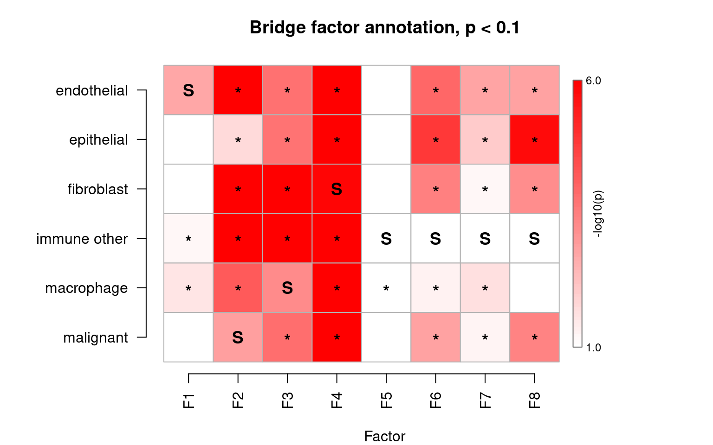

The pair plots show the same bridge evidence one factor at a time. They
make it easier to inspect whether inferred source cell types and
significant target cell types form a coherent source-target pattern.

``` r
bridge$plot_pairs()
```

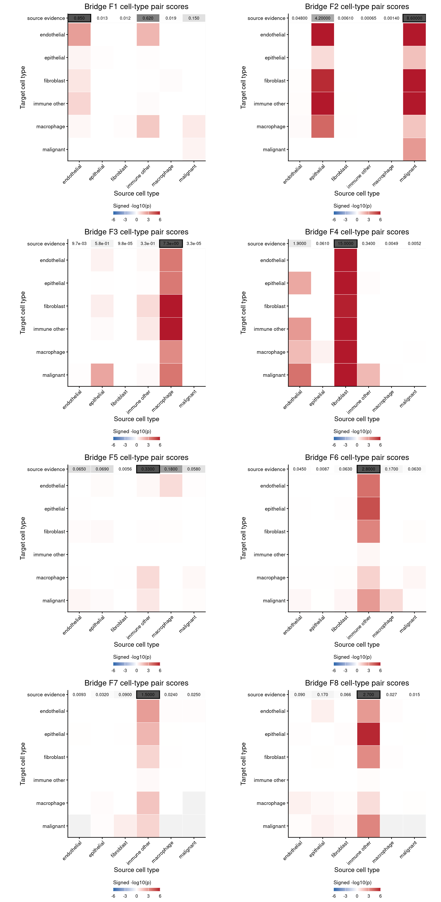

## Cleanup

Cleanup removes molecules matching the bridge-supported
source-target-factor rules. The operation writes a corrected run into
the output directory and keeps the original fit unchanged.

``` r
correction <- bridge$correct(rules = rules)

correction$summary()
```

    ##      cell_type n_cells n_modified_cells fraction_cells_modified
    ## 1          all   98002            93769               0.9568070
    ## 2  endothelial    7613             7437               0.9768816
    ## 3   epithelial    4098             3868               0.9438751
    ## 4   fibroblast   13151            12702               0.9658581
    ## 5 immune other   47131            45391               0.9630816
    ## 6   macrophage    7409             6532               0.8816304
    ## 7    malignant   18600            17839               0.9590860
    ##   molecules_before molecules_after molecules_removed fraction_molecules_removed
    ## 1         30245074        26012677           4232397                 0.13993674
    ## 2          2299672         2024970            274702                 0.11945269
    ## 3          1532030         1444489             87541                 0.05714053
    ## 4          3932478         3500905            431573                 0.10974581
    ## 5         10859357         7706604           3152753                 0.29032594
    ## 6          2263538         2180158             83380                 0.03683614
    ## 7          9357999         9155551            202448                 0.02163368
    ##   median_removed_per_modified_cell median_fraction_removed_per_modified_cell
    ## 1                               18                                0.07975460
    ## 2                               25                                0.09117647
    ## 3                               10                                0.02785073
    ## 4                               19                                0.07398264
    ## 5                               37                                0.20771513
    ## 6                                6                                0.02105263
    ## 7                                7                                0.01428571

The next plot summarizes how many molecules were removed in modified
cells. Large removals should be inspected carefully, while very small
removals may have little impact on downstream summaries.

``` r
correction$plot_removed_molecules()
```

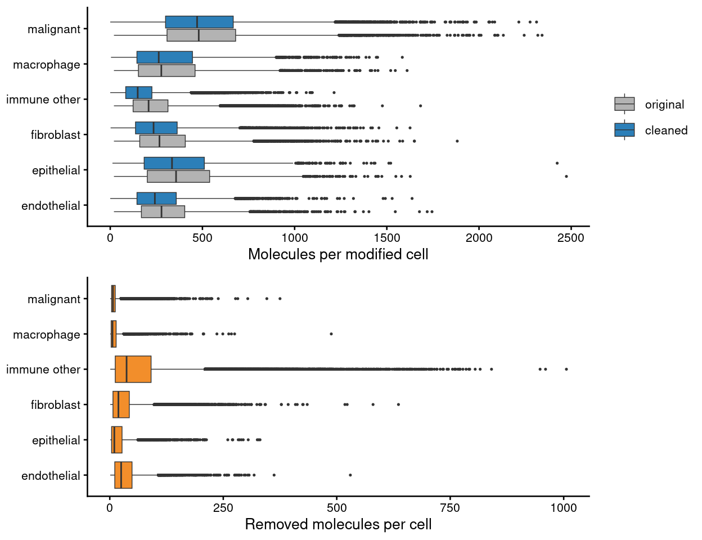

## Verify Cleanup

The audit re-measures the same exposure gradients on the corrected
counts. The report gives per-pair cleanup sensitivity and the own-marker
false-removal rate, and warns about any detected pair the rules did not
cover; the panels show the estimated admixture remaining after
correction and the pooled exposure profile before and after cleanup.

``` r
report <- audit$evaluate(correction)
```

    ## Warning: Detected ~50,035 admixed molecules from endothelial into epithelial,
    ## but no removal rule covers this pair

    ## Warning: Detected ~150,226 admixed molecules from endothelial into fibroblast,
    ## but no removal rule covers this pair

    ## Warning: Detected ~225,464 admixed molecules from endothelial into immune
    ## other, but no removal rule covers this pair

    ## Warning: Detected ~17,704 admixed molecules from endothelial into macrophage,
    ## but no removal rule covers this pair

    ## Warning: Detected ~17,283 admixed molecules from endothelial into malignant,
    ## but no removal rule covers this pair

    ## Warning: Detected ~52,074 admixed molecules from epithelial into endothelial,
    ## but no removal rule covers this pair

    ## Warning: Detected ~38,067 admixed molecules from epithelial into fibroblast,
    ## but no removal rule covers this pair

    ## Warning: Detected ~142,099 admixed molecules from epithelial into immune other,
    ## but no removal rule covers this pair

    ## Warning: Detected ~15,103 admixed molecules from epithelial into macrophage,
    ## but no removal rule covers this pair

    ## Warning: Detected ~58,519 admixed molecules from epithelial into malignant, but
    ## no removal rule covers this pair

    ## Warning: Detected ~86,715 admixed molecules from fibroblast into endothelial,
    ## but no removal rule covers this pair

    ## Warning: Detected ~34,129 admixed molecules from malignant into epithelial, but
    ## no removal rule covers this pair

``` r
report$summary()
```

    ## $detected_pairs
    ## [1] 27
    ## 
    ## $estimated_admixed_molecules
    ## [1] 3064797
    ## 
    ## $leakage_removed_overall
    ## [1] 0.69881
    ## 
    ## $median_pair_sensitivity
    ## [1] 0.7789844
    ## 
    ## $own_marker_false_removal
    ## [1] 0.006143006
    ## 
    ## $worst_false_removal
    ## [1] "immune other"

``` r
cowplot::plot_grid(
  audit$plot_remaining(list(corrected = correction)),
  audit$plot_exposure(correction = correction),
  ncol = 2, align = "hv", axis = "tblr")
```

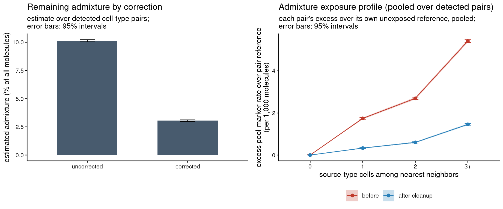

## Correction Diagnostics

For this example, the diagnostic question is whether malignant
epithelial marker signal in fibroblast cells is reduced after cleanup,
while native fibroblast marker signal is preserved. These plots are not
required for cellAdmix itself; they are an interpretable downstream
check for this dataset.

``` r
malignant_marker_genes <- c(
  "KRT19", "KRT8", "KRT18", "TACSTD2", "CEACAM6", "CDH1", "EPCAM",
  "CLDN4", "SFN", "PHLDA2", "DDR1", "AGR2", "KRT6A", "KRT17",
  "CD24", "KRT5", "AQP3", "SLC2A1", "KRT7", "COL17A1", "FASN",
  "KRT15", "ITGA2", "ERBB3", "S100A2", "SPINK1", "ITGB4", "PIGR",
  "SOX2", "ITGA3", "CYSTM1", "NTRK2", "MAPK13", "CCND1", "HDAC1", "EGFR"
)
malignant_label_genes <- c("KRT19", "KRT8", "KRT17", "CEACAM6")
fibroblast_marker_genes <- c("MYL9", "CXCL12", "PDGFRB", "RARRES2")

counts <- fit$counts()
fib_cells <- rownames(cell_meta)[
  cell_meta$celltype == "fibroblast" & !is.na(cell_meta$regions_compare)
]
fib_cells <- intersect(fib_cells, colnames(counts))
regions_compare <- setNames(cell_meta[fib_cells, "regions_compare"], fib_cells)
de_out_orig <- celladmix_de(counts[, fib_cells, drop = FALSE], regions_compare,
  contrast = c("tumor", "stroma"))
impact <- celladmix_correction_impact(correction, counts, fib_cells,
  regions_compare, contrast = c("tumor", "stroma"))

data.frame(fibroblast_cells = length(fib_cells),
  regions = paste(sort(unique(na.omit(regions_compare))), collapse = ", "))
```

    ##   fibroblast_cells       regions
    ## 1             7031 stroma, tumor

The uncorrected volcano plot compares fibroblast cells in
tumor-associated regions with fibroblast cells in stromal regions.
Malignant markers enriched in the tumor-associated fibroblasts are the
signal we expect cleanup to reduce.

``` r
celladmix_plot_volcano(de_out_orig, markers = malignant_marker_genes,
  label = malignant_label_genes, marker_label = "Malignant marker",
  title = "Before cleanup")
```

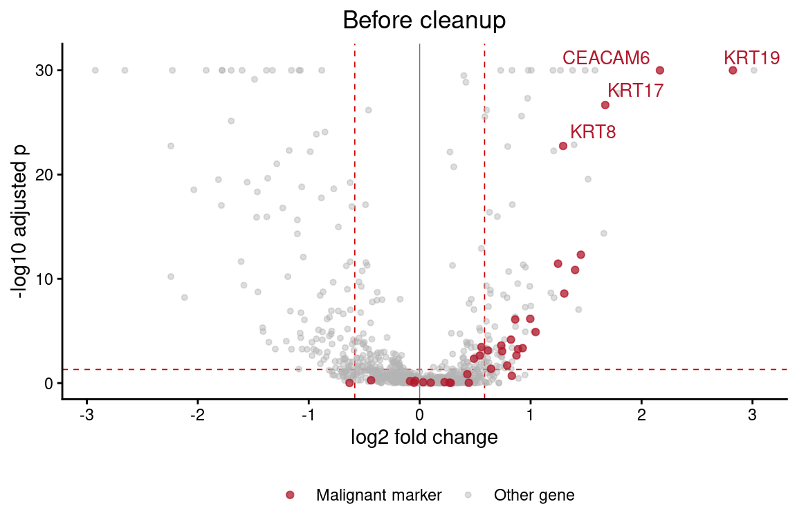

The marker barplots compare mean normalized expression before and after
cleanup within fibroblast cells. The desired pattern is preservation of
native fibroblast markers and reduction of malignant marker signal.

``` r
celladmix_plot_marker_expression(counts, impact$counts, fib_cells,
  markers = list("Fibroblast markers" = fibroblast_marker_genes,
    "Malignant markers" = malignant_label_genes))
```

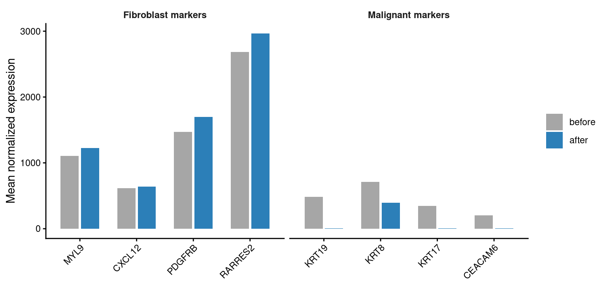

The cleaned volcano plot repeats the same fibroblast comparison after
molecule removal. A successful correction should shift suspicious
malignant markers toward weaker significance and smaller tumor-region
enrichment.

``` r
celladmix_plot_volcano(impact$de, markers = malignant_marker_genes,
  label = malignant_label_genes, marker_label = "Malignant marker",
  title = "After cleanup")
```

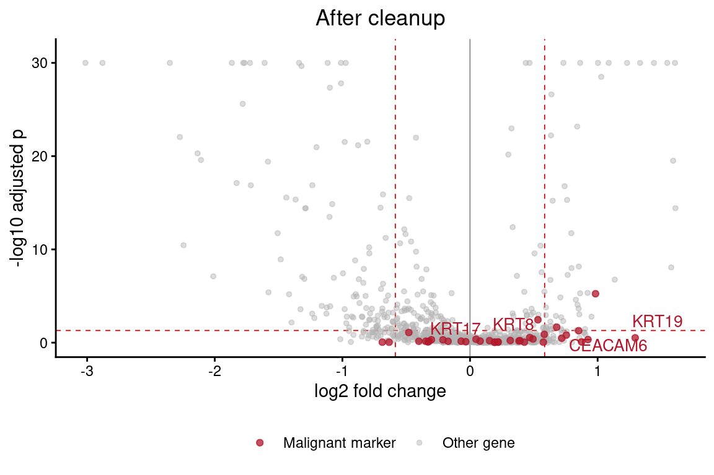

The final scatter plot directly compares signed adjusted-p-value
significance before and after cleanup. Positive values indicate
tumor-region enrichment within fibroblasts, negative values indicate
stromal-region enrichment, and points below the diagonal became less
significant after cleanup. Highlighted malignant markers moving toward
zero are consistent with reduced malignant admixture signal.

``` r
celladmix_plot_de_shift(de_out_orig, impact$de,
  markers = malignant_marker_genes, label = malignant_label_genes,
  marker_label = "Malignant marker")
```

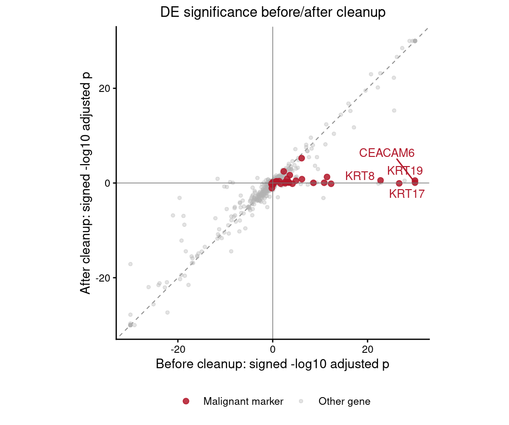

The expected result is not that every malignant marker disappears.
Instead, the correction should remove the molecule subset assigned to
bridge-supported admixture factors, reduce the strongest suspicious
marker signal in target cells, and leave native fibroblast markers
largely intact.
