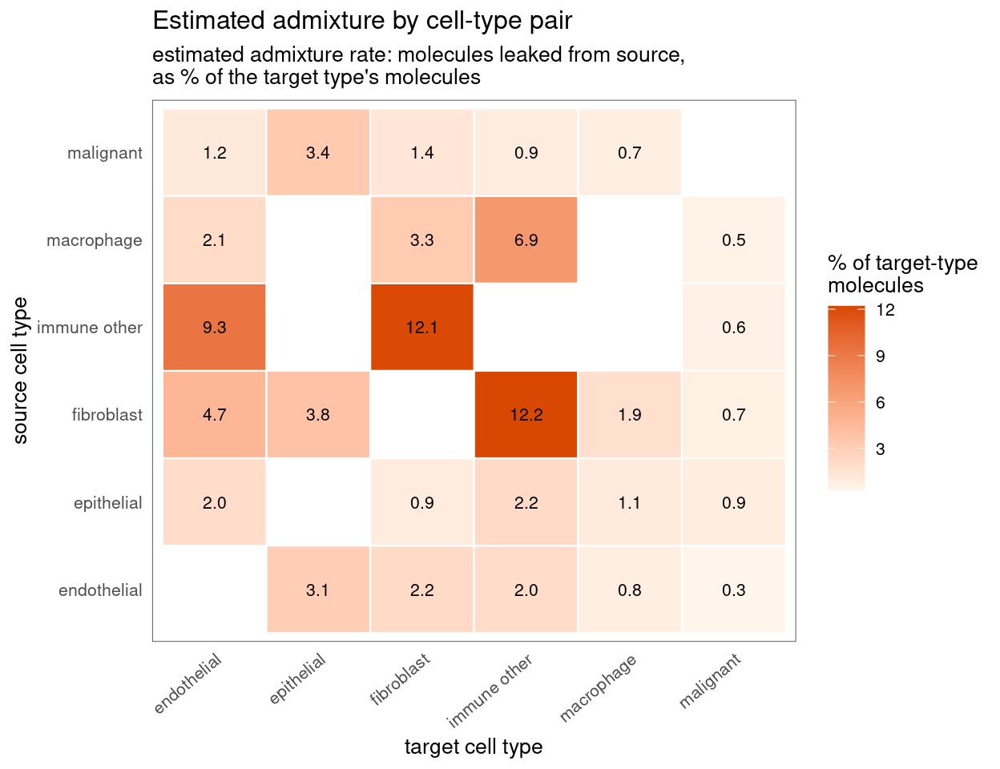
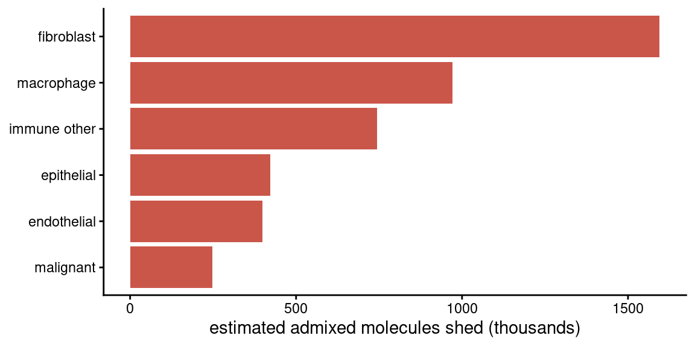
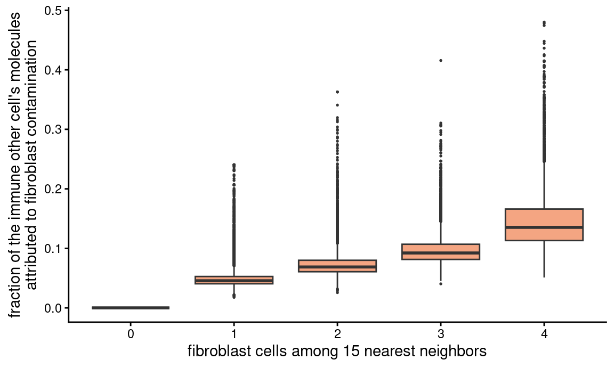
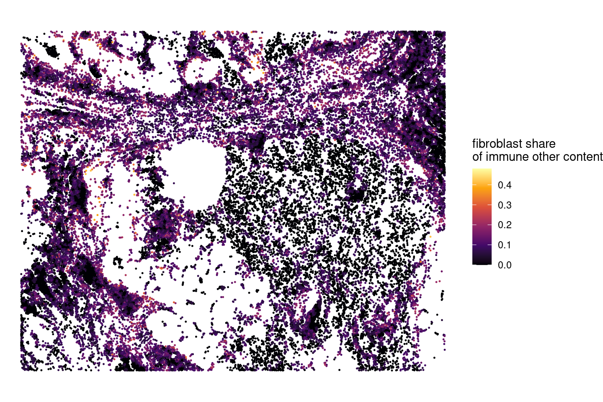
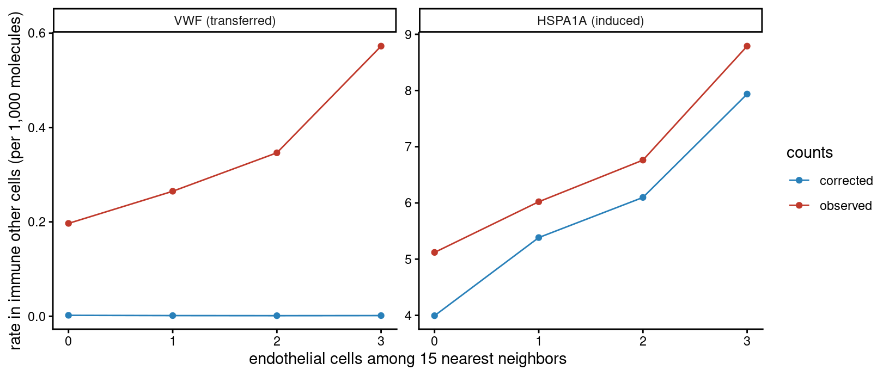
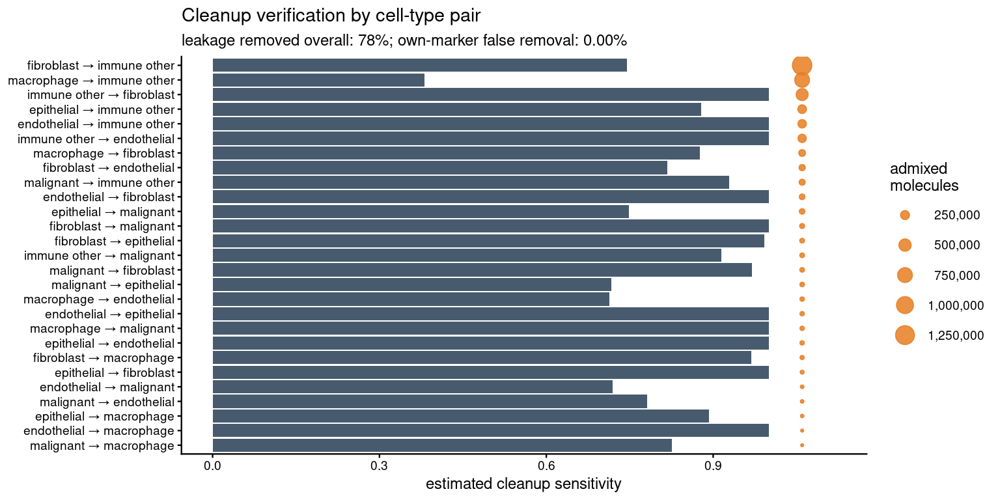

Generative Admixture Correction on CosMx NSCLC
================

-   <a href="#the-admixture-pattern-between-cell-types"
    id="toc-the-admixture-pattern-between-cell-types">The admixture pattern
    between cell types</a>
-   <a href="#correcting-with-the-generative-model"
    id="toc-correcting-with-the-generative-model">Correcting with the
    generative model</a>
-   <a href="#the-induction-pattern" id="toc-the-induction-pattern">The
    induction pattern</a>
-   <a href="#verification" id="toc-verification">Verification</a>

The generative model corrects admixture by decomposing each cell’s
counts into the cell’s own expression, contamination from each
neighboring cell type, ambient background, and expression the cell
switched on in response to its neighborhood; the contamination and
ambient shares are removed, the induced expression retained
([docs/generative.md](../../docs/generative.md)). This page runs it on
the CosMx NSCLC dataset and characterizes both sides of the separation:
the pattern of material moving between cell types, and the induced
programs the correction preserves. One platform note applies throughout:
this CosMx export carries no nucleus-overlap flag, so the model uses
whole-cell rather than cytoplasmic source profiles.

``` r
cell_meta <- read.csv(file.path("prepared", "cell_metadata_all.csv.gz"),
  stringsAsFactors = FALSE)
cell_annotation <- setNames(cell_meta$cell_type_coarse, cell_meta$cell)

ds <- cellAdmix(file.path("prepared", "molecules_all.csv.gz"),
  output_dir = "out", annotation = cell_annotation)
```

## The admixture pattern between cell types

The audit is computed straight from the dataset — counts, cell
positions, and the annotation; no factorization is involved:

``` r
audit <- ds$audit_admixture()
```

    ## Excluded 72 likely induced genes from marker panels (exposure-linked excess far above the source-profile expectation): ADIRF, B2M, C5AR2, CAV1, CCL21, CCL3, CCL3L3, CCL4

``` r
audit$plot_map()
```



``` r
pairs <- audit$pairs(detected_only = TRUE)
head(pairs[order(-pairs$rate),
  c("source", "target", "admixed_molecules", "rate")], 8)
```

    ##          source       target admixed_molecules       rate
    ## 13   fibroblast immune other           1325145 0.12202791
    ## 17 immune other   fibroblast            474902 0.12076415
    ## 16 immune other  endothelial            214239 0.09316072
    ## 22   macrophage immune other            747404 0.06882583
    ## 11   fibroblast  endothelial            107226 0.04662678
    ## 12   fibroblast   epithelial             58450 0.03815173
    ## 25    malignant   epithelial             51489 0.03360857
    ## 21   macrophage   fibroblast            130021 0.03306331

Aggregated over targets, the shedding is dominated by the tumor and
myeloid compartments:

``` r
by_source <- aggregate(admixed_molecules ~ source, pairs, sum)
ggplot(by_source, aes(reorder(source, admixed_molecules),
    admixed_molecules / 1e3)) +
  geom_col(fill = "#c0392b", alpha = 0.85) +
  coord_flip() +
  labs(x = NULL, y = "estimated admixed molecules shed (thousands)") +
  theme_classic(base_size = 11)
```



## Correcting with the generative model

The model is fitted on the audit’s detected pairs. The NMF fit enters
only to initialize the model’s expression programs — the recommended
configuration — and the correction derives from the fitted model:

``` r
nmf_fit <- ds$fit()
```

    ## Reusing cached run fit_manual_rank8_ls_nmf (parameters match)

``` r
model <- audit$fit_generative(init = nmf_fit, num_threads = 8)
model
```

    ## cellAdmix generative model
    ##   pairs: 27 
    ##   induced genes retained: 88 
    ##   removed molecules (expected): 2,645,086 
    ##   initialization: nmf_factors

``` r
correction <- model$correct()
```

The per-cell contamination fractions for the largest pair, by exposure
and in space:

``` r
top_pair <- pairs[order(-pairs$admixed_molecules), ][1, ]
comp <- model$composition(top_pair$source, top_pair$target)
cells_xy <- ds$cells()
expo <- setNames(
  cellAdmixCore:::.celladmix_source_exposure_counts(
    cells_xy, cell_annotation, 15L)$counts[, top_pair$source],
  as.character(cells_xy$cell_id))
comp$exposure <- pmin(expo[comp$cell_id], 4)
ggplot(comp, aes(factor(exposure), contamination)) +
  geom_boxplot(outlier.size = 0.3, fill = "#f4a582") +
  labs(x = sprintf("%s cells among 15 nearest neighbors", top_pair$source),
    y = sprintf("fraction of the %s cell's molecules\nattributed to %s contamination",
      top_pair$target, top_pair$source)) +
  theme_classic(base_size = 11)
```



``` r
xy <- cells_xy[match(comp$cell_id, as.character(cells_xy$cell_id)), ]
ggplot(cbind(comp, x = xy$x, y = xy$y), aes(x, y,
    color = pmin(contamination, 0.5))) +
  geom_point(size = 0.2) +
  scale_color_viridis_c(option = "inferno",
    name = sprintf("%s share\nof %s content",
      top_pair$source, top_pair$target)) +
  coord_equal() +
  labs(x = NULL, y = NULL) +
  theme_void(base_size = 11)
```



## The induction pattern

On this tissue the retained induced set reads as the classic stress,
immediate-early and chemokine programs of cells at tissue interfaces:

``` r
induced <- model$induced
head(induced[order(-induced$excess),
  c("source", "target", "gene", "excess", "fold", "z")], 10)
```

    ##         source       target   gene    excess     fold         z
    ## 36 endothelial immune other HSPA1A 10822.071 4.115105 17.490821
    ## 37 endothelial immune other HSPA1B  9197.786 4.069366 16.709907
    ## 43  macrophage immune other   GLUL  7484.991 2.531702  9.664467
    ## 46  macrophage immune other   SRGN  7152.531 5.427598 20.806512
    ## 41  macrophage immune other   NPPC  6637.024 2.434140  8.265147
    ## 84  macrophage    malignant  DUSP5  5885.255 7.805123 24.148229
    ## 20 endothelial   fibroblast COL4A2  5441.595 4.089343 15.346516
    ## 5   macrophage  endothelial  DUSP5  5257.256 6.922895 16.729088
    ## 28  macrophage   fibroblast  DUSP5  5209.542 3.296002 10.064301
    ## 16 endothelial   fibroblast COL4A1  4278.497 3.739423 14.421736

The contrast between a transferred and an induced gene, for the pair
with the strongest induced signal — the observed rise of the transferred
gene is flattened to the unexposed level, while the induced gene keeps
its gradient:

``` r
ind_top <- induced[order(-induced$excess), ][1, ]
mk <- audit$markers(ind_top$source, ind_top$target)
transfer_gene <- setdiff(mk$pool, induced$gene)[1]
before <- ds$counts()
after <- correction$counts()
t_cells <- model$composition(ind_top$source, ind_top$target)$cell_id
expo_t <- setNames(
  cellAdmixCore:::.celladmix_source_exposure_counts(
    cells_xy, cell_annotation, 15L)$counts[, ind_top$source],
  as.character(cells_xy$cell_id))[t_cells]
tot <- Matrix::colSums(before[, t_cells])
bins <- pmin(expo_t, 3)
rate_by_bin <- function(m, gene) {
  tapply(m[gene, t_cells], bins, sum) / tapply(tot, bins, sum) * 1e3
}
df <- do.call(rbind, lapply(c(transfer_gene, ind_top$gene), function(g) {
  rbind(
    data.frame(gene = g, counts = "observed", bin = 0:3,
      rate = as.numeric(rate_by_bin(before, g))),
    data.frame(gene = g, counts = "corrected", bin = 0:3,
      rate = as.numeric(rate_by_bin(after, g))))
}))
df$gene <- factor(df$gene, levels = c(transfer_gene, ind_top$gene),
  labels = c(sprintf("%s (transferred)", transfer_gene),
    sprintf("%s (induced)", ind_top$gene)))
ggplot(df, aes(bin, rate, color = counts)) +
  geom_line() + geom_point() +
  facet_wrap(~gene, scales = "free_y") +
  scale_color_manual(values = c(observed = "#c0392b",
    corrected = "#2980b9")) +
  labs(x = sprintf("%s cells among 15 nearest neighbors", ind_top$source),
    y = sprintf("rate in %s cells (per 1,000 molecules)", ind_top$target)) +
  theme_classic(base_size = 11)
```



## Verification

``` r
report <- audit$evaluate(correction)
report$summary()
```

    ## $detected_pairs
    ## [1] 27
    ## 
    ## $estimated_admixed_molecules
    ## [1] 4381180
    ## 
    ## $leakage_removed_overall
    ## [1] 0.7833605
    ## 
    ## $median_pair_sensitivity
    ## [1] 0.928304
    ## 
    ## $own_marker_false_removal
    ## [1] 0
    ## 
    ## $worst_false_removal
    ## [1] "endothelial"

``` r
report$plot_cleanup()
```



The model never removes a target type’s own marker genes, and induced
expression is only recognizable when disproportionate to the source’s
transfer profile — see the identifiability limit in
[docs/generative.md](../../docs/generative.md).
