Xenium Breast 5K: cellAdmix Membrane Scoring
================

-   <a href="#overview" id="toc-overview">Overview</a>
-   <a href="#inputs" id="toc-inputs">Inputs</a>
-   <a href="#fit-factors" id="toc-fit-factors">Fit Factors</a>
-   <a href="#admixture-audit" id="toc-admixture-audit">Admixture Audit</a>
-   <a href="#tissue-context" id="toc-tissue-context">Tissue Context</a>
-   <a href="#diagnostic-setup" id="toc-diagnostic-setup">Diagnostic
    Setup</a>
-   <a href="#membrane-scoring" id="toc-membrane-scoring">Membrane
    Scoring</a>
-   <a href="#example-cells" id="toc-example-cells">Example Cells</a>
-   <a href="#cleanup" id="toc-cleanup">Cleanup</a>
-   <a href="#cleanup-diagnostics" id="toc-cleanup-diagnostics">Cleanup
    Diagnostics</a>
-   <a href="#bridge-scoring-and-its-limits-on-stain-weak-targets"
    id="toc-bridge-scoring-and-its-limits-on-stain-weak-targets">Bridge
    Scoring and Its Limits on Stain-Weak Targets</a>
-   <a href="#cell-state-umap-before-and-after-cleanup"
    id="toc-cell-state-umap-before-and-after-cleanup">Cell-State UMAP Before
    and After Cleanup</a>

## Overview

This notebook starts from the curated breast 5K annotations shipped with
the example, then runs the main cellAdmix workflow on the full Xenium
bundle: fit molecule-level factors, infer membrane-supported admixture
patterns, remove molecules matching those correction rules, and inspect
the effect of cleanup.

The workflow is:

``` r
ds <- cellAdmix(bundle_dir, output_dir = output_dir, annotation = cell_annotation)
fit <- ds$fit(nmf_variant = "invsqrt_kl")  # membrane scoring pairs with invsqrt_kl

membrane_score <- fit$score_membrane()
membrane_rules <- membrane_score$rules()
membrane_correction <- membrane_score$correct(rules = membrane_rules)
```

## Inputs

Place the Xenium output bundle in a local folder named `data` (this
example uses a Xenium Prime 5K breast cancer run). The curated
annotations ship with this example under `annotations`: cell-type labels
in `annotation.csv.gz` and coarse tissue-domain labels in
`domain_annotation.csv.gz`, produced by a clustering/marker annotation
workflow on the same bundle.

This 5K panel uses higher cell-complexity QC thresholds in the
annotation and cell-state diagnostic steps than the smaller pancreas
377-gene example: `min_molecules = 30` and `min_genes = 15`. With the
default lower thresholds, many very small low-complexity segmented
objects formed detached UMAP islands. These thresholds are practical
choices for this dataset, not universal defaults.

``` r
bundle_dir <- "data"
output_dir <- "out"
annotation_file <- file.path("annotations", "annotation.csv.gz")
domain_file <- file.path("annotations", "domain_annotation.csv.gz")

annotation <- read.csv(annotation_file, stringsAsFactors = FALSE)
domain_annotation <- read.csv(domain_file, stringsAsFactors = FALSE)

table(annotation$merged_annotation)
```

    ## 
    ## Ambiguous / low-quality              B / plasma             Endothelial 
    ##                   47874                   25711                   18016 
    ##              Epithelial        Fibroblast / CAF                 Myeloid 
    ##                  166396                   11279                   82470 
    ##                  T / NK 
    ##                  118803

``` r
table(domain_annotation$domain_label)
```

    ## 
    ##      immune_rich tumor_epithelial 
    ##           353299           117250

The cell-type annotation is passed as a named vector. Cells labeled
`Ambiguous / low-quality` are retained in the side plots, but are
excluded from the active fit/scoring annotation so they are not treated
as a biological source or target class. The domain annotation is kept in
R memory for spatial plots and diagnostic DE comparisons; it is not used
to fit factors or score admixture.

``` r
cell_annotation <- setNames(annotation$merged_annotation, annotation$cell_id)
cell_annotation <- cell_annotation[cell_annotation != "Ambiguous / low-quality"]

ds <- cellAdmix(bundle_dir, output_dir = output_dir, annotation = cell_annotation,
  num_threads = 10)

ds
```

    ## cellAdmix dataset
    ##   format: xenium 
    ##   output cache: configured
    ##   threads: 10 
    ##   molecules: transcripts.parquet 
    ##   cells: cells.parquet 
    ##   annotation:manual (422675 cells, 6 labels)

## Fit Factors

The fit uses the `invsqrt_kl` NMF variant — the recommended pairing for
membrane scoring on stained data (see
[docs/benchmarks.md](../../docs/benchmarks.md)) — with automatic rank
based on the number of annotated cell types, multiple NMF restarts, and
gene-loading molecule scoring.

``` r
fit <- ds$fit(nmf_variant = "invsqrt_kl", verbose = TRUE)
```

    ## Reusing cached run fit_manual_rank8_invsqrt_kl (parameters match)

``` r
fit
```

    ## cellAdmix fit
    ##   run: fit_manual_rank8_invsqrt_kl 
    ##   annotation: manual 
    ##   rank: 8 
    ##   NMF: invsqrt_kl 
    ##   molecule scoring: gene_loadings 
    ##   cells: 688099 
    ##   transcripts: 82144903

Top factor loadings are the first-pass interpretation of each factor.

``` r
fit$plot_loadings()
```

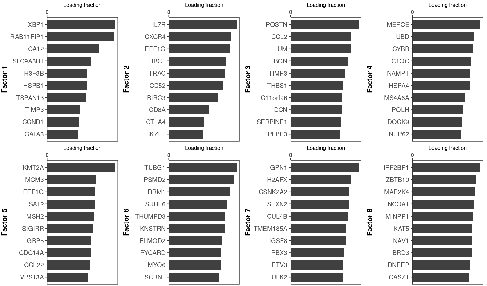

The stability plot summarizes how reproducible the factors were across
NMF starts. High-importance, high-stability factors are usually easiest
to interpret.

The stability plot shows the matched gene-ownership correlation of each
factor across independent NMF restarts (near zero for unrelated factors,
above 0.3 for reproducibly re-found ones). Factor importance (the
x-axis, echoed by dot size) is the share of all assigned molecules that
carry the factor’s label, so large dots mark factors that dominate the
tissue-wide signal.

``` r
fit$plot_stability()
```

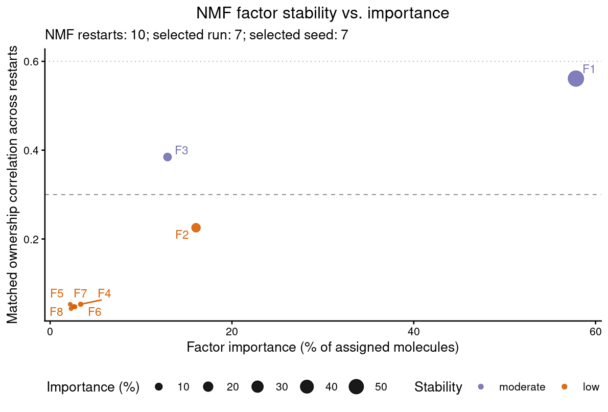

## Admixture Audit

Before correcting anything, the audit estimates each ordered cell-type
pair’s admixture rate — the percent of the target type’s molecules that
leaked in from the source — using only the spatial exposure structure of
the data. It frames what the cleanup below should fix, and the same
audit object verifies the correction afterwards.

``` r
audit <- fit$audit_admixture()
audit$plot_map()
```

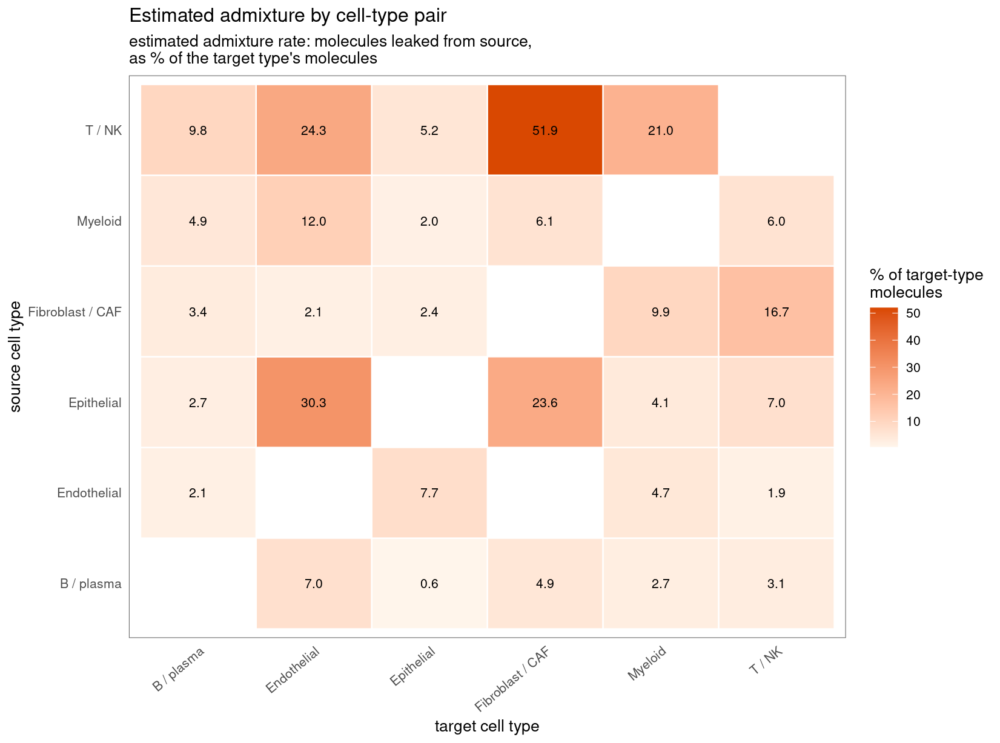

## Tissue Context

For the side visualizations below, merge cell-level factor summaries
with the provisional cell-type and domain annotations.

``` r
cell_factors <- fit$cell_factors()
cell_spatial <- merge(cell_factors,
  annotation[, c("cell_id", "merged_annotation", "cluster_label")],
  by = "cell_id", all.x = FALSE, sort = FALSE)
cell_spatial <- merge(cell_spatial,
  domain_annotation[, c("cell_id", "domain_label")],
  by = "cell_id", all.x = FALSE, sort = FALSE)
cell_spatial$domain_label <- factor(cell_spatial$domain_label,
  levels = c("immune_rich", "tumor_epithelial"))
```

``` r
celladmix_plot_spatial(cell_spatial, color_by = "merged_annotation",
  point_size = 0.06) +
  ggtitle("Cell type annotation")
```

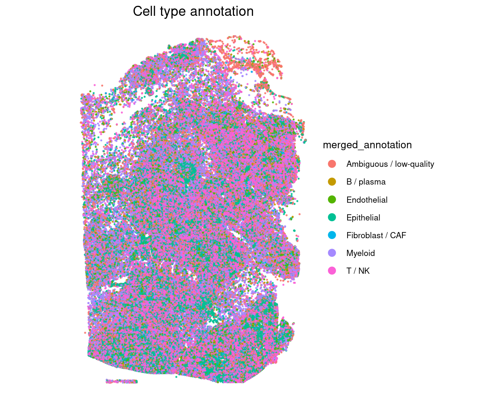

``` r
cowplot::plot_grid(plotlist = list(
  celladmix_plot_spatial(cell_spatial, color_by = "domain_label",
    point_size = 0.06) +
    ggtitle("Coarse tissue domains"),
  celladmix_plot_spatial(cell_spatial, color_by = "dominant_factor",
    point_size = 0.06) +
    ggtitle("Dominant cellAdmix factor")
), ncol = 2, align = "hv", axis = "tblr")
```

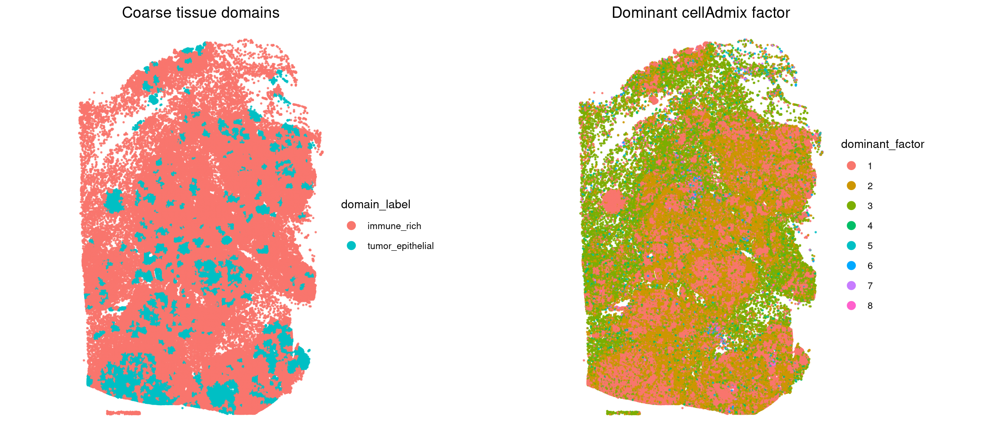

## Diagnostic Setup

Correction is run for all annotated cell types. To keep the follow-up
plots readable, the diagnostic DE panels focus on the two large
populations whose dominant admixture sources membrane scoring calls well
— epithelial cells (which receive heavy immune leakage) and myeloid
cells (which receive epithelial leakage). The stain-weak
stromal/vascular types, whose admixture the current corrections cannot
handle safely, are examined separately in the bridge section below. The
marker sets highlight likely source signatures that may appear as
admixture in the target cells.

``` r
diagnostic_cell_types <- c("Epithelial", "Myeloid")

epithelial_tumor_markers <- c("EPCAM", "KRT8", "KRT18", "KRT19", "MUC1",
  "GATA3", "CA12", "XBP1", "ERBB2")
lymphoid_myeloid_markers <- c("TRAC", "TRBC1", "CD3D", "CD3E", "CD8A",
  "IL7R", "MS4A1", "CD79A", "AIF1", "C1QC", "MS4A6A", "ITGAX")
source_marker_sets <- list(
  "epithelial/tumor source" = epithelial_tumor_markers,
  "immune source" = lymphoid_myeloid_markers
)
```

The baseline DE comparison contrasts the tumor-epithelial domain against
the immune-rich domain within each diagnostic cell type. This is an
illustrative diagnostic, not a curated biological benchmark.

``` r
original_counts <- fit$counts()
diagnostic_de_original <- celladmix_de_by_group(original_counts, cell_spatial,
  subset_by = "merged_annotation", subsets = diagnostic_cell_types,
  group_by = "domain_label", contrast = c("tumor_epithelial", "immune_rich"))
```

``` r
baseline_volcano_plots <- lapply(diagnostic_cell_types, function(target_type) {
  de <- diagnostic_de_original[[target_type]]
  celladmix_plot_volcano(de, markers = source_marker_sets,
    title = paste(target_type, "before cleanup"),
    subtitle = sprintf("logFC = tumor_epithelial / immune_rich; n = %d / %d",
      unique(de$n_group_a), unique(de$n_group_b)))
})
cowplot::plot_grid(plotlist = baseline_volcano_plots,
  ncol = length(baseline_volcano_plots), align = "hv", axis = "tblr")
```

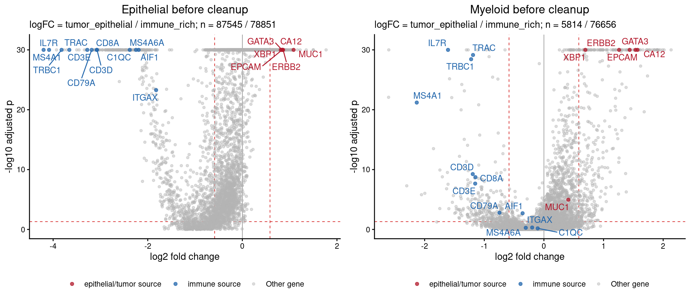

## Membrane Scoring

Membrane scoring asks whether target-cell molecules assigned to a factor
are enriched along membrane-stain paths facing a candidate source cell
type.

``` r
p_thresh <- 0.1
score_pairs_width <- 9.6
score_pairs_height <- max(6, ceiling(fit$rank / 2) * 4.9)
```

``` r
membrane_score <- fit$score_membrane()
```

The factor annotation identifies likely factor source cell types and
significant target cell types. Correction rules say which factor/target
combinations will be removed.

``` r
membrane_annotation <- membrane_score$annotation(p_thresh = p_thresh)
membrane_rules <- membrane_score$rules(p_thresh = p_thresh)

head(membrane_rules[, c("factor", "source_cell_type", "target_cell_type", "p_value")])
```

    ##   factor source_cell_type target_cell_type      p_value
    ## 1      1       Epithelial       B / plasma 0.0112455893
    ## 2      1       Epithelial          Myeloid 0.0013268278
    ## 3      1       Epithelial           T / NK 0.0516748007
    ## 4      2           T / NK       B / plasma 0.0001398496
    ## 5      2           T / NK      Endothelial 0.0929827433
    ## 6      2           T / NK       Epithelial 0.0435733040

The heatmap shows factor-by-cell-type evidence, with symbols marking
inferred source and cleanup target calls.

``` r
membrane_score$plot_heatmap(p_thresh = p_thresh)
```

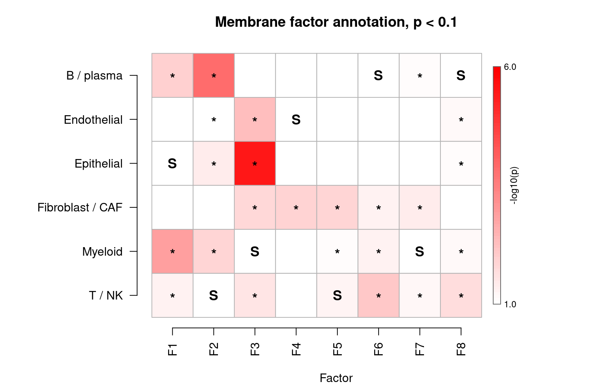

The pair plots show one factor at a time. The top margin shows source
evidence; the main heatmap shows target significance for source-target
cell-type pairs.

``` r
membrane_score$plot_pairs()
```

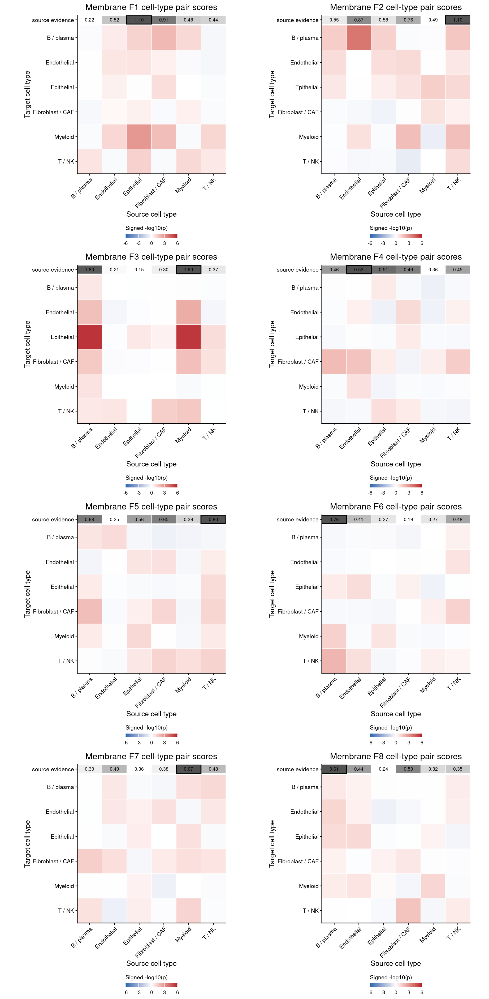

## Example Cells

These examples show the molecule-level interpretation for selected
diagnostic cells before cleanup. The examples are chosen from cells with
strong rule-supported membrane-score evidence. Molecule colors show the
native factor set in blue, the top putative admixture factor in red, and
other non-native factors in orange. Source-marker molecules are drawn
slightly larger.

``` r
example_cells <- membrane_score$examples(rules = membrane_rules,
  score_annotation = membrane_annotation, cell_data = cell_spatial,
  targets = diagnostic_cell_types, n_per_target = 4)

for (cell_type in diagnostic_cell_types) {
  type_examples <- example_cells[example_cells$target_cell_type == cell_type, , drop = FALSE]
  print(membrane_score$plot_examples(type_examples,
    score_annotation = membrane_annotation, cell_data = cell_spatial,
    markers = unique(unlist(source_marker_sets)), ncol = 2))
}
```

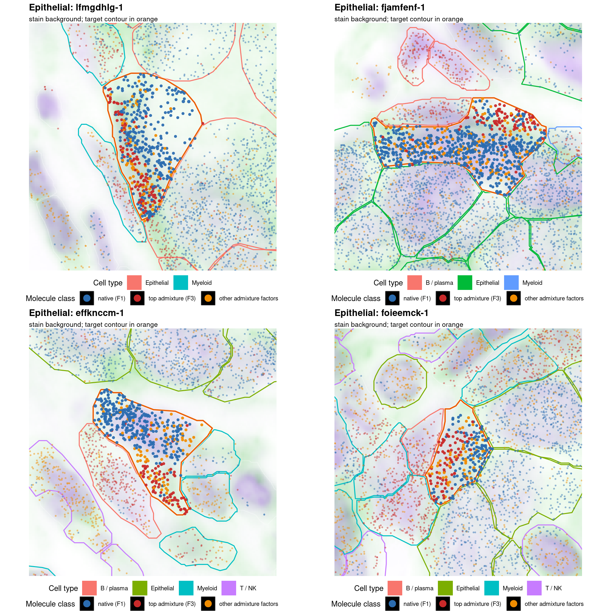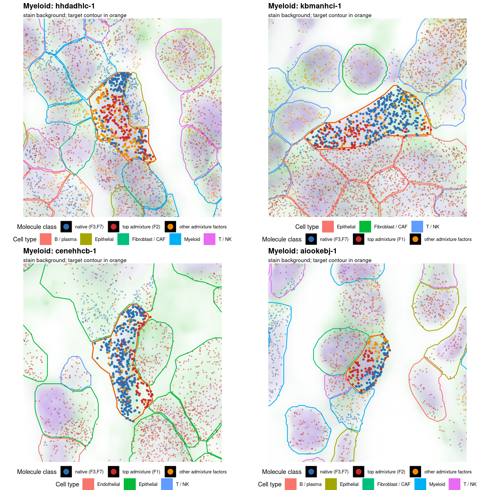

## Cleanup

Apply all membrane-derived correction rules across all annotated cell
types. With the default multi-restart fit this is the molecule-vote
ensemble: each restart member is scored and vetted independently, and a
molecule is removed only when at least 30% of the members agree (3 of 10
here). The corrected counts are then used for diagnostic plots.

``` r
membrane_correction <- membrane_score$correct(rules = membrane_rules,
  name = "membrane_clean")
```

    ## Ensemble correction over 10 members: molecules removed by >= 3 members (vote >= 0.30) are dropped (14,239,573 molecules).

``` r
membrane_counts <- membrane_correction$counts()

membrane_correction$summary()
```

    ##          cell_type n_cells n_modified_cells fraction_cells_modified
    ## 1              all  688099           411726               0.5983529
    ## 2       B / plasma   25711            25242               0.9817588
    ## 3      Endothelial   18016            17848               0.9906750
    ## 4       Epithelial  166396           166309               0.9994772
    ## 5 Fibroblast / CAF   11279            11160               0.9894494
    ## 6          Myeloid   82470            81074               0.9830726
    ## 7           T / NK  118803           110093               0.9266854
    ## 8          unknown  265424                0               0.0000000
    ##   molecules_before molecules_after molecules_removed fraction_molecules_removed
    ## 1         82144903        67905330          14239573                  0.1733470
    ## 2          3831465         3224021            607444                  0.1585409
    ## 3          1275509          677674            597835                  0.4687031
    ## 4         50582711        42750224           7832487                  0.1548451
    ## 5           851651          400294            451357                  0.5299788
    ## 6          9109012         5790325           3318687                  0.3643301
    ## 7          8530598         7098835           1431763                  0.1678385
    ## 8          7963957         7963957                 0                  0.0000000
    ##   median_removed_per_modified_cell median_fraction_removed_per_modified_cell
    ## 1                               27                                0.12536443
    ## 2                               17                                0.10256410
    ## 3                               27                                0.47826087
    ## 4                               41                                0.11674009
    ## 5                               37                                0.64556962
    ## 6                               32                                0.39461530
    ## 7                                5                                0.07843137
    ## 8                                0                                0.00000000

``` r
membrane_de <- celladmix_de_by_group(membrane_counts, cell_spatial,
  subset_by = "merged_annotation", subsets = diagnostic_cell_types,
  group_by = "domain_label", contrast = c("tumor_epithelial", "immune_rich"))
```

## Cleanup Diagnostics

This boxplot summarizes how many molecules were removed from modified
cells.

``` r
membrane_correction$plot_removed_molecules()
```

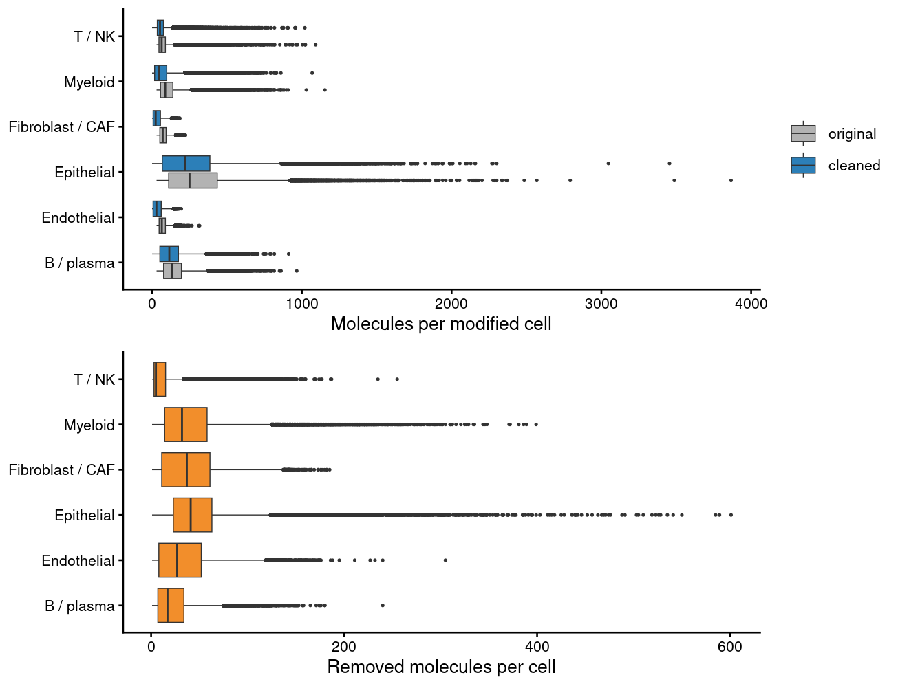

The audit verifies the cleanup against the same exposure measurements:
the report gives per-pair sensitivity and the own-marker false-removal
rate, and the panels show the estimated admixture remaining and the
pooled exposure profile before and after cleanup. The evaluation warns
that the correction removed about half of Fibroblast / CAF’s own-marker
molecules, and that several pairs remain uncovered — both are early
signs of the stain-weak-type problem examined in the bridge section
below.

``` r
report <- audit$evaluate(membrane_correction)
```

    ## Warning: Correction removed 52% of Fibroblast / CAF's own-marker molecules -
    ## severe over-removal of near-surely-genuine expression

    ## Warning: Detected ~27,107 admixed molecules from B / plasma into Fibroblast /
    ## CAF, but no removal rule covers this pair

    ## Warning: Detected ~224,819 admixed molecules from B / plasma into Myeloid, but
    ## no removal rule covers this pair

    ## Warning: Detected ~888,042 admixed molecules from Endothelial into Epithelial,
    ## but no removal rule covers this pair

    ## Warning: Detected ~62,750 admixed molecules from Endothelial into Myeloid, but
    ## no removal rule covers this pair

    ## Warning: Detected ~67,365 admixed molecules from Endothelial into T / NK, but
    ## no removal rule covers this pair

    ## Warning: Detected ~96,102 admixed molecules from Epithelial into B / plasma,
    ## but no removal rule covers this pair

    ## Warning: Detected ~372,852 admixed molecules from Epithelial into Endothelial,
    ## but no removal rule covers this pair

    ## Warning: Detected ~197,536 admixed molecules from Epithelial into Fibroblast /
    ## CAF, but no removal rule covers this pair

    ## Warning: Detected ~64,175 admixed molecules from Fibroblast / CAF into
    ## Epithelial, but no removal rule covers this pair

    ## Warning: Detected ~96,492 admixed molecules from Fibroblast / CAF into Myeloid,
    ## but no removal rule covers this pair

    ## Warning: Detected ~89,672 admixed molecules from Fibroblast / CAF into T / NK,
    ## but no removal rule covers this pair

    ## Warning: Detected ~154,151 admixed molecules from Myeloid into B / plasma, but
    ## no removal rule covers this pair

``` r
report$summary()
```

    ## $detected_pairs
    ## [1] 29
    ## 
    ## $estimated_admixed_molecules
    ## [1] 10267159
    ## 
    ## $leakage_removed_overall
    ## [1] 0.7312333
    ## 
    ## $median_pair_sensitivity
    ## [1] 0.9830171
    ## 
    ## $own_marker_false_removal
    ## [1] 0.01857293
    ## 
    ## $worst_false_removal
    ## [1] "Fibroblast / CAF"

``` r
cowplot::plot_grid(
  audit$plot_remaining(list(corrected = membrane_correction)),
  audit$plot_exposure(correction = membrane_correction),
  ncol = 2, align = "hv", axis = "tblr")
```

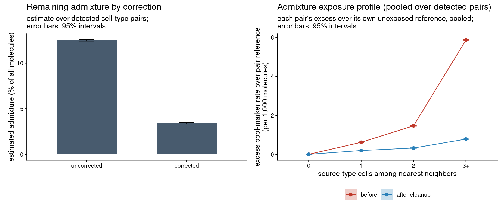

Marker-expression plots show how source-marker expression changed after
cleanup in the two diagnostic cell types.

``` r
plots <- lapply(diagnostic_cell_types, function(cell_type) {
  cells <- cell_spatial$cell_id[cell_spatial$merged_annotation == cell_type]
  celladmix_plot_marker_expression(original_counts, membrane_counts,
    cells = cells, markers = source_marker_sets) +
    ggtitle(cell_type)
})
cowplot::plot_grid(plotlist = plots, ncol = length(plots), align = "hv", axis = "tblr")
```

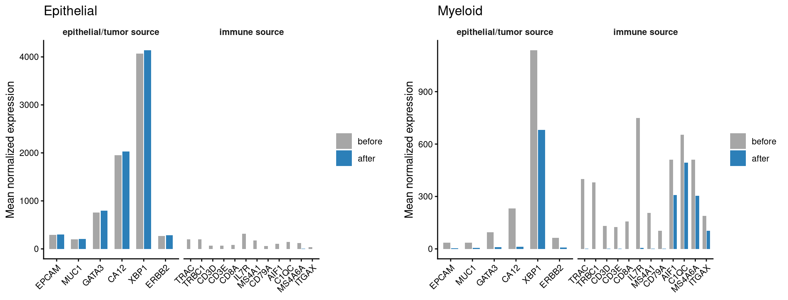

Volcano plots show the diagnostic domain comparison before and after
cleanup.

``` r
for (target_type in diagnostic_cell_types) {
  p_before <- celladmix_plot_volcano(diagnostic_de_original[[target_type]],
    markers = source_marker_sets, title = paste(target_type, "before cleanup")) +
    theme(legend.position = "none")
  p_after <- celladmix_plot_volcano(membrane_de[[target_type]],
    markers = source_marker_sets, title = paste(target_type, "after membrane cleanup"))
  print(cowplot::plot_grid(plotlist = list(p_before, p_after),
    ncol = 2, align = "hv", axis = "tblr"))
}
```

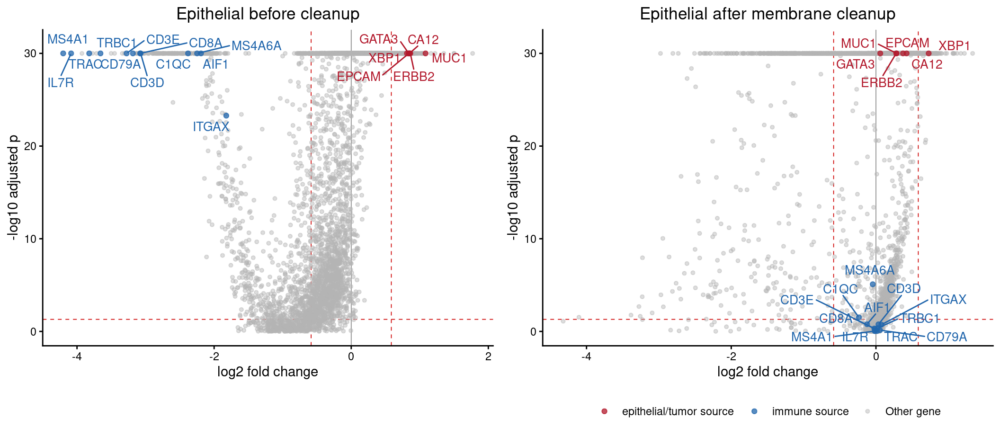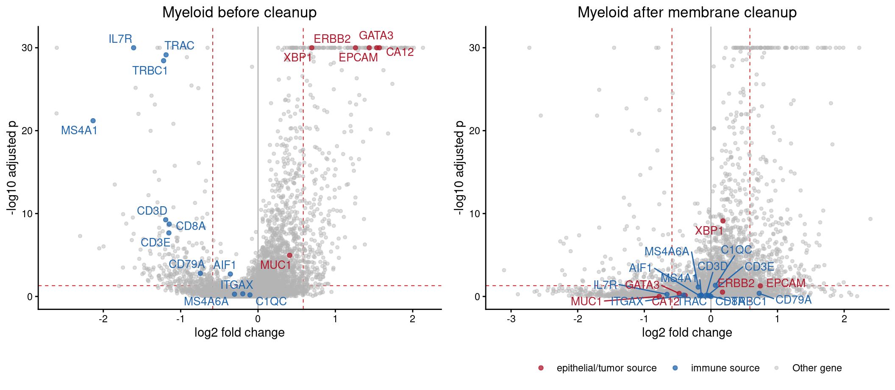

The p-value shift plots compare signed DE significance before and after
cleanup. Genes below the diagonal are less significant after correction.

``` r
plots <- lapply(diagnostic_cell_types, function(target_type) {
  celladmix_plot_de_shift(diagnostic_de_original[[target_type]], membrane_de[[target_type]],
    markers = source_marker_sets, title = paste("Membrane", target_type, "p-value shift"))
})
cowplot::plot_grid(plotlist = plots, ncol = length(plots), align = "hv", axis = "tblr")
```

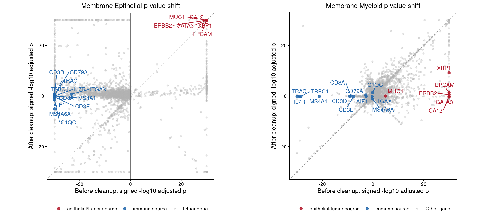

## Bridge Scoring and Its Limits on Stain-Weak Targets

The audit warnings above flag large pairs that membrane scoring issued
no rule for — most prominently endothelial leakage into epithelial cells
(\~888k estimated molecules) and the reciprocal epithelial leakage into
endothelial and fibroblast cells. Membrane scoring depends on stain-path
contrast along molecule-to-centroid lines, which is weak for thin,
elongated cell types such as endothelium and fibroblasts. Bridge scoring
uses molecule adjacency instead of the stain image and pairs best with
the `ls_nmf` factorization (see
[docs/benchmarks.md](../../docs/benchmarks.md)). It detects these pairs
decisively — but, as shown below, it cannot correct them safely on this
dataset, and the reason is instructive.

``` r
fit_ls <- ds$fit()
```

    ## Reusing cached run fit_manual_rank8_ls_nmf (parameters match)

``` r
bridge_score <- fit_ls$score_bridge()
bridge_rules <- bridge_score$rules(p_thresh = p_thresh)
```

Applying the bridge rules, however, exposes a factorization-level
failure mode: the over-removal guardrails fire, reporting that
endothelial and fibroblast cells lose essentially *all* of their
molecules:

``` r
bridge_correction <- bridge_score$correct(rules = bridge_rules,
  name = "bridge_clean")
```

    ## Ensemble correction over 10 members: molecules removed by >= 3 members (vote >= 0.30) are dropped (10,770,358 molecules).

    ## Warning: Correction removed 100% of all molecules from Endothelial - this is
    ## likely erasing native expression (does the factorization have a native factor
    ## for this type?)

    ## Warning: Correction removed 100% of all molecules from Fibroblast / CAF - this
    ## is likely erasing native expression (does the factorization have a native
    ## factor for this type?)

The mechanism: the rank-8 `ls_nmf` fit collapses to a few active
factors, none of them native to the small endothelial and fibroblast
populations. Each bridge rule is individually legitimate — endothelial
cells genuinely carry heavy epithelial and immune leakage, and each rule
passes the native-factor check against cells distant from *its own*
source — but with no native factor to hold the genuinely endothelial
molecules, the union of the rules covers the type’s entire factor
spectrum, and the correction erases the cell type instead of cleaning
it.

The per-pair diagnostics make the trade-off visible. On the leakage side
the bridge correction looks competitive — sensitivity is blind to
over-removal by construction:

``` r
bridge_report <- audit$evaluate(bridge_correction)

cowplot::plot_grid(
  report$plot_cleanup() + ggtitle("Membrane (invsqrt_kl)"),
  bridge_report$plot_cleanup() + ggtitle("Bridge (ls_nmf)"),
  ncol = 2, align = "hv", axis = "tblr")
```

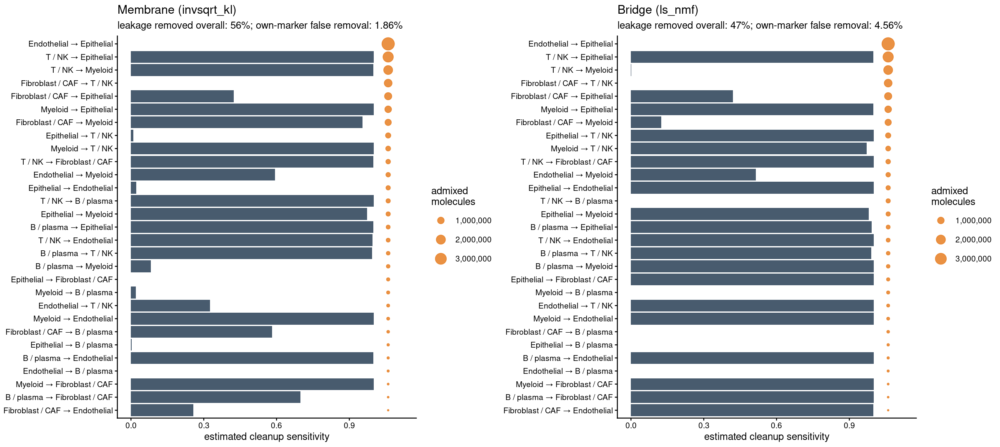

The difference shows in how much near-surely-genuine expression each
correction retains per cell type (left) — the bridge correction’s
erasure of the stain-weak types — while the overall admixture burden
removed (right) stays similar:

``` r
retention <- rbind(
  transform(report$false_removal(), correction = "membrane (invsqrt_kl)"),
  transform(bridge_report$false_removal(), correction = "bridge (ls_nmf)"))
retention$correction <- factor(retention$correction,
  levels = c("membrane (invsqrt_kl)", "bridge (ls_nmf)"))

cowplot::plot_grid(
  ggplot(retention, aes(cell_type, 1 - false_removal, fill = correction)) +
    geom_col(position = "dodge") +
    scale_fill_manual(values = c("#34495e", "#c0392b")) +
    labs(x = NULL, y = "own-marker molecules retained",
      title = "Retention of near-surely-genuine expression") +
    theme_classic(base_size = 10) +
    theme(axis.text.x = element_text(angle = 30, hjust = 1),
      legend.position = "bottom", legend.title = element_blank()),
  audit$plot_remaining(list(
    `membrane\n(invsqrt_kl)` = membrane_correction,
    `bridge\n(ls_nmf)` = bridge_correction)),
  ncol = 2, rel_widths = c(1.45, 1), align = "hv", axis = "tblr")
```

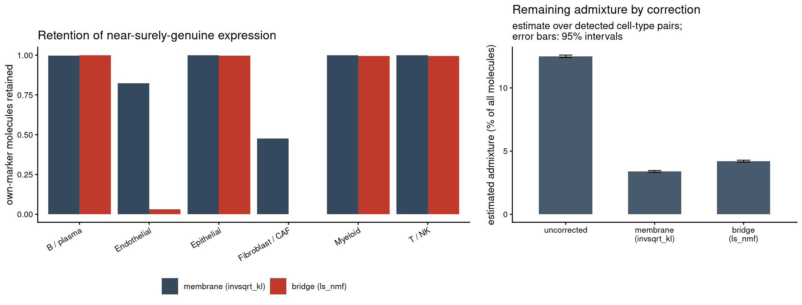

The bottom line for this dataset: membrane scoring cannot see the
epithelial leakage into these thin, stain-weak cell types, and bridge
scoring sees it but cannot separate it, because the factorization never
formed native endothelial or fibroblast factors. Correcting these pairs
safely requires factorization-level remedies (a rank that resolves the
small types, or anchor-based factor recovery — see
[docs/benchmarks.md](../../docs/benchmarks.md)). Downstream analysis in
this notebook therefore proceeds with the membrane correction, and the
endothelial and fibroblast admixture flagged by the audit should be kept
in mind when interpreting those cell types.

## Cell-State UMAP Before and After Cleanup

As a compact global diagnostic, compute cell-state UMAPs from sparse
cell-level counts before and after the membrane cleanup (the correction
retained for downstream use here — see the bridge section above for why
the bridge correction is not applied). The two UMAPs are independent
embeddings, so the exact coordinates are not meant to align; the
comparison asks whether the corrected counts produce clearer annotation
separation.

``` r
state_cells_max <- 5000
original_state <- ds$cell_state_umap(cells_max = state_cells_max,
  min_molecules = 30, min_genes = 15, verbose = TRUE)
```

    ## [INFO 21:22:08 +0.003s] Reused compatible Xenium input store (0.000s)
    ## [INFO 21:22:08 +0.003s] Built Xenium input store: 82144903 molecules, 688099 cells (0.003s)
    ## [INFO 21:22:11 +2.852s] Loaded input-store cell-gene counts: 688099 cells (2.852s)
    ## [INFO 21:22:11 +2.991s] Indexed cell counts: 470549 eligible cells (min_molecules=30, min_genes=15) (0.139s)
    ## [INFO 21:22:11 +3.222s] Selected clustering cells: 5000 cells (0.231s)
    ## [INFO 21:22:11 +3.241s] Loaded sparse cell-gene counts: 776043 non-zero entries (0.018s)
    ## [INFO 21:22:11 +3.263s] Selected variable genes: 1000 genes (0.022s)
    ## [INFO 21:22:11 +3.311s] Materialized dense clustering matrix: 1000 x 5000 (0.048s)
    ## [INFO 21:22:12 +4.107s] Computed cell PCA: 30 x 5000 (0.796s)
    ## [INFO 21:22:12 +4.379s] Built HNSW cell KNN graph: 75000 directed edges using 10 thread(s); reusing 15 cosine-distance neighbors for UMAP (0.272s)
    ## [INFO 21:22:12 +4.393s] Ran Louvain clustering (0.015s)
    ## [INFO 21:22:12 +4.440s] Initialized UMAP layout (0.046s)
    ## [INFO 21:22:17 +9.495s] Optimized UMAP layout with parallel optimization (5.055s)
    ## [INFO 21:22:17 +9.495s] Computed cell UMAP (5.101s)
    ## [INFO 21:22:17 +9.497s] Assembled cell clustering result (0.002s)
    ## [INFO 21:22:17 +9.497s] Finished store-backed cell clustering (6.645s)
    ## [INFO 21:22:17 +9.506s] Wrote cell clustering outputs (0.009s)

``` r
corrected_state <- membrane_correction$cell_state_umap(cells_max = state_cells_max,
  min_molecules = 30, min_genes = 15, verbose = TRUE)
```

    ## [INFO 21:22:36 +18.821s] Loaded run cell-gene counts: 688099 cells (18.821s)
    ## [INFO 21:22:36 +18.938s] Indexed cell counts: 368117 eligible cells (min_molecules=30, min_genes=15) (0.117s)
    ## [INFO 21:22:36 +19.127s] Selected clustering cells: 5000 cells (0.189s)
    ## [INFO 21:22:36 +19.159s] Loaded sparse cell-gene counts: 761964 non-zero entries (0.032s)
    ## [INFO 21:22:36 +19.184s] Selected variable genes: 1000 genes (0.025s)
    ## [INFO 21:22:37 +19.233s] Materialized dense clustering matrix: 1000 x 5000 (0.049s)
    ## [INFO 21:22:37 +20.110s] Computed cell PCA: 30 x 5000 (0.877s)
    ## [INFO 21:22:38 +20.354s] Built HNSW cell KNN graph: 75000 directed edges using 10 thread(s); reusing 15 cosine-distance neighbors for UMAP (0.244s)
    ## [INFO 21:22:38 +20.421s] Ran Louvain clustering (0.067s)
    ## [INFO 21:22:38 +20.464s] Initialized UMAP layout (0.043s)
    ## [INFO 21:22:44 +26.577s] Optimized UMAP layout with parallel optimization (6.113s)
    ## [INFO 21:22:44 +26.577s] Computed cell UMAP (6.156s)
    ## [INFO 21:22:44 +26.579s] Assembled cell clustering result (0.002s)
    ## [INFO 21:22:44 +26.579s] Finished run-count cell-state embedding (7.757s)

``` r
cell_type_levels <- sort(unique(cell_annotation))
cell_type_palette <- setNames(grDevices::hcl.colors(length(cell_type_levels), "Dark 3"),
  cell_type_levels)
original_state$cell_type <- factor(original_state$cell_type, levels = cell_type_levels)
corrected_state$cell_type <- factor(corrected_state$cell_type, levels = cell_type_levels)
```

``` r
state_umap_limits <- function(...) {
  frames <- list(...)
  x <- unlist(lapply(frames, `[[`, "umap_1"))
  y <- unlist(lapply(frames, `[[`, "umap_2"))
  span <- max(diff(range(x, na.rm = TRUE)), diff(range(y, na.rm = TRUE)))
  xmid <- mean(range(x, na.rm = TRUE))
  ymid <- mean(range(y, na.rm = TRUE))
  pad <- span * 0.04
  list(xlim = xmid + c(-1, 1) * (span / 2 + pad),
    ylim = ymid + c(-1, 1) * (span / 2 + pad))
}

plot_state_umap <- function(df, title, limits) {
  ggplot(df, aes(umap_1, umap_2, color = cell_type)) +
    geom_point(size = 0.55, alpha = 0.75) +
    coord_equal(xlim = limits$xlim, ylim = limits$ylim) +
    scale_color_manual(values = cell_type_palette, drop = FALSE) +
    labs(title = title, x = "UMAP 1", y = "UMAP 2", color = "Cell type") +
    theme_classic(base_size = 10) +
    guides(color = guide_legend(override.aes = list(size = 3.2, alpha = 1))) +
    theme(legend.position = "right")
}

limits <- state_umap_limits(original_state, corrected_state)
cowplot::plot_grid(plotlist = list(
  plot_state_umap(original_state, "Original counts", limits),
  plot_state_umap(corrected_state, "Membrane-corrected counts", limits)
), ncol = 2, align = "hv", axis = "tblr")
```

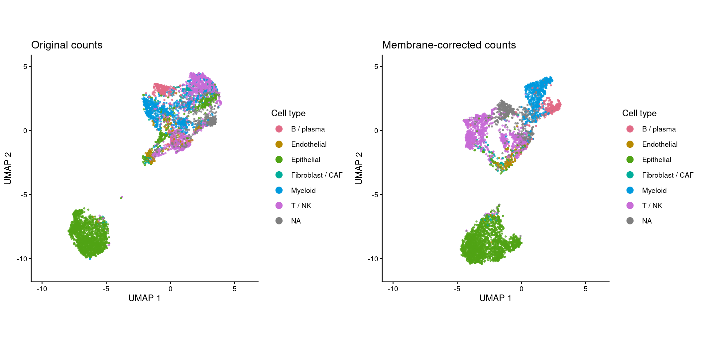
