Xenium Breast 5K Medium Crop: cellAdmix Membrane Scoring
================

-   <a href="#overview" id="toc-overview">Overview</a>
-   <a href="#inputs-and-crop" id="toc-inputs-and-crop">Inputs and Crop</a>
-   <a href="#fit-factors" id="toc-fit-factors">Fit Factors</a>
-   <a href="#admixture-audit" id="toc-admixture-audit">Admixture Audit</a>
-   <a href="#tissue-context" id="toc-tissue-context">Tissue Context</a>
-   <a href="#diagnostic-setup" id="toc-diagnostic-setup">Diagnostic
    Setup</a>
-   <a href="#membrane-scoring" id="toc-membrane-scoring">Membrane
    Scoring</a>
-   <a href="#example-cells" id="toc-example-cells">Example Cells</a>
-   <a href="#cleanup-diagnostics" id="toc-cleanup-diagnostics">Cleanup
    Diagnostics</a>
-   <a href="#cell-state-umap-before-and-after-cleanup"
    id="toc-cell-state-umap-before-and-after-cleanup">Cell-State UMAP Before
    and After Cleanup</a>

## Overview

This is a medium-crop version of the breast 5K membrane-scoring
notebook, meant for fast iteration on content, layout, and diagnostics
before rerunning the full dataset. The crop is large enough to contain
both immune-rich and tumor-epithelial domains, but much smaller than the
full 82M-molecule dataset.

## Inputs and Crop

The curated annotations ship with this example as
`annotations/annotation.csv.gz` and
`annotations/domain_annotation.csv.gz`. We keep the same annotations
here but construct a cropped cellAdmix dataset using `analysis_bbox`.

For this 5K panel we use stricter cell-complexity thresholds in the
annotation and cell-state UMAP diagnostics: `min_molecules = 30` and
`min_genes = 15`. The lower defaults produced many small low-complexity
UMAP islands in this dataset.

``` r
bundle_dir <- "data"
output_dir <- "out_medium_crop"
annotation_file <- file.path("annotations", "annotation.csv.gz")
domain_file <- file.path("annotations", "domain_annotation.csv.gz")
analysis_bbox <- c(5000, 7000, 4500, 6500)

annotation <- read.csv(annotation_file, stringsAsFactors = FALSE)
domain_annotation <- read.csv(domain_file, stringsAsFactors = FALSE)

in_crop <- annotation$cell_id %in% domain_annotation$cell_id[
  domain_annotation$x >= analysis_bbox[[1]] &
    domain_annotation$x <= analysis_bbox[[2]] &
    domain_annotation$y >= analysis_bbox[[3]] &
    domain_annotation$y <= analysis_bbox[[4]]
]
table(annotation$merged_annotation[in_crop])
```

    ## 
    ## Ambiguous / low-quality              B / plasma             Endothelial 
    ##                    3133                    1498                     810 
    ##              Epithelial        Fibroblast / CAF                 Myeloid 
    ##                   14839                     648                    3499 
    ##                  T / NK 
    ##                    7085

``` r
table(domain_annotation$domain_label[
  domain_annotation$x >= analysis_bbox[[1]] &
    domain_annotation$x <= analysis_bbox[[2]] &
    domain_annotation$y >= analysis_bbox[[3]] &
    domain_annotation$y <= analysis_bbox[[4]]
])
```

    ## 
    ##      immune_rich tumor_epithelial 
    ##            20106            11406

Cells labeled `Ambiguous / low-quality` are retained in side plots but
excluded from the active fit/scoring annotation.

``` r
cell_annotation <- setNames(annotation$merged_annotation, annotation$cell_id)
cell_annotation <- cell_annotation[cell_annotation != "Ambiguous / low-quality"]

ds <- cellAdmix(bundle_dir, output_dir = output_dir, annotation = cell_annotation,
  num_threads = 10, analysis_bbox = analysis_bbox)

ds
```

    ## cellAdmix dataset
    ##   format: xenium 
    ##   output cache: configured
    ##   threads: 10 
    ##   molecules: transcripts.parquet 
    ##   cells: cells.parquet 
    ##   annotation:manual (422675 cells, 6 labels)

## Fit Factors

The fit uses the `invsqrt_kl` NMF variant, the recommended pairing for
membrane scoring on stained data (see
[docs/benchmarks.md](../../docs/benchmarks.md)).

``` r
fit <- ds$fit(nmf_variant = "invsqrt_kl", verbose = TRUE)
```

    ## Reusing cached run fit_manual_rank8_invsqrt_kl (parameters match)

``` r
fit
```

    ## cellAdmix fit
    ##   run: fit_manual_rank8_invsqrt_kl 
    ##   annotation: manual 
    ##   rank: 8 
    ##   NMF: invsqrt_kl 
    ##   molecule scoring: gene_loadings 
    ##   cells: 34541 
    ##   transcripts: 8189365

``` r
fit$plot_loadings()
```

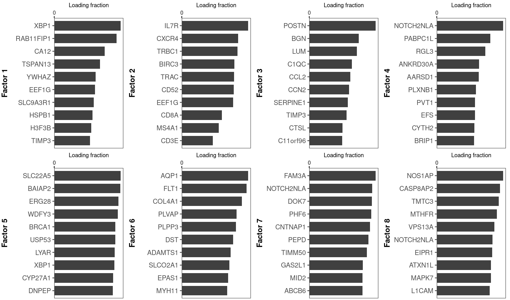

The stability plot shows the matched gene-ownership correlation of each
factor across independent NMF restarts (near zero for unrelated factors,
above 0.3 for reproducibly re-found ones). Factor importance (the
x-axis, echoed by dot size) is the share of all assigned molecules that
carry the factor’s label, so large dots mark factors that dominate the
tissue-wide signal.

``` r
fit$plot_stability()
```

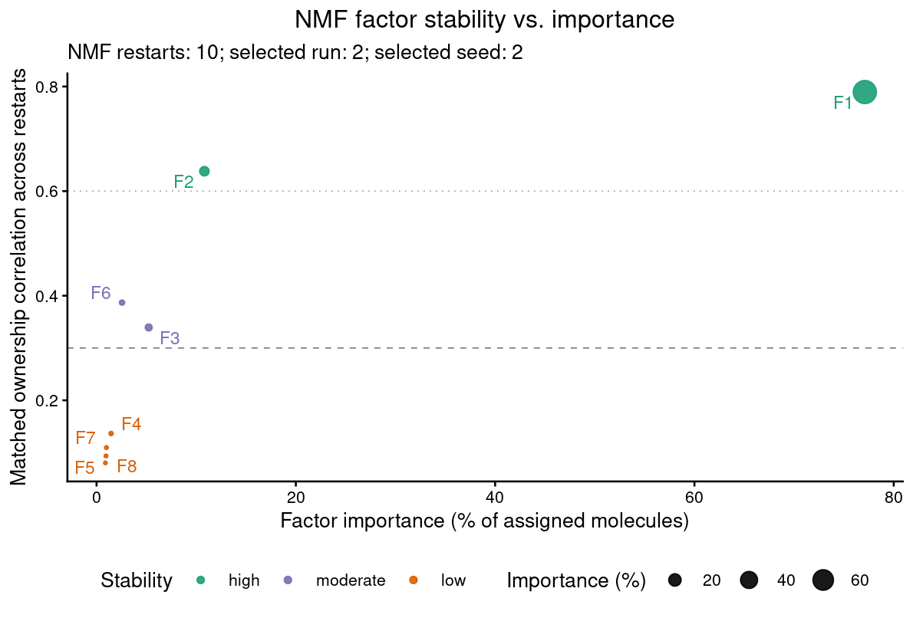

## Admixture Audit

Before correcting anything, the audit estimates each ordered cell-type
pair’s admixture rate within the crop — the percent of the target type’s
molecules that leaked in from the source — using only the spatial
exposure structure of the data.

``` r
audit <- fit$audit_admixture()
audit$plot_map()
```

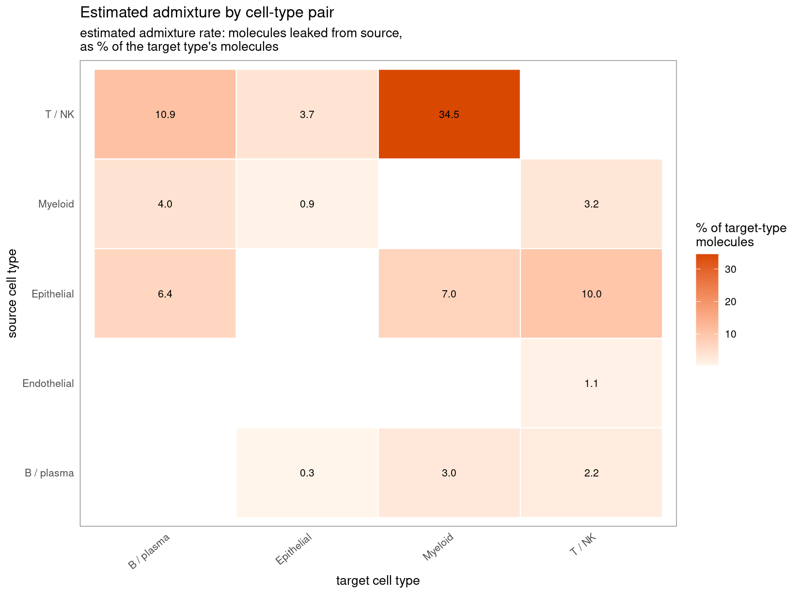

## Tissue Context

``` r
cell_factors <- fit$cell_factors()
cell_spatial <- merge(cell_factors,
  annotation[, c("cell_id", "merged_annotation", "cluster_label")],
  by = "cell_id", all.x = FALSE, sort = FALSE)
cell_spatial <- merge(cell_spatial,
  domain_annotation[, c("cell_id", "domain_label")],
  by = "cell_id", all.x = FALSE, sort = FALSE)
cell_spatial$domain_label <- factor(cell_spatial$domain_label,
  levels = c("immune_rich", "tumor_epithelial"))
```

``` r
cowplot::plot_grid(plotlist = list(
  celladmix_plot_spatial(cell_spatial, color_by = "merged_annotation",
    point_size = 0.18) +
    ggtitle("Cell type annotation"),
  celladmix_plot_spatial(cell_spatial, color_by = "domain_label",
    point_size = 0.18) +
    ggtitle("Tissue domain"),
  celladmix_plot_spatial(cell_spatial, color_by = "dominant_factor",
    point_size = 0.18) +
    ggtitle("Dominant cellAdmix factor")
), ncol = 3, align = "hv", axis = "tblr")
```

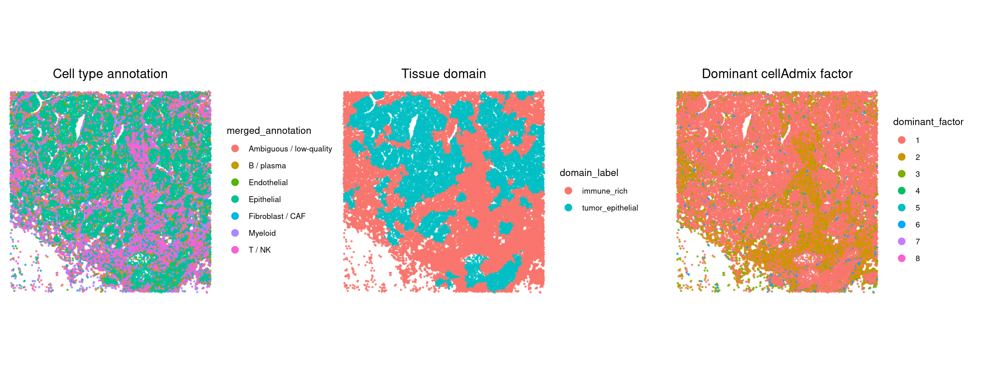

## Diagnostic Setup

``` r
diagnostic_cell_types <- c("Fibroblast / CAF", "Endothelial")

epithelial_tumor_markers <- c("EPCAM", "KRT8", "KRT18", "KRT19", "MUC1",
  "GATA3", "CA12", "XBP1", "ERBB2")
lymphoid_myeloid_markers <- c("TRAC", "TRBC1", "CD3D", "CD3E", "CD8A",
  "IL7R", "MS4A1", "CD79A", "AIF1", "C1QC", "MS4A6A", "ITGAX")
source_marker_sets <- list(
  "epithelial/tumor source" = epithelial_tumor_markers,
  "immune source" = lymphoid_myeloid_markers
)
```

``` r
original_counts <- fit$counts()
diagnostic_de_original <- celladmix_de_by_group(original_counts, cell_spatial,
  subset_by = "merged_annotation", subsets = diagnostic_cell_types,
  group_by = "domain_label", contrast = c("tumor_epithelial", "immune_rich"))
```

``` r
baseline_volcano_plots <- lapply(diagnostic_cell_types, function(target_type) {
  de <- diagnostic_de_original[[target_type]]
  celladmix_plot_volcano(de, markers = source_marker_sets,
    title = paste(target_type, "before cleanup"),
    subtitle = sprintf("logFC = tumor_epithelial / immune_rich; n = %d / %d",
      unique(de$n_group_a), unique(de$n_group_b)))
})
cowplot::plot_grid(plotlist = baseline_volcano_plots,
  ncol = length(baseline_volcano_plots), align = "hv", axis = "tblr")
```

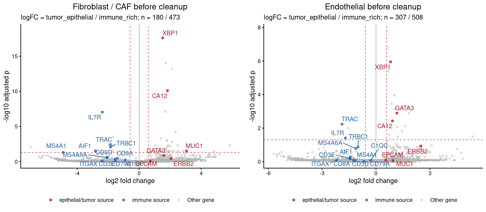

## Membrane Scoring

This crop is small enough that a permissive rule threshold can produce
broad cleanup calls. We use a stricter `p_thresh = 0.01` here to keep
the exploratory crop diagnostics interpretable before moving back to
full-dataset settings.

``` r
p_thresh <- 0.01
score_pairs_width <- 9.6
score_pairs_height <- max(6, ceiling(fit$rank / 2) * 4.9)
```

``` r
membrane_score <- fit$score_membrane()
membrane_annotation <- membrane_score$annotation(p_thresh = p_thresh)
membrane_rules <- membrane_score$rules(p_thresh = p_thresh)

head(membrane_rules[, c("factor", "source_cell_type", "target_cell_type", "p_value")])
```

    ##   factor source_cell_type target_cell_type      p_value
    ## 1      1       Epithelial       B / plasma 4.684050e-03
    ## 2      2           T / NK       B / plasma 1.531888e-04
    ## 3      2           T / NK      Endothelial 9.223030e-04
    ## 4      2           T / NK       Epithelial 7.156584e-04
    ## 5      2           T / NK          Myeloid 2.703150e-05
    ## 6      3          Myeloid       Epithelial 1.072667e-07

``` r
membrane_score$plot_heatmap(p_thresh = p_thresh)
```

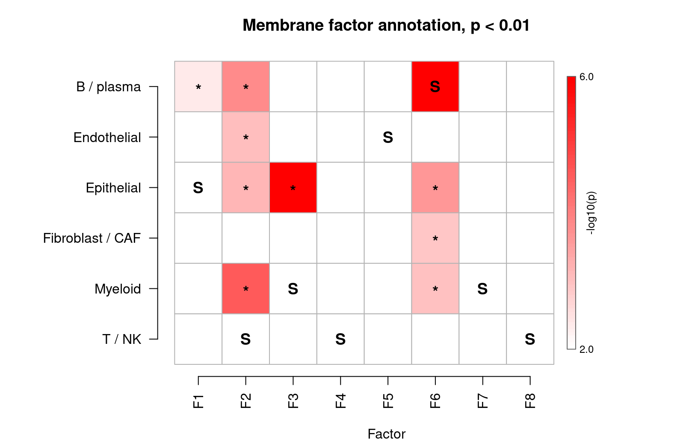

``` r
membrane_score$plot_pairs()
```

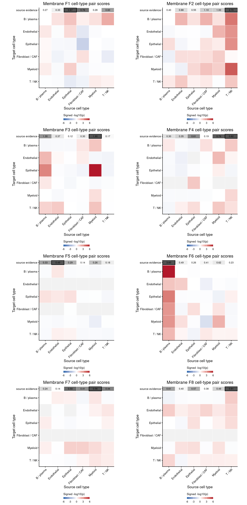

## Example Cells

These examples show the molecule-level interpretation for selected
diagnostic cells before cleanup. The examples are chosen from cells with
strong rule-supported membrane-score evidence. Molecule colors show the
native factor set in blue, the top putative admixture factor in red, and
other non-native factors in orange. Source-marker molecules are drawn
slightly larger.

``` r
example_cells <- membrane_score$examples(rules = membrane_rules,
  score_annotation = membrane_annotation, cell_data = cell_spatial,
  targets = diagnostic_cell_types, n_per_target = 4)

for (cell_type in diagnostic_cell_types) {
  type_examples <- example_cells[example_cells$target_cell_type == cell_type, , drop = FALSE]
  print(membrane_score$plot_examples(type_examples,
    score_annotation = membrane_annotation, cell_data = cell_spatial,
    markers = unique(unlist(source_marker_sets)), ncol = 2))
}
```

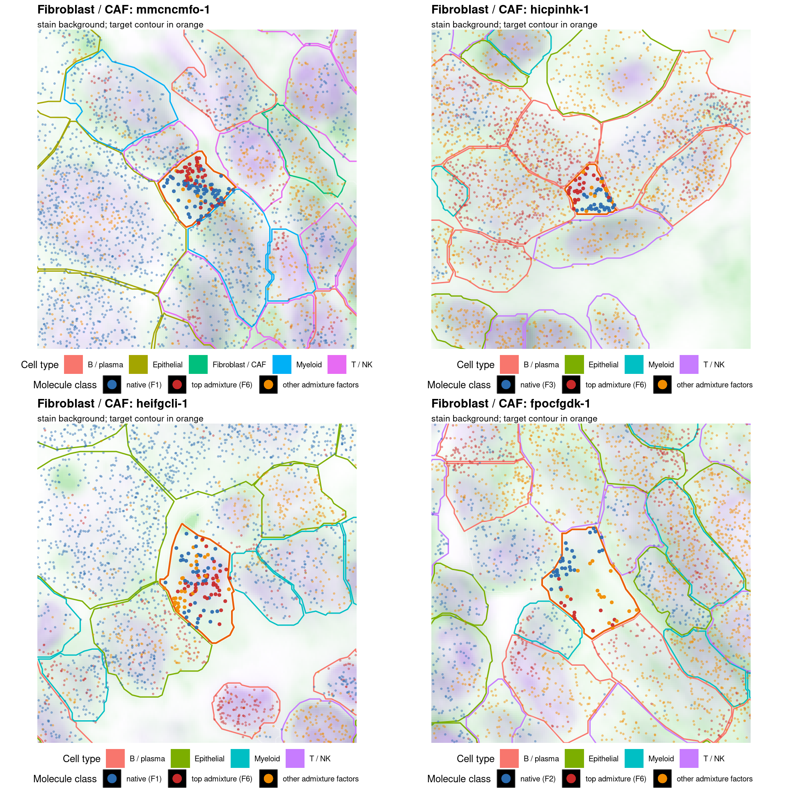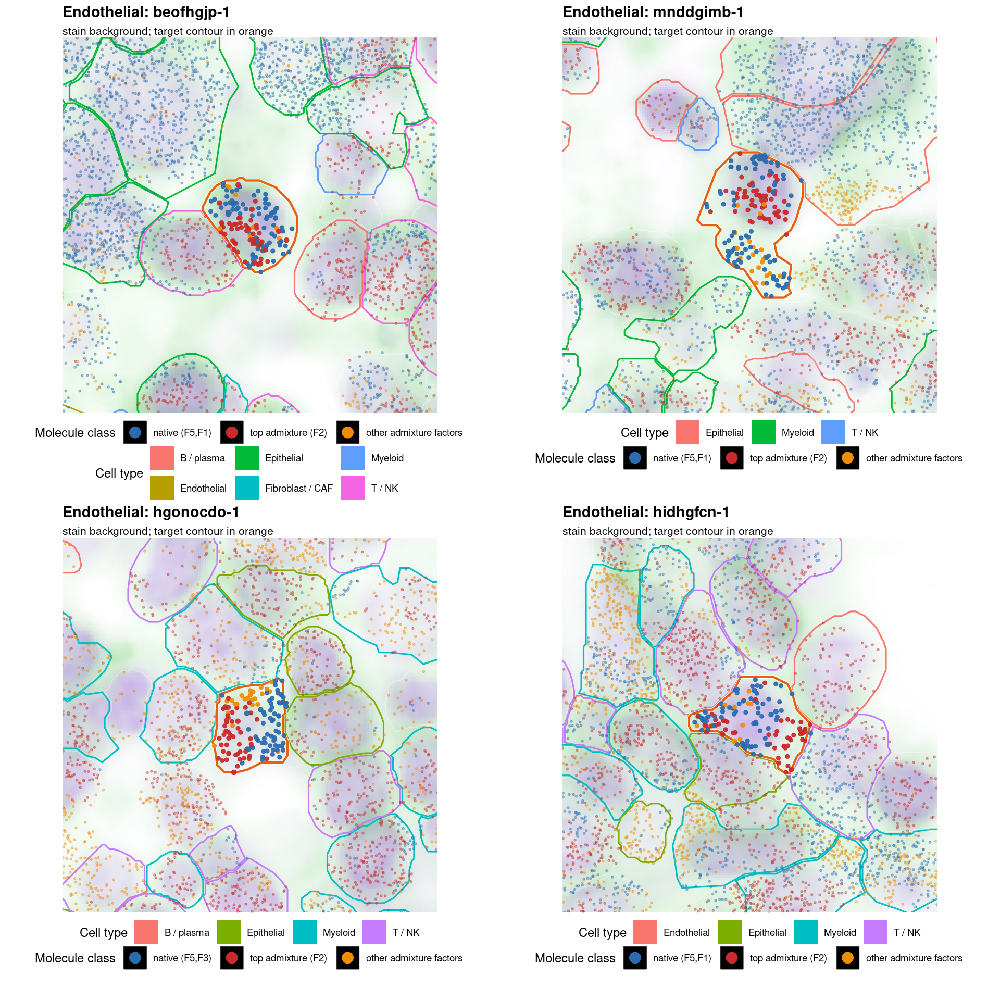

## Cleanup Diagnostics

The correction applies all membrane-derived rules; with the default
multi-restart fit it is the molecule-vote ensemble, removing a molecule
only when at least 30% of the independently scored members agree (3 of
10 here).

``` r
membrane_correction <- membrane_score$correct(rules = membrane_rules,
  name = "membrane_clean_p001")
```

    ## Ensemble correction over 10 members: molecules removed by >= 3 members (vote >= 0.30) are dropped (621,801 molecules).

``` r
membrane_counts <- membrane_correction$counts()

membrane_correction$summary()
```

    ##          cell_type n_cells n_modified_cells fraction_cells_modified
    ## 1              all   34541            20531               0.5943951
    ## 2       B / plasma    1522             1390               0.9132720
    ## 3      Endothelial     815              573               0.7030675
    ## 4       Epithelial   14953            14732               0.9852204
    ## 5 Fibroblast / CAF     653              417               0.6385911
    ## 6          Myeloid    3534             3419               0.9674590
    ## 7           T / NK    7130                0               0.0000000
    ## 8          unknown    5934                0               0.0000000
    ##   molecules_before molecules_after molecules_removed fraction_molecules_removed
    ## 1          8189365         7567564            621801                 0.07592786
    ## 2           306036          273035             33001                 0.10783372
    ## 3            64415           50501             13914                 0.21600559
    ## 4          5963412         5543389            420023                 0.07043334
    ## 5            57255           54301              2954                 0.05159375
    ## 6           495356          343447            151909                 0.30666632
    ## 7           744914          744914                 0                 0.00000000
    ## 8           557977          557977                 0                 0.00000000
    ##   median_removed_per_modified_cell median_fraction_removed_per_modified_cell
    ## 1                               20                                0.04700855
    ## 2                               13                                0.06029927
    ## 3                               11                                0.14634146
    ## 4                               19                                0.04106368
    ## 5                                2                                0.02857143
    ## 6                               34                                0.30208333
    ## 7                                0                                0.00000000
    ## 8                                0                                0.00000000

``` r
membrane_de <- celladmix_de_by_group(membrane_counts, cell_spatial,
  subset_by = "merged_annotation", subsets = diagnostic_cell_types,
  group_by = "domain_label", contrast = c("tumor_epithelial", "immune_rich"))
```

``` r
membrane_correction$plot_removed_molecules()
```

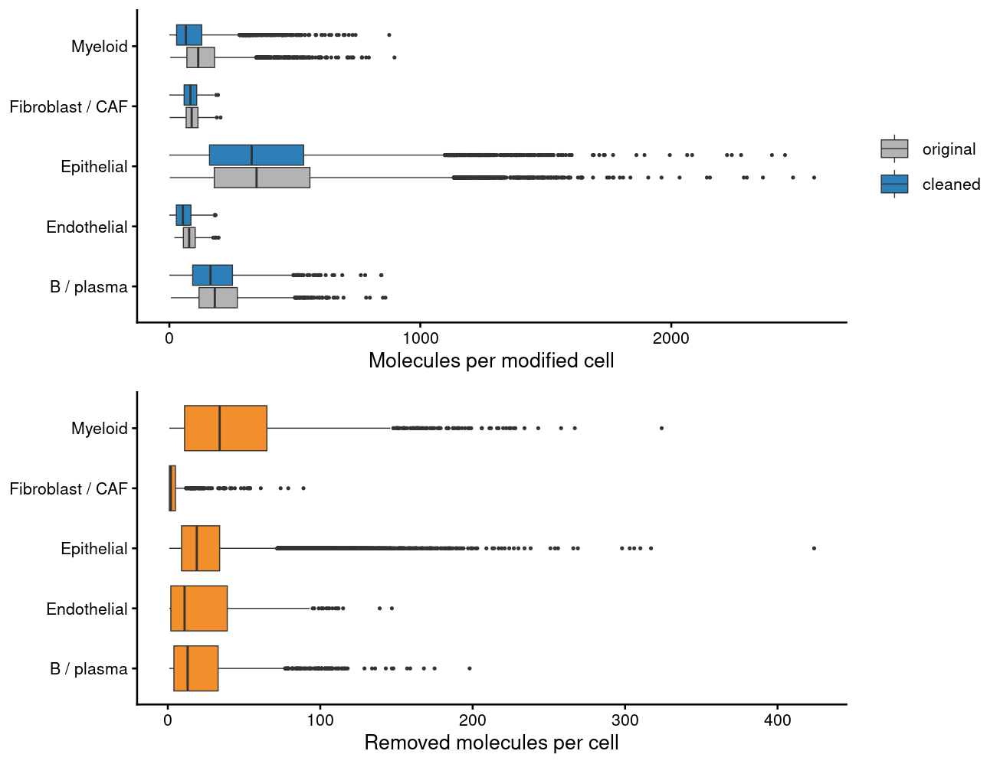

The audit verifies the cleanup against the same exposure measurements it
used to detect the admixture.

``` r
report <- audit$evaluate(membrane_correction)
```

    ## Warning: Detected ~34,755 admixed molecules from Epithelial into Myeloid, but
    ## no removal rule covers this pair

    ## Warning: Detected ~74,145 admixed molecules from Epithelial into T / NK, but no
    ## removal rule covers this pair

    ## Warning: Detected ~23,775 admixed molecules from Myeloid into T / NK, but no
    ## removal rule covers this pair

``` r
report$summary()
```

    ## $detected_pairs
    ## [1] 13
    ## 
    ## $estimated_admixed_molecules
    ## [1] 706403
    ## 
    ## $leakage_removed_overall
    ## [1] 0.7233465
    ## 
    ## $median_pair_sensitivity
    ## [1] 0.1166828
    ## 
    ## $own_marker_false_removal
    ## [1] 0.00313466
    ## 
    ## $worst_false_removal
    ## [1] "Endothelial"

``` r
cowplot::plot_grid(
  audit$plot_remaining(list(corrected = membrane_correction)),
  audit$plot_exposure(correction = membrane_correction),
  ncol = 2, align = "hv", axis = "tblr")
```

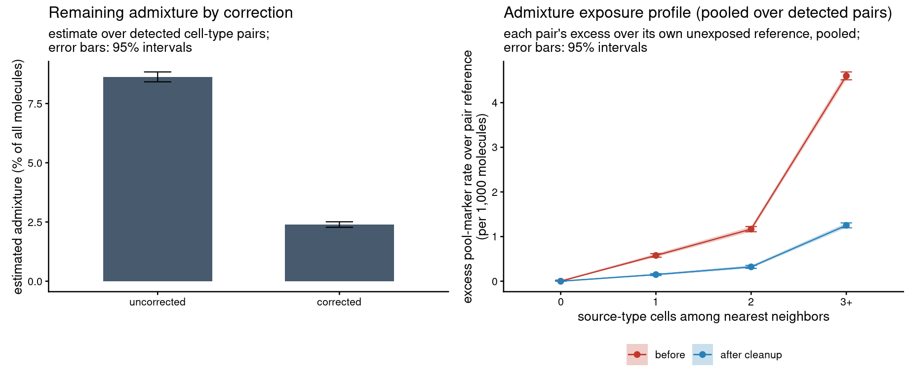

``` r
plots <- lapply(diagnostic_cell_types, function(cell_type) {
  cells <- cell_spatial$cell_id[cell_spatial$merged_annotation == cell_type]
  celladmix_plot_marker_expression(original_counts, membrane_counts,
    cells = cells, markers = source_marker_sets) +
    ggtitle(cell_type)
})
cowplot::plot_grid(plotlist = plots, ncol = length(plots), align = "hv", axis = "tblr")
```

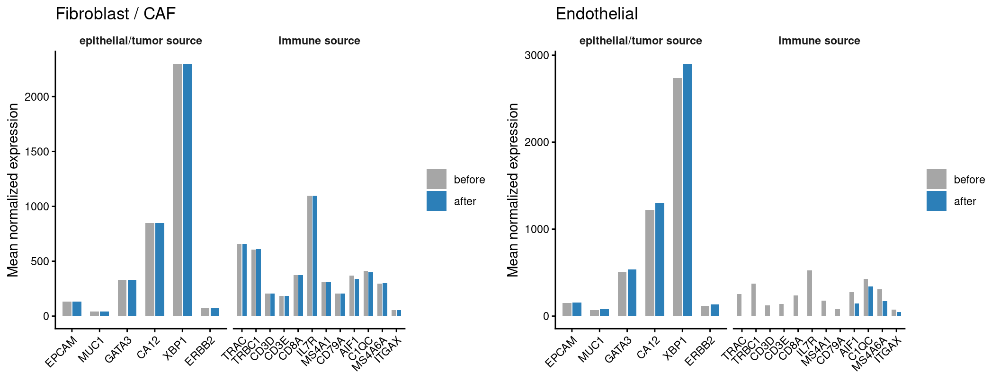

``` r
for (target_type in diagnostic_cell_types) {
  p_before <- celladmix_plot_volcano(diagnostic_de_original[[target_type]],
    markers = source_marker_sets, title = paste(target_type, "before cleanup")) +
    theme(legend.position = "none")
  p_after <- celladmix_plot_volcano(membrane_de[[target_type]],
    markers = source_marker_sets, title = paste(target_type, "after membrane cleanup"))
  print(cowplot::plot_grid(plotlist = list(p_before, p_after),
    ncol = 2, align = "hv", axis = "tblr"))
}
```

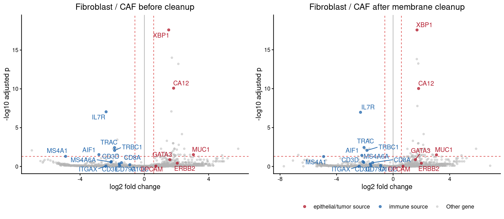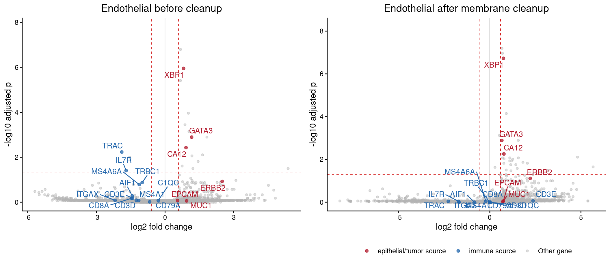

``` r
plots <- lapply(diagnostic_cell_types, function(target_type) {
  celladmix_plot_de_shift(diagnostic_de_original[[target_type]], membrane_de[[target_type]],
    markers = source_marker_sets, title = paste("Membrane", target_type, "p-value shift"))
})
cowplot::plot_grid(plotlist = plots, ncol = length(plots), align = "hv", axis = "tblr")
```

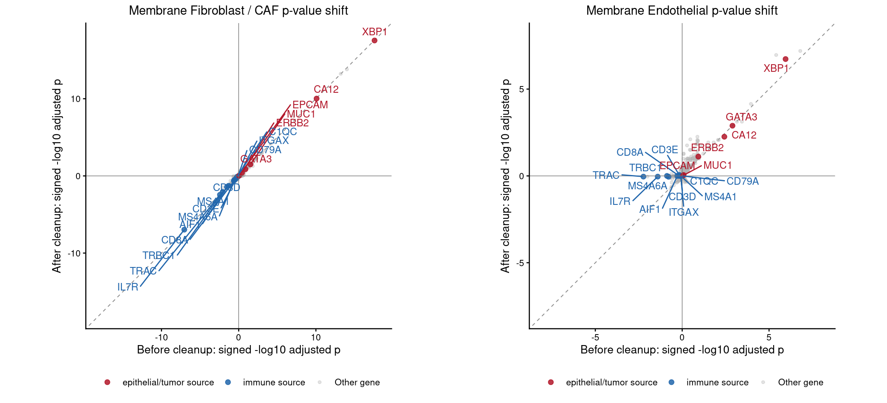

## Cell-State UMAP Before and After Cleanup

``` r
state_cells_max <- NULL
original_state_all <- ds$cell_state_umap(cells_max = state_cells_max,
  min_molecules = 30, min_genes = 15, verbose = TRUE)
```

    ## [INFO 13:50:06 +0.002s] Reused compatible Xenium input store (0.000s)
    ## [INFO 13:50:06 +0.002s] Built Xenium input store: 8189365 molecules, 34541 cells (0.002s)
    ## [INFO 13:50:06 +0.221s] Loaded input-store cell-gene counts: 34541 cells (0.221s)
    ## [INFO 13:50:06 +0.228s] Indexed cell counts: 31642 eligible cells (min_molecules=30, min_genes=15) (0.008s)
    ## [INFO 13:50:06 +0.228s] Selected clustering cells: 31642 cells (0.000s)
    ## [INFO 13:50:06 +0.318s] Loaded sparse cell-gene counts: 6011201 non-zero entries (0.090s)
    ## [INFO 13:50:06 +0.437s] Selected variable genes: 1000 genes (0.119s)
    ## [INFO 13:50:07 +0.820s] Materialized dense clustering matrix: 1000 x 31642 (0.383s)
    ## [INFO 13:50:13 +7.222s] Computed cell PCA: 30 x 31642 (6.402s)
    ## [INFO 13:50:15 +9.339s] Built HNSW cell KNN graph: 474630 directed edges using 10 thread(s); reusing 15 cosine-distance neighbors for UMAP (2.116s)
    ## [INFO 13:50:16 +10.039s] Ran Louvain clustering (0.700s)
    ## [INFO 13:50:16 +10.355s] Initialized UMAP layout (0.316s)
    ## [INFO 13:51:00 +54.439s] Optimized UMAP layout with parallel optimization (44.084s)
    ## [INFO 13:51:00 +54.440s] Computed cell UMAP (44.401s)
    ## [INFO 13:51:00 +54.462s] Assembled cell clustering result (0.022s)
    ## [INFO 13:51:00 +54.467s] Finished store-backed cell clustering (54.246s)
    ## [INFO 13:51:00 +54.509s] Wrote cell clustering outputs (0.043s)

``` r
corrected_state_all <- membrane_correction$cell_state_umap(cells_max = state_cells_max,
  min_molecules = 30, min_genes = 15, verbose = TRUE)
```

    ## [INFO 13:51:03 +2.026s] Loaded run cell-gene counts: 34541 cells (2.026s)
    ## [INFO 13:51:03 +2.040s] Indexed cell counts: 29049 eligible cells (min_molecules=30, min_genes=15) (0.014s)
    ## [INFO 13:51:03 +2.040s] Selected clustering cells: 29049 cells (0.000s)
    ## [INFO 13:51:03 +2.152s] Loaded sparse cell-gene counts: 5448449 non-zero entries (0.112s)
    ## [INFO 13:51:03 +2.314s] Selected variable genes: 1000 genes (0.162s)
    ## [INFO 13:51:03 +2.766s] Materialized dense clustering matrix: 1000 x 29049 (0.451s)
    ## [INFO 13:51:10 +9.746s] Computed cell PCA: 30 x 29049 (6.980s)
    ## [INFO 13:51:12 +11.379s] Built HNSW cell KNN graph: 435735 directed edges using 10 thread(s); reusing 15 cosine-distance neighbors for UMAP (1.633s)
    ## [INFO 13:51:12 +11.521s] Ran Louvain clustering (0.143s)
    ## [INFO 13:51:12 +11.796s] Initialized UMAP layout (0.274s)
    ## [INFO 13:51:43 +42.562s] Optimized UMAP layout with parallel optimization (30.767s)
    ## [INFO 13:51:43 +42.563s] Computed cell UMAP (31.041s)
    ## [INFO 13:51:43 +42.581s] Assembled cell clustering result (0.018s)
    ## [INFO 13:51:43 +42.584s] Finished run-count cell-state embedding (40.558s)

``` r
cell_type_levels <- sort(unique(cell_annotation))
cell_type_palette <- setNames(grDevices::hcl.colors(length(cell_type_levels), "Dark 3"),
  cell_type_levels)
original_state_all$cell_type <- factor(original_state_all$cell_type, levels = cell_type_levels)
corrected_state_all$cell_type <- factor(corrected_state_all$cell_type, levels = cell_type_levels)

shared_state_cells <- intersect(original_state_all$cell_id, corrected_state_all$cell_id)
original_state <- original_state_all[original_state_all$cell_id %in% shared_state_cells, , drop = FALSE]
corrected_state <- corrected_state_all[corrected_state_all$cell_id %in% shared_state_cells, , drop = FALSE]
original_state$cell_type <- factor(original_state$cell_type, levels = cell_type_levels)
corrected_state$cell_type <- factor(corrected_state$cell_type, levels = cell_type_levels)

state_cell_retention <- rbind(
  data.frame(panel = "original eligible", as.data.frame(table(original_state_all$cell_type))),
  data.frame(panel = "corrected eligible", as.data.frame(table(corrected_state_all$cell_type))),
  data.frame(panel = "plotted common cells", as.data.frame(table(original_state$cell_type)))
)
names(state_cell_retention) <- c("panel", "cell_type", "cells")
state_cell_retention
```

    ##                   panel        cell_type cells
    ## 1     original eligible       B / plasma  1512
    ## 2     original eligible      Endothelial   810
    ## 3     original eligible       Epithelial 14928
    ## 4     original eligible Fibroblast / CAF   648
    ## 5     original eligible          Myeloid  3509
    ## 6     original eligible           T / NK  7094
    ## 7    corrected eligible       B / plasma  1356
    ## 8    corrected eligible      Endothelial   657
    ## 9    corrected eligible       Epithelial 13509
    ## 10   corrected eligible Fibroblast / CAF   629
    ## 11   corrected eligible          Myeloid  2663
    ## 12   corrected eligible           T / NK  7094
    ## 13 plotted common cells       B / plasma  1356
    ## 14 plotted common cells      Endothelial   657
    ## 15 plotted common cells       Epithelial 13509
    ## 16 plotted common cells Fibroblast / CAF   629
    ## 17 plotted common cells          Myeloid  2663
    ## 18 plotted common cells           T / NK  7094

``` r
state_umap_limits <- function(...) {
  frames <- list(...)
  x <- unlist(lapply(frames, `[[`, "umap_1"))
  y <- unlist(lapply(frames, `[[`, "umap_2"))
  span <- max(diff(range(x, na.rm = TRUE)), diff(range(y, na.rm = TRUE)))
  xmid <- mean(range(x, na.rm = TRUE))
  ymid <- mean(range(y, na.rm = TRUE))
  pad <- span * 0.04
  list(xlim = xmid + c(-1, 1) * (span / 2 + pad),
    ylim = ymid + c(-1, 1) * (span / 2 + pad))
}

plot_state_umap <- function(df, title, limits) {
  ggplot(df, aes(umap_1, umap_2, color = cell_type)) +
    geom_point(size = 0.55, alpha = 0.75) +
    coord_equal(xlim = limits$xlim, ylim = limits$ylim) +
    scale_color_manual(values = cell_type_palette, drop = FALSE) +
    labs(title = title, x = "UMAP 1", y = "UMAP 2", color = "Cell type") +
    theme_classic(base_size = 10) +
    guides(color = guide_legend(override.aes = list(size = 3.2, alpha = 1))) +
    theme(legend.position = "right")
}

limits <- state_umap_limits(original_state, corrected_state)
cowplot::plot_grid(plotlist = list(
  plot_state_umap(original_state, "Original counts", limits),
  plot_state_umap(corrected_state, "Corrected counts", limits)
), ncol = 2, align = "hv", axis = "tblr")
```

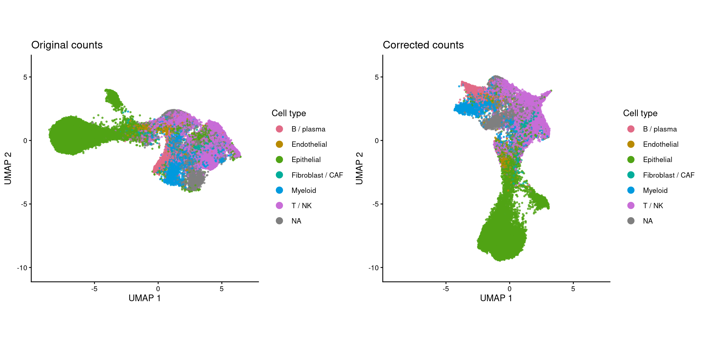
