Generative Admixture Correction on Xenium Pancreas
================

-   <a href="#the-admixture-pattern-between-cell-types"
    id="toc-the-admixture-pattern-between-cell-types">The admixture pattern
    between cell types</a>
-   <a href="#correcting-with-the-generative-model"
    id="toc-correcting-with-the-generative-model">Correcting with the
    generative model</a>
-   <a href="#the-induction-pattern" id="toc-the-induction-pattern">The
    induction pattern</a>
-   <a href="#verification" id="toc-verification">Verification</a>

Molecules leak between neighboring cells, so a cell’s counts mix its own
expression with material from the cells around it. But not every count
that rises near a neighbor is leakage: cells also change their own
transcription in response to their neighborhood, and a correction that
flattens every neighbor-linked gradient erases exactly that biology. The
generative model separates the two: it decomposes each cell’s counts
into the cell’s own expression programs, contamination from each
neighboring cell type, ambient background, and neighborhood-induced
expression, then removes the contamination and ambient shares while
keeping the induced ones ([docs/generative.md](../../docs/generative.md)
describes the model and its validation; [the minimal
version](pancreas_generative_minimal.md) of this page runs the same
workflow in a handful of calls).

This example characterizes both sides on the pancreas dataset: how much
material moves between which cell types, and which genes the model
recognizes as the cells’ own induced expression.

``` r
annotation <- read.csv(file.path("annotations", "annotation.csv.gz"))
cell_annotation <- setNames(annotation$merged_annotation, annotation$cell_id)

ds <- cellAdmix("data", output_dir = "out", annotation = cell_annotation)
```

## The admixture pattern between cell types

The audit measures, for every ordered pair of cell types, how many
molecules leaked from the source type into cells of the target type,
using the rise of source-marker content with the number of source-type
neighbors. It is computed straight from the dataset — counts, cell
positions, and the annotation — with no factorization involved:

``` r
audit <- ds$audit_admixture()
```

    ## Excluded 23 likely induced genes from marker panels (exposure-linked excess far above the source-profile expectation): ACTG2, ADAMTS1, APCDD1, APOLD1, BASP1, C5orf46, CA4, CAVIN1

``` r
audit$plot_map()
```

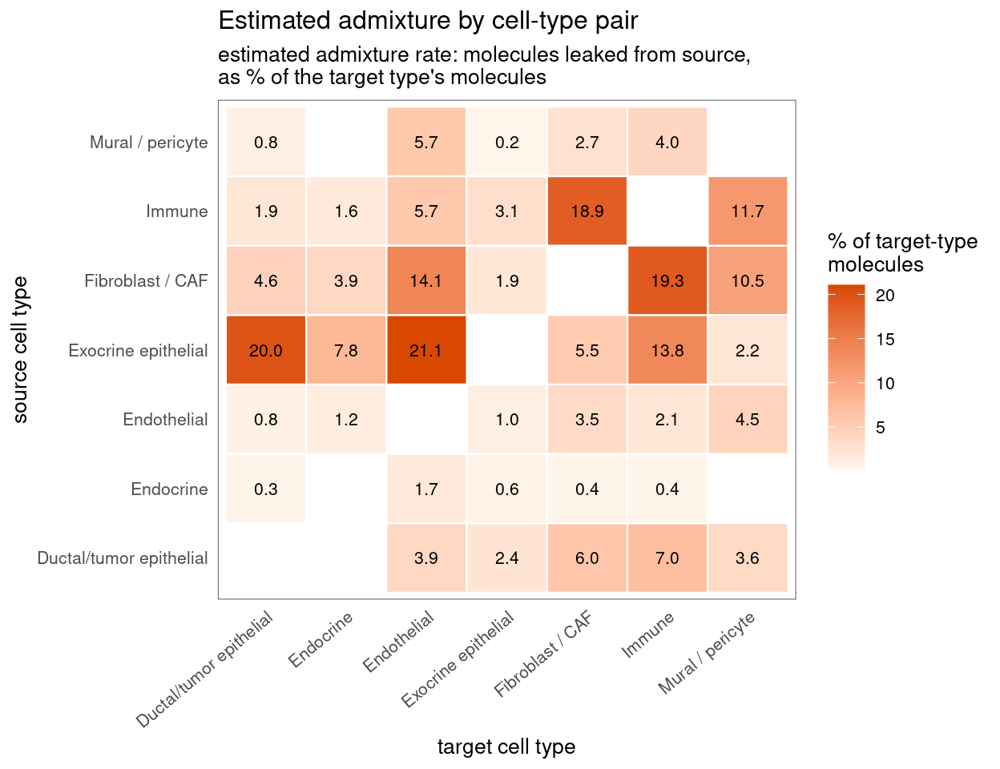

The magnitudes are far from uniform. Sorting the detected pairs by their
estimated admixture rate — the fraction of the target type’s molecules
that originated in the source:

``` r
pairs <- audit$pairs(detected_only = TRUE)
head(pairs[order(-pairs$rate),
  c("source", "target", "admixed_molecules", "rate")], 8)
```

    ##                 source                  target admixed_molecules      rate
    ## 21 Exocrine epithelial             Endothelial             67068 0.2107178
    ## 19 Exocrine epithelial Ductal/tumor epithelial            382869 0.1995796
    ## 29    Fibroblast / CAF                  Immune             97795 0.1928331
    ## 35              Immune        Fibroblast / CAF            206179 0.1886504
    ## 27    Fibroblast / CAF             Endothelial             44954 0.1412410
    ## 23 Exocrine epithelial                  Immune             69990 0.1380071
    ## 36              Immune        Mural / pericyte              6666 0.1173330
    ## 30    Fibroblast / CAF        Mural / pericyte              5979 0.1052369

Aggregating over targets shows which cell types shed the most material —
on this tissue, the exocrine compartment dominates as a source:

``` r
by_source <- aggregate(admixed_molecules ~ source, pairs, sum)
ggplot(by_source, aes(reorder(source, admixed_molecules),
    admixed_molecules / 1e3)) +
  geom_col(fill = "#c0392b", alpha = 0.85) +
  coord_flip() +
  labs(x = NULL, y = "estimated admixed molecules shed (thousands)") +
  theme_classic(base_size = 11)
```

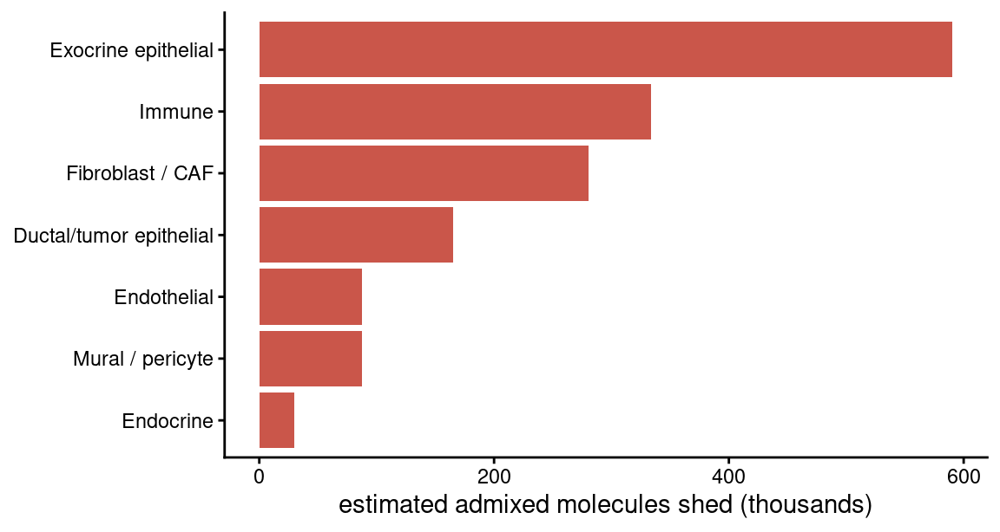

## Correcting with the generative model

The model is fitted on the audit’s detected pairs. The one place a
factorization enters this workflow is the initialization of the model’s
expression programs: the recommended configuration initializes them from
an NMF fit’s factor-labeled molecules, which preserves the most induced
biology (`init = "clusters"` fits without any NMF, at nearly identical
removal but lower induced-gene retention on large panels). The
correction then derives from the fitted model:

``` r
nmf_fit <- ds$fit(nmf_variant = "invsqrt_kl")
```

    ## Reusing cached run fit_manual_rank9_invsqrt_kl (parameters match)

``` r
model <- audit$fit_generative(init = nmf_fit, num_threads = 8)
model
```

    ## cellAdmix generative model
    ##   pairs: 39 
    ##   induced genes retained: 28 
    ##   removed molecules (expected): 1,193,699 
    ##   initialization: nmf_factors

``` r
correction <- model$correct()
before <- ds$counts()
after <- correction$counts()
```

The most quotable summary of the result is the admixture burden per cell
type: the fraction of each type’s total molecule content that the model
attributed to contamination or ambient background and removed.

``` r
cell_types <- cell_annotation[colnames(before)]
removed_by_type <- tapply(Matrix::colSums(before) - Matrix::colSums(after),
  cell_types, sum)
total_by_type <- tapply(Matrix::colSums(before), cell_types, sum)
burden <- data.frame(type = names(removed_by_type),
  share = as.numeric(removed_by_type / total_by_type))
ggplot(burden, aes(reorder(type, share), share)) +
  geom_col(fill = "#c0392b", alpha = 0.85) +
  scale_y_continuous(labels = scales::percent) +
  coord_flip() +
  labs(x = NULL, y = "share of the type's molecules removed as admixture") +
  theme_classic(base_size = 11)
```

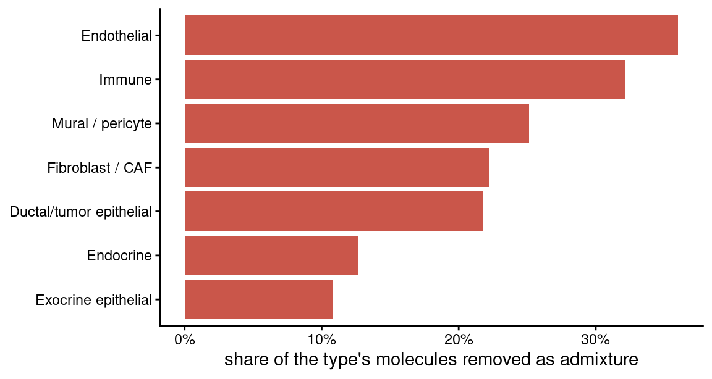

The model’s central output is the per-cell decomposition. Averaged over
ductal cells at each exocrine exposure, it shows where a contaminated
cell’s molecules come from: the cell’s own expression share falls with
exposure as the contamination share grows, with the ambient background
throughout and the induced expression appearing exactly in the exposed
cells:

``` r
comp_all <- model$composition(target = "Ductal/tumor epithelial")
cells_xy <- ds$cells()
expo <- setNames(
  cellAdmixCore:::.celladmix_source_exposure_counts(
    cells_xy, cell_annotation, 15L)$counts[, "Exocrine epithelial"],
  as.character(cells_xy$cell_id))
cont <- tapply(comp_all$contamination, comp_all$cell_id, sum)
indv <- tapply(comp_all$induced, comp_all$cell_id, sum)
amb <- tapply(comp_all$ambient, comp_all$cell_id, max)
per_cell <- data.frame(cell_id = names(cont),
  contamination = as.numeric(cont), induced = as.numeric(indv),
  ambient = as.numeric(amb), stringsAsFactors = FALSE)
per_cell$own <- pmax(1 - per_cell$contamination - per_cell$induced -
  per_cell$ambient, 0)
per_cell$bin <- factor(pmin(expo[per_cell$cell_id], 3), levels = 0:3,
  labels = c("0", "1", "2", "3+"))
agg <- aggregate(cbind(own, contamination, ambient, induced) ~ bin,
  per_cell, mean)
shares <- data.frame(bin = rep(agg$bin, 4),
  part = rep(c("own expression", "contamination", "ambient", "induced"),
    each = nrow(agg)),
  share = c(agg$own, agg$contamination, agg$ambient, agg$induced))
shares$part <- factor(shares$part,
  levels = rev(c("own expression", "contamination", "ambient", "induced")))
ggplot(shares, aes(bin, share, fill = part)) +
  geom_col(width = 0.72) +
  scale_fill_manual(values = c("own expression" = "#2980b9",
    "contamination" = "#c0392b", "ambient" = "#8a8a8a",
    "induced" = "#1e8449"), name = NULL,
    breaks = c("own expression", "contamination", "ambient", "induced")) +
  labs(x = "exocrine cells among 15 nearest neighbors",
    y = "mean share of ductal-cell content") +
  theme_classic(base_size = 11)
```

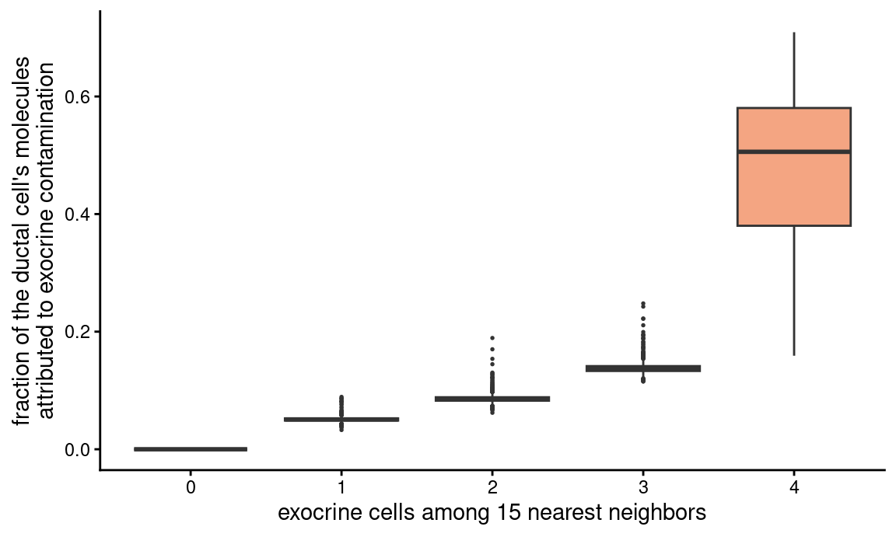

The same fractions drawn in space show the admixture concentrating at
the tissue interfaces: ductal cells inside the acinar tissue carry up to
half exocrine content, while the ductal/tumor mass itself is nearly
clean:

``` r
comp <- model$composition("Exocrine epithelial",
  "Ductal/tumor epithelial")
xy <- cells_xy[match(comp$cell_id, as.character(cells_xy$cell_id)), ]
ggplot(cbind(comp, x = xy$x, y = xy$y), aes(x, y,
    color = pmin(contamination, 0.6))) +
  geom_point(size = 0.25) +
  scale_color_viridis_c(option = "inferno",
    name = "exocrine share\nof ductal-cell\ncontent") +
  coord_equal() +
  labs(x = NULL, y = NULL,
    title = "Exocrine contamination of ductal cells") +
  theme_void(base_size = 11)
```

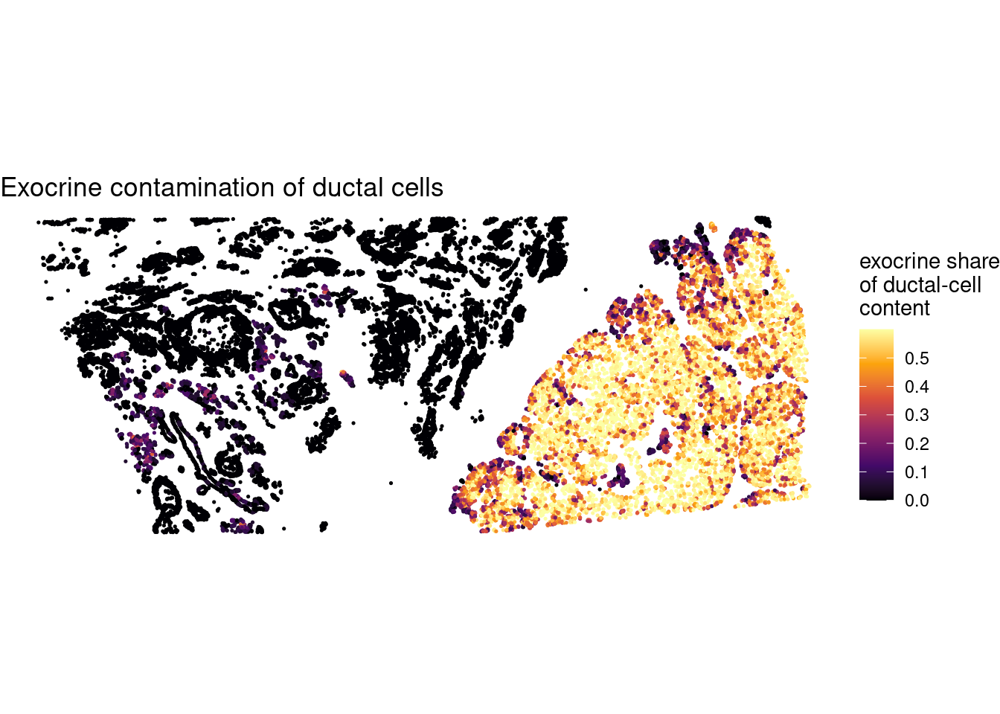

The decomposition is a per-cell statement, so it can be read for
individual cells. Three ductal cells illustrate the range — one deep in
the tumor mass, one moderately exposed, one embedded in acinar tissue:

``` r
comp_all_pairs <- model$composition(target = "Ductal/tumor epithelial")
tot_by_cell <- Matrix::colSums(before[, comp$cell_id])
elig <- comp$cell_id[tot_by_cell[comp$cell_id] >= 100]
cc <- setNames(comp$contamination, comp$cell_id)[elig]
picks <- c(
  `tumor mass` = names(which.min(cc + (expo[elig] > 0))),
  `interface, moderate` = names(which.min(abs(cc - 0.25))),
  `interface, heavy` = names(which.max(cc)))
stopifnot(!anyDuplicated(picks))
anat <- comp_all_pairs[comp_all_pairs$cell_id %in% picks, ]
anat$which <- names(picks)[match(anat$cell_id, picks)]
anat_amb <- anat[!duplicated(anat$cell_id),
  c("cell_id", "which", "ambient")]
stack <- rbind(
  data.frame(which = anat$which, part = anat$source,
    share = anat$contamination),
  data.frame(which = anat_amb$which, part = "ambient",
    share = anat_amb$ambient))
own_share <- 1 - tapply(stack$share, stack$which, sum)
stack <- rbind(stack, data.frame(which = names(own_share),
  part = "own expression", share = as.numeric(own_share)))
stack$part <- factor(stack$part, levels = c("own expression", "ambient",
  rev(sort(unique(anat$source)))))
stack$which <- factor(stack$which, levels = names(picks))
ggplot(stack, aes(which, share, fill = part)) +
  geom_col(width = 0.6) +
  scale_fill_manual(values = c("own expression" = "#a8c6df",
    "ambient" = "#8a8a8a",
    setNames(hcl.colors(length(unique(anat$source)), "Reds 3"),
      rev(sort(unique(anat$source)))))) +
  labs(x = NULL, y = "share of the cell's molecules", fill = NULL) +
  theme_classic(base_size = 11)
```

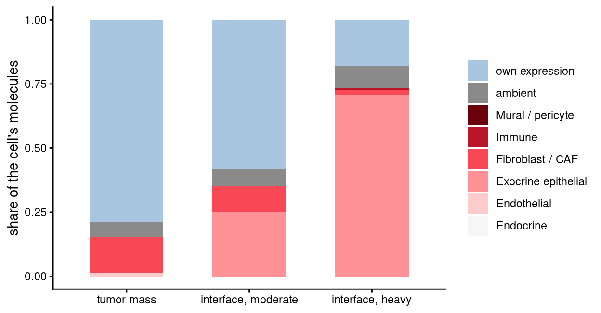

Individual cells can be inspected with the package’s standard
molecule-level rendering — stain background, cell boundaries, cell-type
contours, and molecules colored by their factor role, with the exocrine
marker genes emphasized. Both cells below have a strong ductal identity;
the difference is their surroundings. In the tumor mass the cell’s
content is its own; at the acinar interface, the same kind of cell is
filled with molecules of the exocrine factor:

``` r
profiles <- cellAdmixCore:::.celladmix_audit_profiles(before,
  cell_annotation[colnames(before)])
top_type <- setNames(
  colnames(profiles)[max.col(profiles, ties.method = "first")],
  rownames(profiles))
ductal_genes <- names(top_type)[top_type == "Ductal/tumor epithelial"]
duct_own_count <- Matrix::colSums(before[ductal_genes, elig])
rich <- elig[duct_own_count >= stats::quantile(duct_own_count, 0.6)]
cid_clean <- rich[which.min(cc[rich] + (expo[rich] > 0))]
cid_cont <- rich[which.max(cc[rich])]
# the exocrine-aligned NMF factor colors the admixed molecules
fr <- nmf_fit$cell_factors()
fcols <- grep("^factor_[0-9]+_fraction$", names(fr), value = TRUE)
exo_cells <- cell_annotation[as.character(fr$cell_id)] == "Exocrine epithelial"
fmeans <- colMeans(fr[which(exo_cells), fcols], na.rm = TRUE)
exo_factor <- as.integer(sub("^factor_([0-9]+)_fraction$", "\\1",
  names(which.max(fmeans))))
mk_pool <- audit$markers("Exocrine epithelial",
  "Ductal/tumor epithelial")$pool
example_of <- function(cid) data.frame(target_cell = cid,
  target_cell_type = "Ductal/tumor epithelial",
  top_admix_factor = unname(exo_factor), stringsAsFactors = FALSE)
cowplot::plot_grid(
  nmf_fit$plot_cell_example(example_of(cid_clean), markers = mk_pool,
    title = sprintf("Tumor mass: %.0f%% exocrine content",
      100 * cc[[cid_clean]])),
  nmf_fit$plot_cell_example(example_of(cid_cont), markers = mk_pool,
    title = sprintf("Acinar interface: %.0f%% exocrine content",
      100 * cc[[cid_cont]])),
  ncol = 2)
```

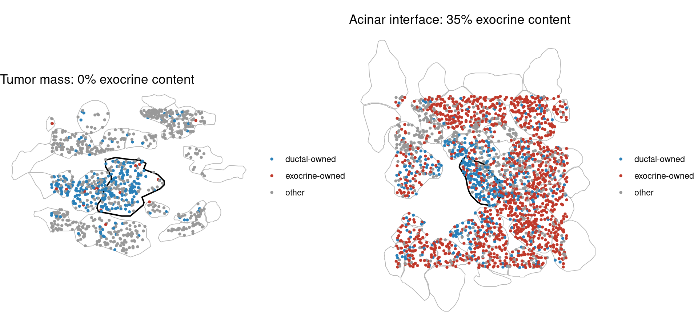

The model’s mechanics are visibleThe model’s mechanics are visible in
how the fitted contamination fraction relates to the exposure-derived
dose: each cell’s own expression can move its estimate around the dose,
but only within a bounded factor — removal stays anchored to the
demonstrated spatial signal:

``` r
ggplot(comp, aes(dose, contamination,
    color = factor(pmin(expo[cell_id], 3)))) +
  geom_point(size = 0.4, alpha = 0.5) +
  geom_abline(color = "grey40", linewidth = 0.4) +
  scale_color_viridis_d(name = "exocrine
neighbors", end = 0.9) +
  labs(x = "dose: prior contamination fraction from exposure",
    y = "fitted contamination fraction") +
  theme_classic(base_size = 11)
```

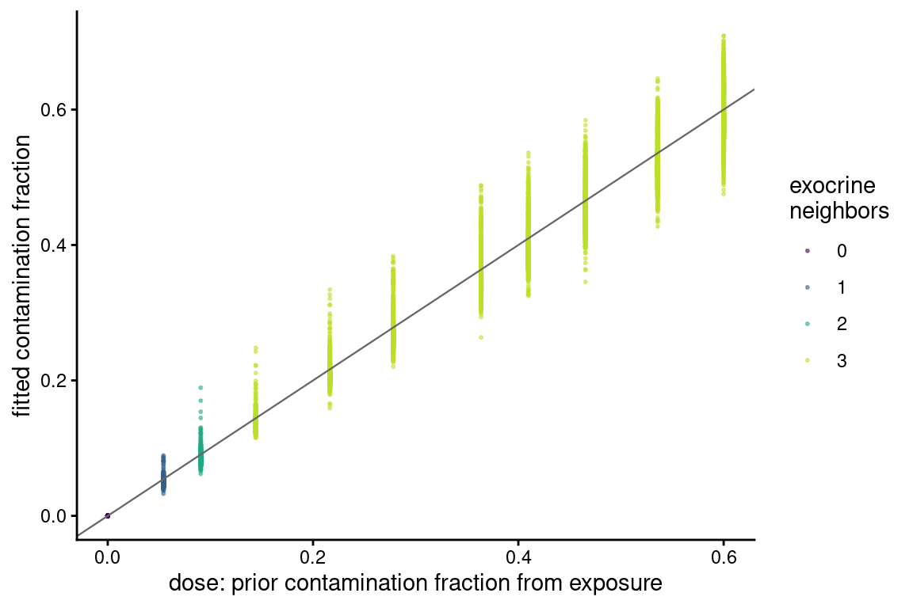

The audit’s standard per-pair diagnostic — the panel rate with exact 95%
intervals, the zero-neighbor line, and the ambient reference — verifies
the pair directly, before and after the correction:

``` r
audit$plot_exposure("Exocrine epithelial", "Ductal/tumor epithelial",
  correction = correction)
```

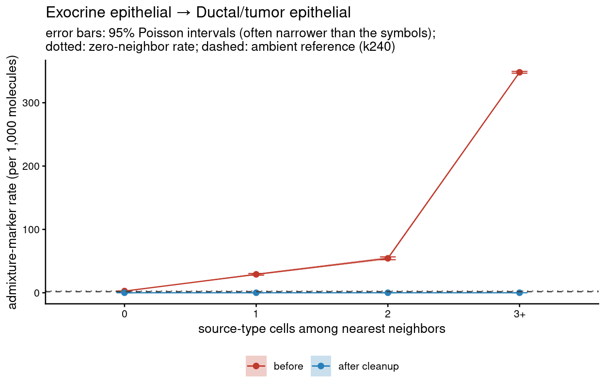

The transferred material itself is profile-shaped, not uniform: the
genes removed from ductal cells are dominated by the source’s largest
expression channels, the digestive enzymes of the exocrine pancreas:

``` r
duct_cells <- comp$cell_id
removed_g <- Matrix::rowSums(before[, duct_cells]) -
  Matrix::rowSums(after[, duct_cells])
head(data.frame(gene = names(sort(removed_g, decreasing = TRUE)),
  removed = round(sort(removed_g, decreasing = TRUE))), 8)
```

    ##          gene removed
    ## AMY2A   AMY2A  150613
    ## GATM     GATM   64326
    ## CFTR     CFTR   16975
    ## AQP8     AQP8   11748
    ## ANPEP   ANPEP    8360
    ## VCAN     VCAN    7508
    ## FBN1     FBN1    5239
    ## COL5A2 COL5A2    4803

## The induction pattern

The model retains genes whose exposure-linked excess exceeds what
transfer from the source can deliver — expression the target cells
switched on themselves. On this tissue the retained set is led by the
duct-cell program that ductal cells activate at acinar interfaces:

``` r
induced <- model$induced
head(induced[order(-induced$excess),
  c("source", "target", "gene", "excess", "fold", "z")], 8)
```

    ##                 source                  target    gene     excess     fold
    ## 4  Exocrine epithelial Ductal/tumor epithelial    CFTR 110866.738 4.640906
    ## 6  Exocrine epithelial Ductal/tumor epithelial   PROX1  11709.747 3.320398
    ## 8     Fibroblast / CAF Ductal/tumor epithelial  SEMA3C   4181.181 7.741020
    ## 25    Fibroblast / CAF                  Immune   PMP22   3183.480 3.092253
    ## 9     Fibroblast / CAF Ductal/tumor epithelial   BASP1   2750.508 2.332749
    ## 19    Mural / pericyte             Endothelial ADAMTS1   2045.614 3.725193
    ## 7     Fibroblast / CAF Ductal/tumor epithelial  APCDD1   2035.355 3.465643
    ## 5  Exocrine epithelial Ductal/tumor epithelial     CA4   1681.018 4.159392
    ##            z
    ## 4  24.154536
    ## 6  15.121410
    ## 8  22.477063
    ## 25 10.279826
    ## 9   8.124244
    ## 19 15.015948
    ## 7  11.999946
    ## 5  16.955261

What this means for downstream analysis is best seen the way
[docs/generative.md](../../docs/generative.md) (Figure 4) shows it: on
the corrected counts, every gene of the target type is tested for
expression change with each source’s proximity, jointly across all
sources so correlated neighborhoods do not cross-attribute. Genes with
essentially none of their content removed as transfer (filled points)
are unambiguous expression changes — the induced interface program
rising (green) and the ductal identity program falling (purple) — while
genes entangled with the transfer split stay open grey:

``` r
duct_cells <- model$composition("Exocrine epithelial",
  "Ductal/tumor epithelial")$cell_id
duct_pairs <- model$pairs[model$pairs$target == "Ductal/tumor epithelial", ]
E <- sapply(duct_pairs$source, function(src) pmin(setNames(
  cellAdmixCore:::.celladmix_source_exposure_counts(
    cells_xy, cell_annotation, 15L)$counts[, src],
  as.character(cells_xy$cell_id))[duct_cells], 4))
K <- after[, duct_cells]
t_kept <- Matrix::colSums(K)
X <- cbind(1, E)
fit_gene <- function(y) {
  beta <- c(log(max(sum(y), 0.5) / sum(t_kept)), numeric(ncol(E)))
  for (it in 1:25) {
    mu <- t_kept * exp(pmin(pmax(X %*% beta, -30), 5))
    H <- crossprod(X, X * as.numeric(mu))
    step <- tryCatch(solve(H + diag(1e-8, ncol(X)), crossprod(X, y - mu)),
      error = function(e) NULL)
    if (is.null(step)) return(NULL)
    beta <- beta + step
    if (max(abs(step)) < 1e-6) break
  }
  mu <- t_kept * exp(pmin(pmax(X %*% beta, -30), 5))
  disp <- max(sum((y - mu)^2 / pmax(mu, 1e-9)) /
    max(length(y) - ncol(X), 1), 1)
  se <- sqrt(pmax(diag(solve(crossprod(X, X * as.numeric(mu)) +
    diag(1e-8, ncol(X)))), 1e-300) * disp)
  c(beta[[2]], beta[[2]] / se[[2]])  # exocrine coefficient and its z
}
removed_frac_g <- 1 - Matrix::rowSums(after[, duct_cells]) /
  pmax(Matrix::rowSums(before[, duct_cells]), 1)
res <- t(sapply(rownames(K), function(g) {
  y <- as.numeric(K[g, ])
  if (sum(y) < 100) return(c(NA, NA))
  out <- fit_gene(y)
  if (is.null(out)) c(NA, NA) else out
}))
vol <- data.frame(gene = rownames(K), lfc = res[, 1] / log(2),
  z = pmin(abs(res[, 2]), 60), dir = sign(res[, 1]),
  stringsAsFactors = FALSE)
vol$clean <- removed_frac_g[vol$gene] < 0.10
vol <- vol[!is.na(vol$z), ]
vol$tier <- ifelse(!vol$clean, "transfer-entangled",
  ifelse(vol$dir > 0, "increased near exocrine", "decreased near exocrine"))
lab <- vol[vol$clean & vol$z > 6, ]
lab <- lab[order(-lab$z), ][1:8, ]
ggplot(vol, aes(lfc, z)) +
  geom_point(data = vol[!vol$clean, ], shape = 1, size = 1.3,
    color = "#b6b6b6") +
  geom_point(data = vol[vol$clean, ], aes(color = tier), size = 1.5) +
  geom_hline(yintercept = 6, color = "grey50", linetype = "13") +
  ggrepel::geom_text_repel(data = lab, aes(label = gene), size = 3) +
  scale_color_manual(values = c("increased near exocrine" = "#1e8449",
    "decreased near exocrine" = "#7d3c98"), name = NULL) +
  labs(x = "fold change per exocrine neighbor (log2)",
    y = "significance |z| (capped at 60)") +
  theme_classic(base_size = 11)
```

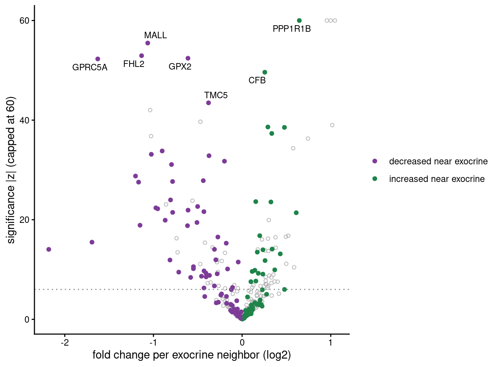

The evidence behind these calls is a proportionality test.The evidence
behind these calls is a proportionality test. Transferred material
samples the source’s transcriptome, so a gene’s excess in ductal cells
should be proportional to its share of the exocrine profile; genes above
the significance bound are the ductal cells’ own response. Each point
below is one exocrine-owned gene:

``` r
exp_cells <- duct_cells[expo[duct_cells] > 0]
un_cells <- duct_cells[expo[duct_cells] == 0]
t_exp <- sum(Matrix::colSums(before[, exp_cells]))
t_un <- sum(Matrix::colSums(before[, un_cells]))
gset <- names(top_type)[top_type == "Exocrine epithelial"]
S_cells <- names(cell_types)[!is.na(cell_types) &
  cell_types == "Exocrine epithelial"]
dist_T <- cellAdmixCore:::.celladmix_source_nearest_distance(
  cells_xy, cell_annotation)[, "Ductal/tumor epithelial"]
m_exp <- Matrix::rowSums(before[gset, exp_cells])
m_un <- Matrix::rowSums(before[gset, un_cells])
excess <- m_exp - m_un / t_un * t_exp
v <- m_exp + (t_exp / t_un)^2 * m_un + 1
expected_of <- function(prof) {
  p <- prof
  p[names(p) %in% names(top_type)[top_type == "Ductal/tumor epithelial"]] <- 0
  p <- p[gset]
  slope <- max(sum(excess * p / v) / sum(p^2 / v), 0)
  slope * p
}
exp_int <- expected_of(cellAdmixCore:::.celladmix_audit_interface_profile(
  before, S_cells, dist_T))
exp_glob <- expected_of(profiles[, "Exocrine epithelial"] /
  sum(profiles[, "Exocrine epithelial"]))
scr <- data.frame(gene = gset, excess = excess, expected = exp_int,
  expected_global = exp_glob, stringsAsFactors = FALSE)
scr$flagged <- scr$gene %in%
  induced$gene[induced$source == "Exocrine epithelial" &
    induced$target == "Ductal/tumor epithelial"]
scr <- scr[scr$excess > 10 & scr$expected > 1, ]
vdf <- data.frame(lx = log(scr$expected), ly = log(v[scr$gene]))
vfit <- stats::lm(ly ~ lx, vdf)
xg <- exp(seq(log(min(scr$expected)), log(max(scr$expected) * 1.5),
  length.out = 200))
bound_df <- data.frame(expected = xg,
  excess = xg + 8 * sqrt(exp(predict(vfit, data.frame(lx = log(xg)))) +
    (0.15 * xg)^2))
flag <- scr[scr$flagged, ]
ggplot(scr, aes(expected, excess)) +
  geom_abline(color = "grey40", linewidth = 0.4) +
  geom_line(data = bound_df, linetype = "22", color = "grey50",
    linewidth = 0.4) +
  geom_point(data = scr[!scr$flagged, ], size = 1.3, color = "#9bb5c9") +
  geom_segment(data = flag, aes(x = expected_global, xend = expected,
    y = excess, yend = excess), color = "#1e8449", linewidth = 0.5) +
  geom_point(data = flag, aes(x = expected_global), size = 3.6, shape = 1,
    stroke = 1.1, color = "#c0392b") +
  geom_point(data = flag, size = 2, color = "#1e8449") +
  ggrepel::geom_text_repel(
    data = scr[scr$flagged | scr$excess > 5e4, ],
    aes(label = gene), size = 3) +
  scale_x_log10() + scale_y_log10() +
  labs(x = "excess expected in ductal cells from exocrine transfer (molecules)",
    y = "measured excess in ductal cells (molecules)") +
  theme_classic(base_size = 11)
```

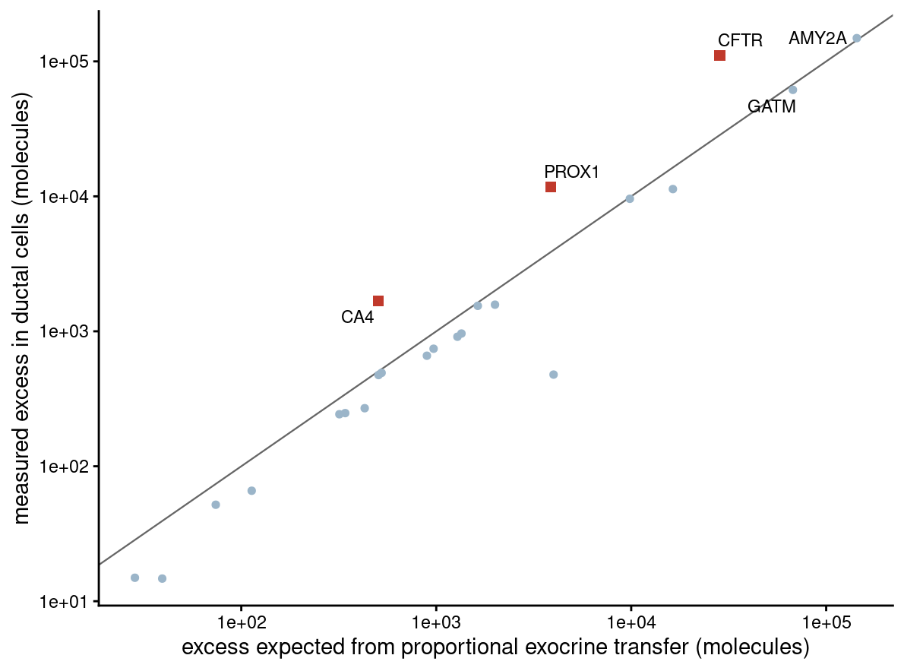

As in [docs/generative.md](../../docs/generative.md) (Figure 2), the
flagged genes are drawn at both transfer expectations — the open red
ring from the average exocrine cell, the filled green point from the
exocrine cells bordering ductal tissue; on this pair the two coincide,
so the markers superimpose. The dashed curve is the largest excess still
consistent with proportional transfer, allowing counting noise and a 15%
profile error.

The consequence is visible gene by gene.The consequence is visible gene
by gene. AMY2A sits on the diagonal above — the largest exocrine
transfer channel — and the correction flattens its exposure gradient to
the unexposed level. CFTR sits far above the diagonal, and the
correction preserves its gradient, removing only the transferred share.
The same fitted model can also derive the opposite policy —
`model$correct(retain_induced = FALSE)` removes the fitted induced share
along with the contamination — which shows directly what retention
protects, at no change on the transferred gene:

``` r
correction_noind <- model$correct(name = "generative_noind",
  retain_induced = FALSE)
after_noind <- correction_noind$counts()
tot <- Matrix::colSums(before[, duct_cells])
bins <- pmin(expo[duct_cells], 3)
rates_ci <- function(m, gene) {
  mm <- tapply(m[gene, duct_cells], bins, sum)
  MM <- tapply(tot, bins, sum)
  data.frame(bin = 0:3, rate = as.numeric(mm / MM) * 1e3,
    lo = stats::qgamma(0.025, pmax(as.numeric(mm), 1e-9)) /
      as.numeric(MM) * 1e3,
    hi = stats::qgamma(0.975, as.numeric(mm) + 1) / as.numeric(MM) * 1e3)
}
df <- do.call(rbind, lapply(c("AMY2A", "CFTR"), function(g) {
  do.call(rbind, lapply(list(
    list(m = before, lab = "observed"),
    list(m = after, lab = "retained"),
    list(m = after_noind, lab = "induced share also removed")), function(a) {
    cbind(gene = g, counts = a$lab, rates_ci(a$m, g))
  }))
}))
df$counts <- factor(df$counts,
  levels = c("observed", "retained", "induced share also removed"))
band <- merge(
  df[df$counts == "retained", c("gene", "bin", "rate")],
  df[df$counts == "observed", c("gene", "bin", "rate")],
  by = c("gene", "bin"), suffixes = c("_ret", "_obs"))
base0 <- df[df$counts == "observed" & df$bin == 0, c("gene", "rate")]
ggplot(df, aes(bin, rate)) +
  geom_ribbon(data = band, aes(bin, ymin = rate_ret, ymax = rate_obs),
    fill = "#c0392b", alpha = 0.12, inherit.aes = FALSE) +
  geom_hline(data = base0, aes(yintercept = rate), color = "grey50",
    linetype = "13", linewidth = 0.5) +
  geom_line(aes(color = counts, linetype = counts)) +
  geom_errorbar(aes(ymin = lo, ymax = hi, color = counts), width = 0.1,
    linewidth = 0.4, show.legend = FALSE) +
  geom_point(aes(color = counts, shape = counts), size = 1.9) +
  facet_wrap(~gene, scales = "free_y") +
  scale_color_manual(values = c("observed" = "#c0392b",
    "retained" = "#2980b9", "induced share also removed" = "#7d3c98"),
    name = NULL) +
  scale_shape_manual(values = c("observed" = 15, "retained" = 16,
    "induced share also removed" = 16), name = NULL) +
  scale_linetype_manual(values = c("observed" = "solid",
    "retained" = "solid", "induced share also removed" = "22"),
    name = NULL) +
  labs(x = "exocrine cells among 15 nearest neighbors",
    y = "rate in ductal cells (per 1,000 molecules)") +
  theme_classic(base_size = 11)
```

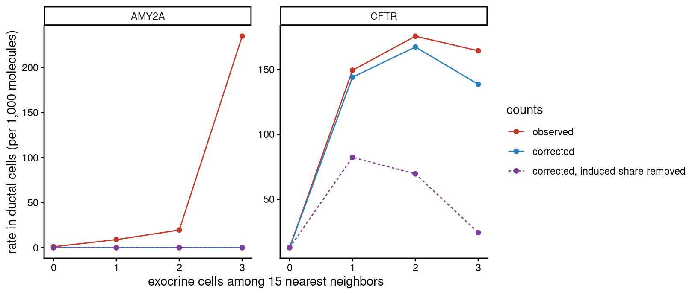

Across all retained genes, most of the exposure-linked excess survives
the correction — the retained fraction per gene, for the largest calls:

``` r
gene_excess <- function(m, gene, source, target) {
  t_cells <- names(cell_types)[!is.na(cell_types) & cell_types == target]
  e <- setNames(cellAdmixCore:::.celladmix_source_exposure_counts(
    cells_xy, cell_annotation, 15L)$counts[, source],
    as.character(cells_xy$cell_id))[t_cells]
  tt <- Matrix::colSums(before[, t_cells])
  sum(m[gene, t_cells[e > 0]]) -
    sum(m[gene, t_cells[e == 0]]) / max(sum(tt[e == 0]), 1) * sum(tt[e > 0])
}
top_ind <- head(induced[order(-induced$excess), ], 8)
ret <- do.call(rbind, lapply(seq_len(nrow(top_ind)), function(i) {
  r <- top_ind[i, ]
  data.frame(gene = r$gene,
    counts = c("observed excess", "excess after correction"),
    excess = c(gene_excess(before, r$gene, r$source, r$target),
      gene_excess(after, r$gene, r$source, r$target)))
}))
ret$counts <- factor(ret$counts,
  levels = c("observed excess", "excess after correction"))
ggplot(ret, aes(reorder(gene, -excess), excess / 1e3, fill = counts)) +
  geom_col(position = "dodge", width = 0.7) +
  scale_fill_manual(values = c("observed excess" = "#c0392b",
    "excess after correction" = "#1e8449")) +
  labs(x = NULL, y = "exposure-linked excess (thousand molecules)",
    fill = NULL) +
  theme_classic(base_size = 11)
```

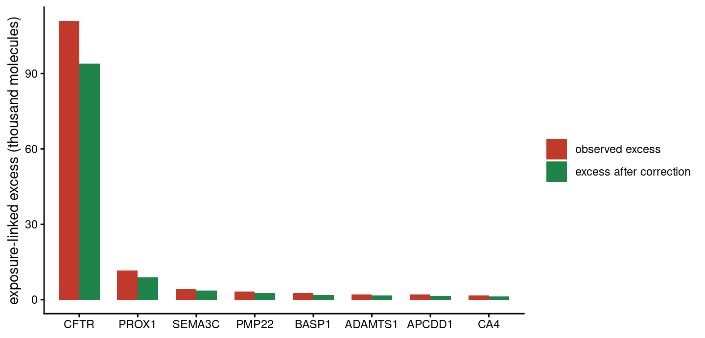

The induction is not one gene’s story: each interface has its own
program, retained in its own pair. The largest retained gene of four
different pairs, each in its target cells against its source’s exposure:

``` r
top_by_pair <- do.call(rbind, lapply(
  split(induced, paste(induced$source, induced$target)), function(d)
    d[which.max(d$excess), ]))
top_by_pair <- top_by_pair[order(-top_by_pair$excess), ]
top_by_pair <- top_by_pair[top_by_pair$gene != "CFTR", ][1:4, ]
expo_of <- function(source) setNames(
  cellAdmixCore:::.celladmix_source_exposure_counts(
    cells_xy, cell_annotation, 15L)$counts[, source],
  as.character(cells_xy$cell_id))
df2 <- do.call(rbind, lapply(seq_len(nrow(top_by_pair)), function(i) {
  r <- top_by_pair[i, ]
  tc <- model$composition(r$source, r$target)$cell_id
  e <- pmin(expo_of(r$source)[tc], 3)
  tt <- Matrix::colSums(before[, tc])
  rb <- function(m) {
    mm <- tapply(m[r$gene, tc], e, sum)
    MM <- tapply(tt, e, sum)
    data.frame(bin = 0:3, rate = as.numeric(mm / MM) * 1e3,
      lo = stats::qgamma(0.025, pmax(as.numeric(mm), 1e-9)) /
        as.numeric(MM) * 1e3,
      hi = stats::qgamma(0.975, as.numeric(mm) + 1) / as.numeric(MM) * 1e3)
  }
  lab <- sprintf("%s\n(%s \u2192 %s)", r$gene,
    sub("/.*", "", r$source), sub("/.*", "", r$target))
  rbind(cbind(panel = lab, counts = "observed", rb(before)),
    cbind(panel = lab, counts = "corrected", rb(after)))
}))
ggplot(df2, aes(bin, rate, color = counts)) +
  geom_line() + geom_point(size = 1.4) +
  geom_errorbar(aes(ymin = lo, ymax = hi), width = 0.12, linewidth = 0.4) +
  facet_wrap(~panel, scales = "free_y", nrow = 2) +
  scale_color_manual(values = c(observed = "#c0392b",
    corrected = "#2980b9")) +
  labs(x = "source-type cells among 15 nearest neighbors",
    y = "rate in target cells (per 1,000 molecules)", color = NULL) +
  theme_classic(base_size = 10)
```

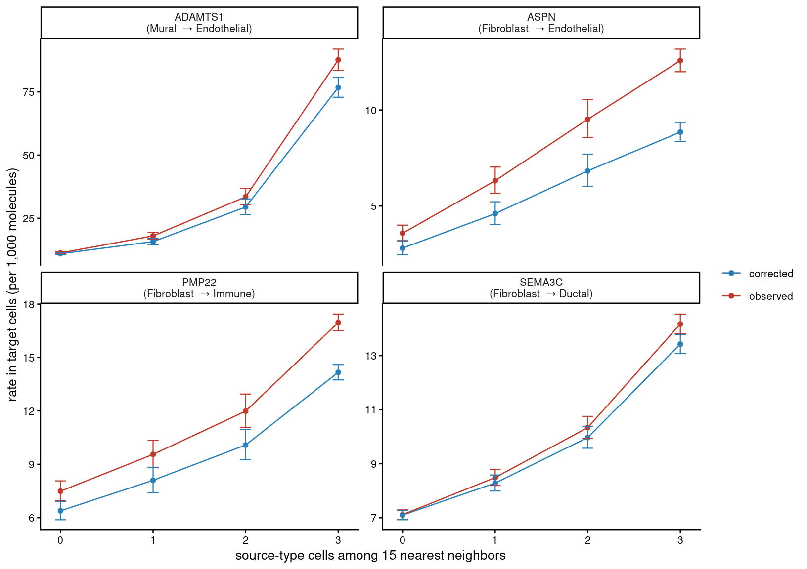

Which cells carry the induced expression is itself fitted: the per-cell
induced activity concentrates in the exposed cells, rather than being
spread uniformly over the type:

``` r
ggplot(comp, aes(factor(pmin(expo[cell_id], 3)), induced_activity)) +
  geom_boxplot(outlier.size = 0.3, fill = "#a9dfbf") +
  labs(x = "exocrine cells among 15 nearest neighbors",
    y = "fitted induced activity of the cell\n(multiplier of the pair's induced term)") +
  theme_classic(base_size = 11)
```

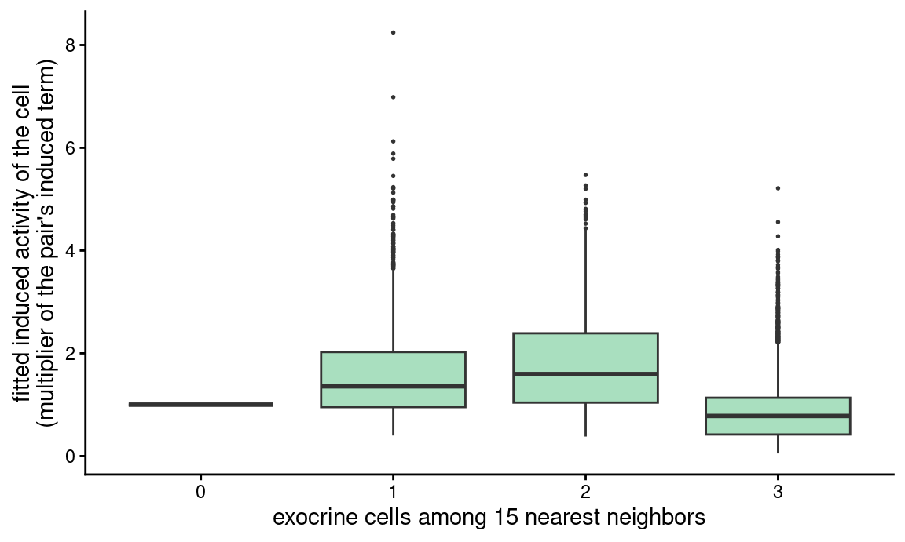

The retained program has a spatial identity of its own. Drawing the
corrected CFTR expression across ductal cells shows it peaking exactly
where the induced table says it should — the duct cells embedded in
acinar tissue — a pattern a marker-based correction would have removed
as contamination:

``` r
cftr_rate <- after["CFTR", duct_cells] /
  pmax(Matrix::colSums(after[, duct_cells]), 1) * 1e3
ggplot(cbind(comp, x = xy$x, y = xy$y, cftr = pmin(cftr_rate, 250)),
    aes(x, y, color = cftr)) +
  geom_point(size = 0.25) +
  scale_color_viridis_c(name = "corrected CFTR\n(per 1,000\nmolecules)") +
  coord_equal() +
  labs(x = NULL, y = NULL,
    title = "The retained CFTR program in ductal cells") +
  theme_void(base_size = 11)
```

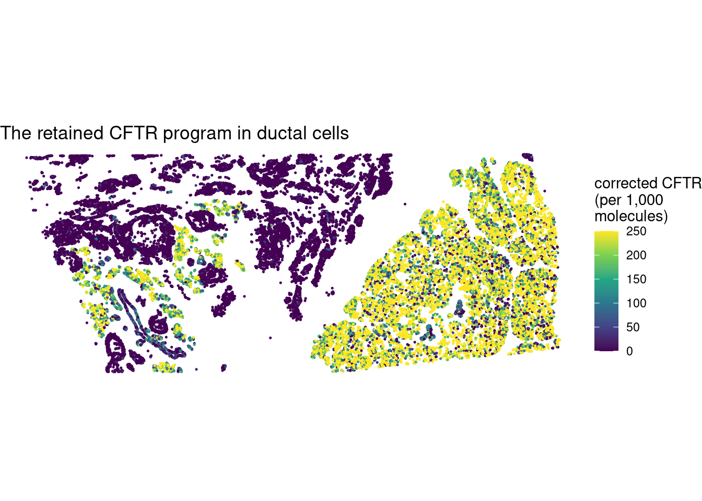

## Verification

The correction is verified against the audit’s own measurements, like
any other correction in the package. The pooled exposure profile shows
the flattening directly:

``` r
report <- audit$evaluate(correction)
report$summary()
```

    ## $detected_pairs
    ## [1] 39
    ## 
    ## $estimated_admixed_molecules
    ## [1] 1574854
    ## 
    ## $leakage_removed_overall
    ## [1] 0.9405623
    ## 
    ## $median_pair_sensitivity
    ## [1] 0.9587951
    ## 
    ## $own_marker_false_removal
    ## [1] 0
    ## 
    ## $worst_false_removal
    ## [1] "Ductal/tumor epithelial"

``` r
report$plot_cleanup()
```

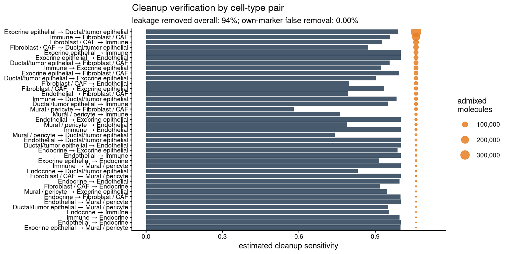

``` r
audit$plot_exposure(correction = correction)
```

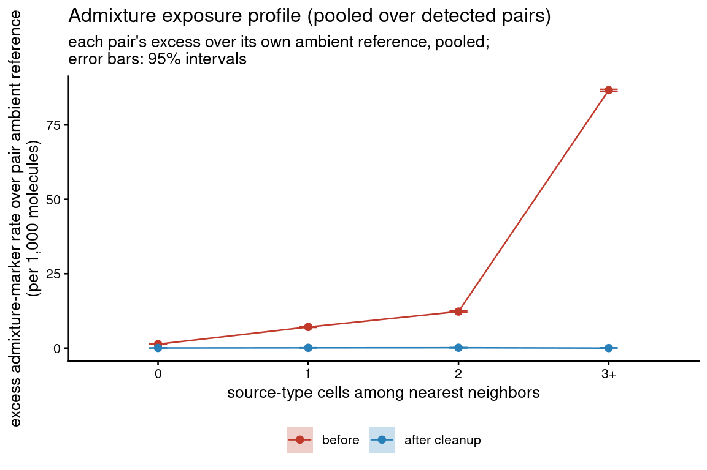

The downstream payoff is visible in cell state space: a UMAP of the
corrected counts separates the annotated cell types more cleanly than
the original counts, where contaminated interface cells blur the
boundaries between clusters:

``` r
original_state <- ds$cell_state_umap(cells_max = 5000)
corrected_state <- correction$cell_state_umap(cells_max = 5000,
  num_threads = 8)
type_levels <- sort(unique(cell_annotation))
palette <- setNames(grDevices::hcl.colors(length(type_levels), "Dark 3"),
  type_levels)
umap_panel <- function(df, title) {
  ggplot(df, aes(umap_1, umap_2,
      color = factor(cell_type, levels = type_levels))) +
    geom_point(size = 0.4, alpha = 0.7) +
    scale_color_manual(values = palette, drop = FALSE, name = NULL) +
    labs(title = title, x = "UMAP 1", y = "UMAP 2") +
    theme_classic(base_size = 10) +
    guides(color = guide_legend(override.aes = list(size = 3, alpha = 1)))
}
p1 <- umap_panel(original_state, "Original counts")
p2 <- umap_panel(corrected_state, "Generative correction")
shared_legend <- cowplot::get_legend(p1)
cowplot::plot_grid(
  cowplot::plot_grid(p1 + theme(legend.position = "none"),
    p2 + theme(legend.position = "none"), ncol = 2, align = "hv"),
  shared_legend, ncol = 2, rel_widths = c(1, 0.22))
```

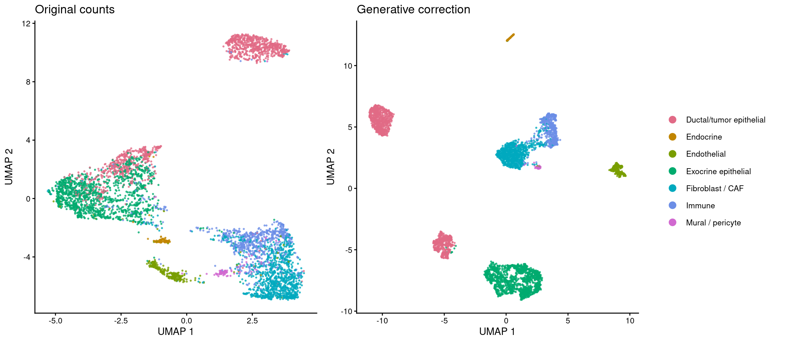

Two limits are worth keeping in mind when reading the results. The model
never removes a target type’s own marker genes (their contamination is
indistinguishable from native expression and is deliberately left in
place), so shared-gene admixture is under-removed by construction. And
induced expression is only recognizable when it is disproportionate to
the source’s transfer profile: induction of a source’s own top marker
genes cannot be told apart from admixture at count level and is removed
with it ([docs/generative.md](../../docs/generative.md), the
identifiability limit).
