cellAdmix Xenium Example: Pancreas Membrane and Bridge Scoring
================

-   <a href="#overview" id="toc-overview">Overview</a>
-   <a href="#inputs" id="toc-inputs">Inputs</a>
-   <a href="#fit-factors" id="toc-fit-factors">Fit Factors</a>
-   <a href="#admixture-audit" id="toc-admixture-audit">Admixture Audit</a>
-   <a href="#factor-source-prior" id="toc-factor-source-prior">Factor
    Source Prior</a>
-   <a href="#tissue-context" id="toc-tissue-context">Tissue Context</a>
-   <a href="#diagnostic-setup" id="toc-diagnostic-setup">Diagnostic
    Setup</a>
-   <a href="#membrane-scoring" id="toc-membrane-scoring">Membrane
    Scoring</a>
-   <a href="#bridge-scoring" id="toc-bridge-scoring">Bridge Scoring</a>
-   <a href="#score-comparison" id="toc-score-comparison">Score
    Comparison</a>
-   <a href="#cell-state-umap-before-and-after-cleanup"
    id="toc-cell-state-umap-before-and-after-cleanup">Cell-State UMAP Before
    and After Cleanup</a>

## Overview

This notebook illustrates a cellAdmix workflow on a Xenium pancreas
dataset with membrane staining. The example starts from a Xenium output
bundle, a simple cell-type annotation, and a coarse regional annotation.
The core fit uses the `invsqrt_kl` factorization recommended for
membrane scoring, with otherwise-default settings: automatic rank from
the number of annotated cell types, an automatically resolved
neighborhood size, multiple NMF starts, and gene-loading molecule
scoring.

At a high level, the workflow is:

``` r
ds <- cellAdmix(bundle_dir, output_dir = output_dir, annotation = cell_annotation)
fit <- ds$fit(nmf_variant = "invsqrt_kl")  # membrane scoring pairs with invsqrt_kl

membrane_score <- fit$score_membrane()
membrane_rules <- membrane_score$rules()
membrane_correction <- membrane_score$correct(rules = membrane_rules)

fit_ls <- ds$fit()                         # bridge scoring pairs with ls_nmf
bridge_score <- fit_ls$score_bridge()
bridge_rules <- bridge_score$rules()
bridge_correction <- bridge_score$correct(rules = bridge_rules)
```

The constructor records the Xenium bundle location, validates the input
configuration, and stores lightweight cell-level metadata. It does not
load all molecules into R memory. The computational work starts with
`fit()`, followed by one or more scoring methods that identify
source-target admixture patterns and produce correction rules.

## Inputs

Download the Xenium output bundle from the original [10x Genomics
dataset
page](https://www.10xgenomics.com/datasets/ffpe-human-pancreas-with-xenium-multimodal-cell-segmentation-1-standard)
and expand it into a local folder named `data`. The bundle zip can be
downloaded directly with:

``` r
curl -O https://cf.10xgenomics.com/samples/xenium/2.0.0/Xenium_V1_human_Pancreas_FFPE/Xenium_V1_human_Pancreas_FFPE_outs.zip
```

Also create a folder named `annotations` and download the example
annotation files from
<http://pklab.org/peterk/cellAdmix/examples/pancreas_377/annotations>.
The two files used below are `annotations/annotation.csv.gz` and
`annotations/domain_annotation.csv.gz`. Base R can read these
gzip-compressed CSV files directly.

The supplied cell annotation and regional-domain segmentation files are
quick-and-dirty labels generated only for this illustration. They are
not curated biological ground truth, and they are probably wrong in
places. In a real analysis, use your own cell-type annotations and
tissue-region definitions.

The output directory `out` stores reusable cellAdmix caches, fit
outputs, scores, and corrected runs.

``` r
bundle_dir <- "data"
output_dir <- "out"
annotation_file <- file.path("annotations", "annotation.csv.gz")
domain_file <- file.path("annotations", "domain_annotation.csv.gz")

annotation <- read.csv(annotation_file, stringsAsFactors = FALSE)
domain_annotation <- read.csv(domain_file, stringsAsFactors = FALSE)

table(annotation$merged_annotation)
```

    ## 
    ## Ductal/tumor epithelial               Endocrine             Endothelial 
    ##                   29986                    2212                    7026 
    ##     Exocrine epithelial        Fibroblast / CAF                  Immune 
    ##                   36329                   28366                   19251 
    ##        Mural / pericyte 
    ##                    2553

``` r
table(domain_annotation$domain_label)
```

    ## 
    ## adjacent_normal      transition           tumor 
    ##           37909           38853           48961

The cell-type annotation is passed to `cellAdmix()` as a named vector.
The regional-domain table is kept in R memory because it is only used
later for plots and diagnostic DE comparisons, not for factor fitting or
scoring.

``` r
cell_annotation <- setNames(annotation$merged_annotation, annotation$cell_id)

ds <- cellAdmix(bundle_dir, output_dir = output_dir, annotation = cell_annotation)

ds
```

    ## cellAdmix dataset
    ##   format: xenium 
    ##   output cache: configured
    ##   threads: 10 
    ##   molecules: transcripts.parquet 
    ##   cells: cells.parquet 
    ##   annotation:manual (125723 cells, 7 labels)

## Fit Factors

`ds$fit()` constructs molecule-centered neighborhood composition
vectors, fits NMF factors, projects/smooths molecule factor assignments,
and summarizes the result at cell level. The rank is automatically
derived from the number of cell types in the active annotation.

The NMF variant is chosen to match the scoring method that will consume
the factors (see [docs/benchmarks.md](../../docs/benchmarks.md)): on
membrane-stained data, membrane scoring removes the most admixture when
paired with the sparse `invsqrt_kl` factorization, whose
inverse-square-root gene weighting yields sharp, marker-driven loadings.
We therefore fit `invsqrt_kl` as the primary factorization, and fit the
default weighted least-squares variant (`ls_nmf`, the original cellAdmix
formulation) alongside it for comparison and for bridge scoring later in
the notebook.

``` r
fit <- ds$fit(nmf_variant = "invsqrt_kl", verbose = TRUE)
```

    ## Reusing cached run fit_manual_rank9_invsqrt_kl (parameters match)

``` r
fit
```

    ## cellAdmix fit
    ##   run: fit_manual_rank9_invsqrt_kl 
    ##   annotation: manual 
    ##   rank: 9 
    ##   NMF: invsqrt_kl 
    ##   molecule scoring: gene_loadings 
    ##   cells: 140335 
    ##   transcripts: 6186500

Top gene loadings are the first-pass interpretation of each factor.

``` r
fit$plot_loadings()
```

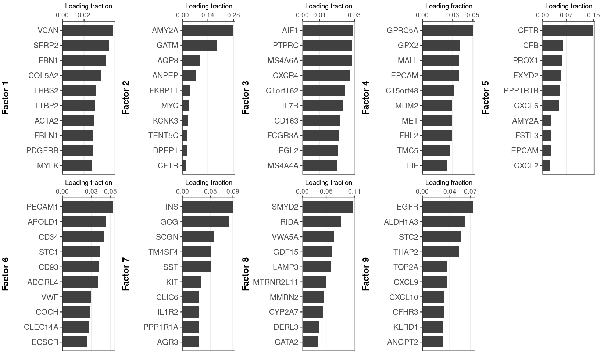

### Variant Comparison: invsqrt KL-NMF vs ls-NMF

``` r
fit_ls <- ds$fit()
```

    ## Reusing cached run fit_manual_rank9_ls_nmf (parameters match)

The stability plots show whether high-importance factors are
reproducible across independent NMF restarts (matched gene-ownership
correlation: near zero for unrelated factors, above 0.3 for reproducibly
re-found ones). Factor importance (the x-axis, echoed by dot size) is
the share of all assigned molecules that carry the factor’s label. The
comparison shows the two variants’ complementary characters: `ls_nmf`
recovers cell-type-native factors far more reproducibly across restarts,
while `invsqrt_kl` trades restart stability for the marker-sharp
loadings that give membrane scoring its cleanest contrast. The
instability costs little in practice because the default correction is
an ensemble that votes across the restarts rather than trusting any
single one.

``` r
cowplot::plot_grid(
  fit$plot_stability() + ggplot2::ggtitle("invsqrt_kl (primary)"),
  fit_ls$plot_stability() + ggplot2::ggtitle("ls_nmf"),
  ncol = 2, align = "hv", axis = "tblr")
```

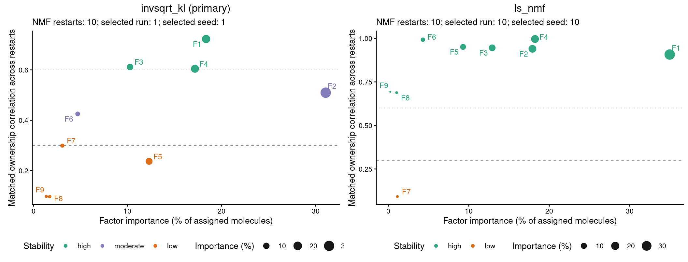

## Admixture Audit

Before interpreting factors, it is worth measuring how much admixture
the dataset carries and between which cell types. The audit exploits the
spatial structure of segmentation-driven admixture: source-marker
content in target cells rises with the number of source-type neighbor
cells, while unexposed target cells provide an internal negative
control. It needs only the annotation, cell positions, and counts — no
factorization. The directly measured marker excess is a conservative
lower bound, which the audit extrapolates to per-pair admixture rates
and molecule counts by the markers’ share of the source transcriptome
(see [docs/benchmarks.md](../../docs/benchmarks.md)).

``` r
audit <- fit$audit_admixture()
audit_pairs <- audit$pairs(detected_only = TRUE)
head(audit_pairs[order(-audit_pairs$admixed_molecules), ], 8)
```

    ##                     source                  target       rate admixed_molecules
    ## 19     Exocrine epithelial Ductal/tumor epithelial 0.26415754            506753
    ## 35                  Immune        Fibroblast / CAF 0.15860496            173342
    ## 29        Fibroblast / CAF                  Immune 0.17848477             90518
    ## 25        Fibroblast / CAF Ductal/tumor epithelial 0.03573816             68559
    ## 23     Exocrine epithelial                  Immune 0.12692013             64367
    ## 21     Exocrine epithelial             Endothelial 0.20206447             64313
    ## 22     Exocrine epithelial        Fibroblast / CAF 0.04917126             53740
    ## 4  Ductal/tumor epithelial        Fibroblast / CAF 0.04714327             51524
    ##    excess excess_strict  coverage q_value detected n_exposed n_reference
    ## 19 362132        221588 0.7146118       0     TRUE     13207       16779
    ## 35  32837            NA 0.1894326       0     TRUE     24683        3683
    ## 29  38636          5717 0.4268330       0     TRUE     16195        3056
    ## 25  24080         14554 0.3512234       0     TRUE     15882       14104
    ## 23  46804         44130 0.7271387       0     TRUE      6409       12842
    ## 21  46048         44347 0.7159979       0     TRUE      3668        3358
    ## 22  38961         38044 0.7249958       0     TRUE      5312       23054
    ## 4   14309         11566 0.2777262       0     TRUE     12056       16310
    ##    n_markers n_strict
    ## 19        20        3
    ## 35        20        0
    ## 29        20        2
    ## 25        20        9
    ## 23        20        5
    ## 21        20        6
    ## 22        20        8
    ## 4         20       15

The admixture map summarizes every detected source → target pair; each
cell shows the estimated admixture rate — the percent of the target
type’s molecules that leaked in from the source.

``` r
audit$plot_map()
```


The default exposure view pools all detected pairs into one curve of
excess source-marker content — each pair’s rise above its own unexposed
reference — versus source-neighbor exposure (error bars are 95%
intervals); pooling the excess rather than the raw rates keeps the curve
comparable across pairs with different native baselines. Passing a
specific pair shows that pair’s own raw profile.

``` r
cowplot::plot_grid(
  audit$plot_exposure(),
  audit$plot_exposure("Exocrine epithelial", "Ductal/tumor epithelial"),
  ncol = 2, align = "hv", axis = "tblr")
```

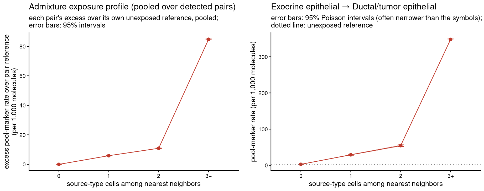

## Factor Source Prior

Top loadings are useful, but source calls should emphasize genes that
actually distinguish annotated cell types. `score_factor_sources()`
builds pseudobulk cell-type profiles from the original counts, estimates
one-versus-rest cell-type marker weights, and compares each NMF factor
against those weighted marker signatures. This is a diagnostic source
prior only; the membrane and bridge scores below are still run
independently.

``` r
original_counts <- fit$counts()
factor_source_score <- fit$score_factor_sources(counts = original_counts)

factor_source_score$annotation()
```

    ##    factor factor_label        source_cell_type      score     margin called
    ## 5       1           F1        Fibroblast / CAF 0.78882685 0.50681651   TRUE
    ## 11      2           F2     Exocrine epithelial 0.70477538 0.69130884   TRUE
    ## 20      3           F3                  Immune 0.86779517 0.84154392   TRUE
    ## 22      4           F4 Ductal/tumor epithelial 0.78896088 0.74097162   TRUE
    ## 29      5           F5                    <NA> 0.14990647 0.01649407  FALSE
    ## 38      6           F6             Endothelial 0.74395352 0.69431470   TRUE
    ## 44      7           F7               Endocrine 0.73591198 0.67247104   TRUE
    ## 52      8           F8                    <NA> 0.08550995 0.03753020  FALSE
    ## 62      9           F9                    <NA> 0.12083374 0.05881825  FALSE

In this table, `score` is the marker-weighted similarity between a
factor and the best matching cell type. `margin` is the best score minus
the second-best score for that factor; larger margins indicate more
specific source evidence. `called` indicates whether the best cell type
passed both the score and margin thresholds used for source-prior
annotation.

The heatmap shows marker-weighted gene-content evidence for each factor
and cell type. The `S` marker identifies the best gene-content source
call for each factor.

``` r
factor_source_score$plot_heatmap()
```

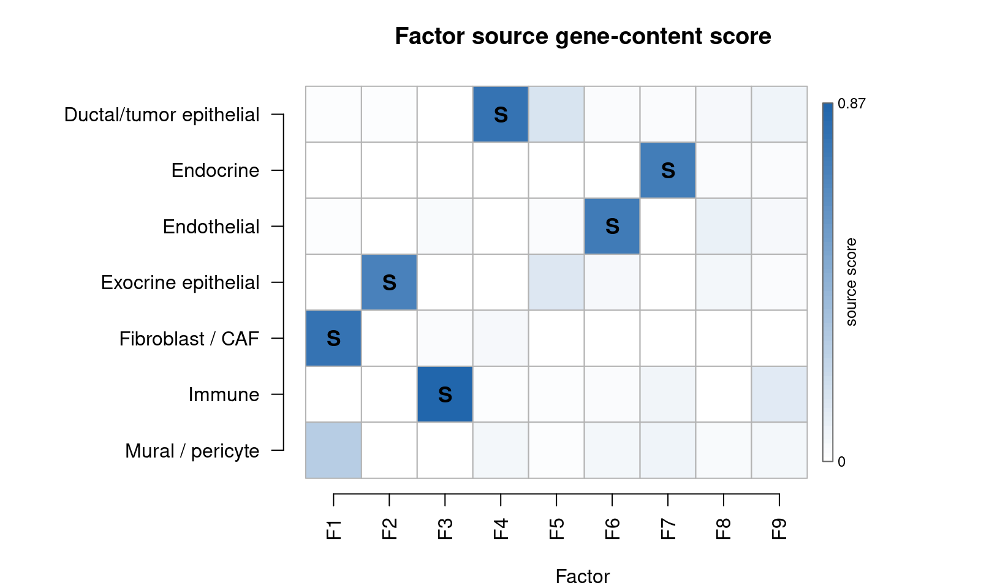

The next plot shows the cell-type marker genes that most strongly
support each factor’s best source call.

``` r
factor_source_score$plot_top_genes()
```

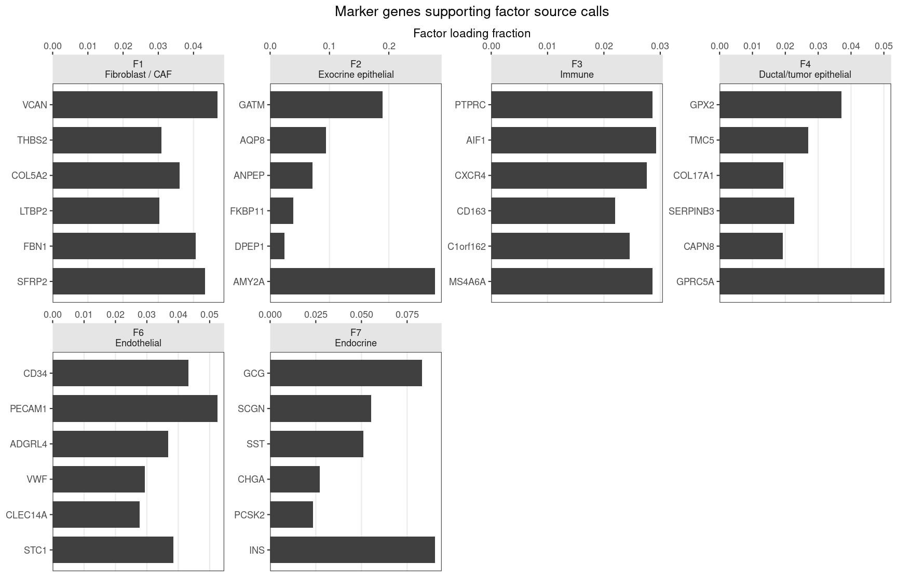

## Tissue Context

The cell-type and domain plots below are side visualizations. To prepare
them, we merge the cellAdmix cell-level factor summaries with the
supplied cell-type and regional-domain annotations.

``` r
cell_factors <- fit$cell_factors()
cell_spatial <- merge(cell_factors,
  annotation[, c("cell_id", "merged_annotation", "cluster_label")],
  by = "cell_id", all.x = FALSE, sort = FALSE)
cell_spatial <- merge(cell_spatial,
  domain_annotation[, c("cell_id", "domain_label", "domain_fine_label")],
  by = "cell_id", all.x = FALSE, sort = FALSE)
cell_spatial$domain_label <- factor(cell_spatial$domain_label,
  levels = c("adjacent_normal", "transition", "tumor"))
```

``` r
celladmix_plot_spatial(cell_spatial, color_by = "merged_annotation") +
  ggtitle("Cell type annotation")
```

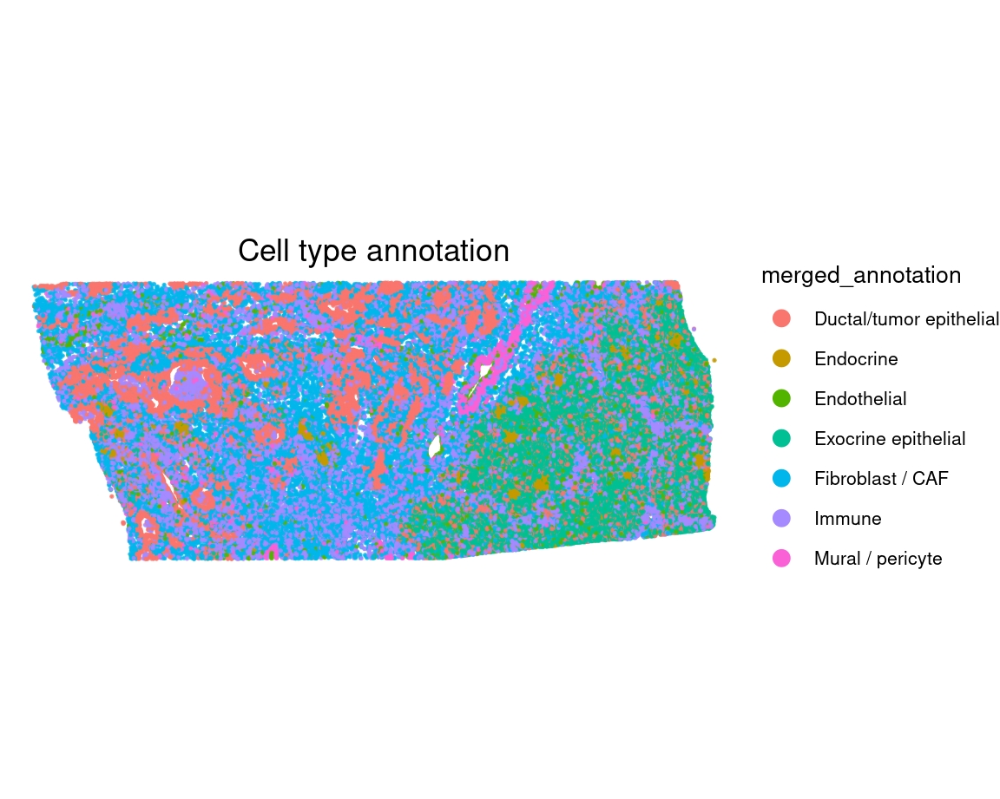

``` r
cowplot::plot_grid(plotlist = list(
  celladmix_plot_spatial(cell_spatial, color_by = "domain_label") +
    ggtitle("Coarse tissue domains"),
  celladmix_plot_spatial(cell_spatial, color_by = "dominant_factor") +
    ggtitle("Dominant cellAdmix factor")
), ncol = 2, align = "hv", axis = "tblr")
```

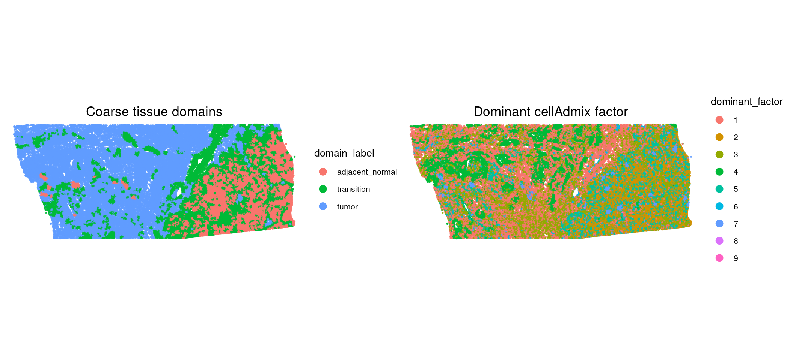

## Diagnostic Setup

Scoring and correction below are run for all annotated cell types. To
keep the diagnostic plots readable, we focus the downstream DE and
example-cell panels on two illustrative cell types: endothelial and
immune cells. These choices are only for visualization; they do not
restrict the cleanup rules.

The marker genes below are used to highlight likely admixture sources in
the diagnostic plots: ductal/tumor epithelial cells and
endocrine/exocrine epithelium.

``` r
diagnostic_cell_types <- c("Endothelial", "Immune")

ductal_tumor_markers <- c("GPRC5A", "MALL", "FHL2", "EPCAM", "GPX2", "MET",
  "SERPINB3", "KRT7")
endocrine_exocrine_markers <- c("AMY2A", "AQP8", "ANPEP", "CFTR", "INS",
  "GCG", "SST", "CHGA", "SCGN")
source_marker_sets <- list(
  "ductal/tumor source" = ductal_tumor_markers,
  "endocrine/exocrine source" = endocrine_exocrine_markers
)
```

We then run a baseline DE comparison between tumor and adjacent-normal
domains for the two diagnostic cell types using the original counts
collected above. These DE results are only used for the illustrative
before/after cleanup plots later in the notebook.

``` r
diagnostic_de_original <- celladmix_de_by_group(original_counts, cell_spatial,
  subset_by = "merged_annotation", subsets = diagnostic_cell_types,
  group_by = "domain_label", contrast = c("tumor", "adjacent_normal"))
```

These baseline volcano plots show tumor-domain versus
adjacent-normal-domain differences before any molecule removal. Positive
logFC means higher expression in tumor-domain target cells.

``` r
baseline_volcano_plots <- lapply(diagnostic_cell_types, function(target_type) {
  de <- diagnostic_de_original[[target_type]]
  celladmix_plot_volcano(de, markers = source_marker_sets,
    title = paste(target_type, "before cleanup"),
    subtitle = sprintf("logFC = tumor / adjacent_normal; n = %d / %d",
      unique(de$n_group_a), unique(de$n_group_b)))
})
cowplot::plot_grid(plotlist = baseline_volcano_plots,
  ncol = length(baseline_volcano_plots), align = "hv", axis = "tblr")
```

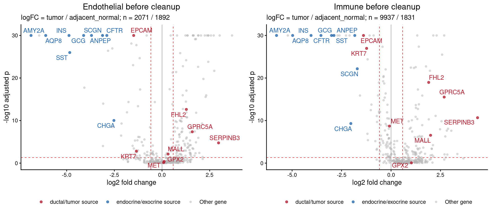

## Membrane Scoring

Membrane scoring asks whether target-cell molecules assigned to a factor
are enriched along membrane-stain paths facing a candidate source cell
type. It operates on the primary `invsqrt_kl` factors, whose sharp
loadings give the stain-path contrast its cleanest separation. The score
summaries are thresholded at `p_thresh`; here we use a permissive
threshold because this notebook is meant to compare candidate cleanup
rules.

``` r
p_thresh <- 0.1
score_pairs_width <- 9.6
score_pairs_height <- max(6, ceiling(fit$rank / 2) * 4.9)
```

First, run the membrane scoring procedure. The returned `membrane_score`
object stores the raw pair-level and summarized evidence; it does not
modify molecules.

``` r
membrane_score <- fit$score_membrane()
```

Next, convert score summaries into factor annotations. For each factor,
this identifies the most plausible source cell type and target cell
types with significant membrane-supported admixture evidence.

``` r
membrane_annotation <- membrane_score$annotation(p_thresh = p_thresh)
```

Finally, convert those annotation calls into correction rules. Each row
says that molecules assigned to a given factor should be removed from a
target cell type; the source cell type is retained as an interpretation
of the likely origin. A native-factor check runs on each rule by
default: rules whose factor persists in target cells with no source-type
neighbors are flagged (`keep = FALSE`) as likely native expression and
skipped by correction.

``` r
membrane_rules <- membrane_score$rules(p_thresh = p_thresh)

head(membrane_rules[, c("factor", "source_cell_type", "target_cell_type",
  "p_value", "keep", "native_check")])
```

    ##   factor    source_cell_type        target_cell_type      p_value keep
    ## 1      1    Fibroblast / CAF Ductal/tumor epithelial 3.632154e-04 TRUE
    ## 2      1    Fibroblast / CAF               Endocrine 2.493568e-03 TRUE
    ## 3      1    Fibroblast / CAF     Exocrine epithelial 2.006543e-02 TRUE
    ## 4      2 Exocrine epithelial Ductal/tumor epithelial 3.707277e-02 TRUE
    ## 5      2 Exocrine epithelial               Endocrine 2.765420e-05 TRUE
    ## 6      2 Exocrine epithelial             Endothelial 7.702263e-07 TRUE
    ##   native_check
    ## 1         pass
    ## 2         pass
    ## 3         pass
    ## 4         pass
    ## 5         pass
    ## 6         pass

The heatmap summarizes factor-by-cell-type evidence. Color intensity
shows the strongest membrane-supported target evidence for each factor
and cell type; plot symbols mark inferred source and cleanup target
calls. With the gene-content source prior overlaid, `S` marks the
membrane/spatial source, `G` marks the gene-content source, `SG` marks
agreement, separate `S` and `G` labels in the same factor column
indicate a source conflict, and `*` marks a cleanup target.

``` r
membrane_score$plot_heatmap(p_thresh = p_thresh,
  source_prior = factor_source_score)
```

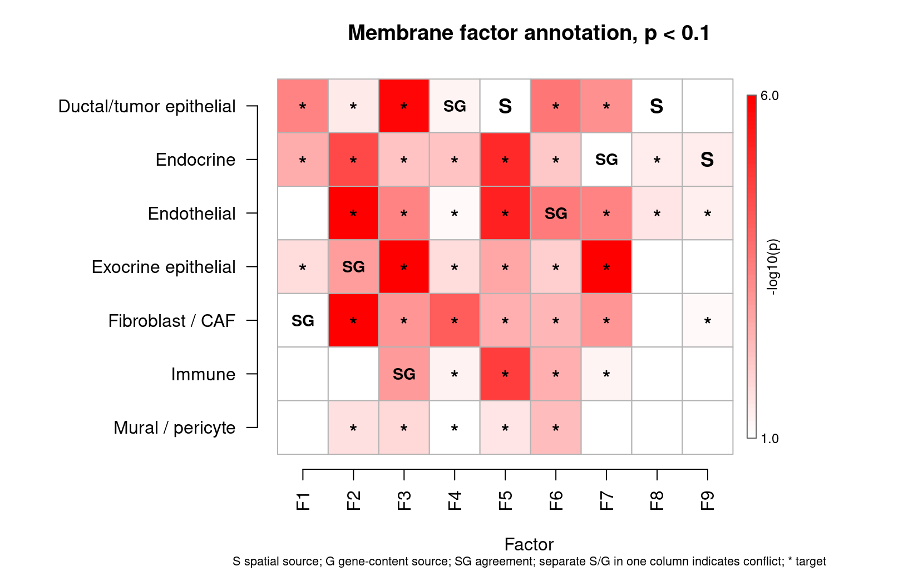

The pair plots show the same membrane evidence one factor at a time.
Rows are factors, columns are candidate target cell types, and the top
margin summarizes which source cell types best explain each factor. This
view is useful for checking whether a correction rule has a plausible
source and target pattern.

``` r
membrane_score$plot_pairs()
```

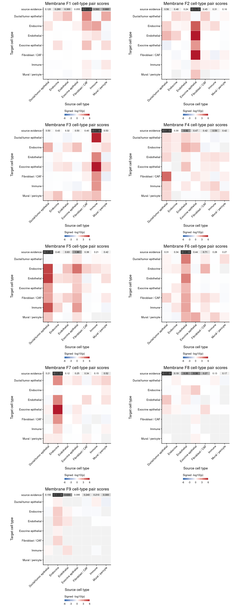

### Example Cells

Next, we render a few target-cell examples for the diagnostic cell
types. The cell selection uses the membrane score to find cells with
strong rule-supported admixture-factor evidence. The molecule colors
show post-smoothing factor labels: native factors in blue, the top
putative admixture factor in red, and other non-native factors in
orange. Marker-gene molecules are shown with the same color coding, but
are drawn slightly larger.

The DAPI/membrane stain backgrounds, cell boundaries, and cell-type
contour coloring are discovered automatically from the Xenium bundle;
stain pixel data are read lazily as small crops around each selected
cell. Pass `stains = NULL` or `color_cell_types = FALSE` to simplify the
panels, or plot specific cells with `plot_examples(cells = c(...))`.

``` r
example_cells <- membrane_score$examples(rules = membrane_rules,
  score_annotation = membrane_annotation, cell_data = cell_spatial,
  targets = diagnostic_cell_types, n_per_target = 4)

for (cell_type in diagnostic_cell_types) {
  type_examples <- example_cells[example_cells$target_cell_type == cell_type, , drop = FALSE]
  print(membrane_score$plot_examples(type_examples,
    score_annotation = membrane_annotation, cell_data = cell_spatial,
    markers = unique(unlist(source_marker_sets)), ncol = 2))
}
```

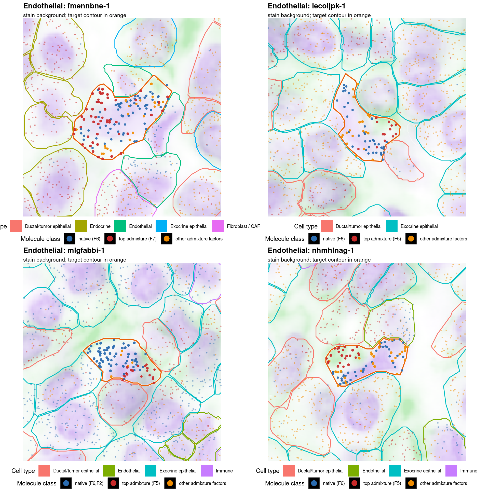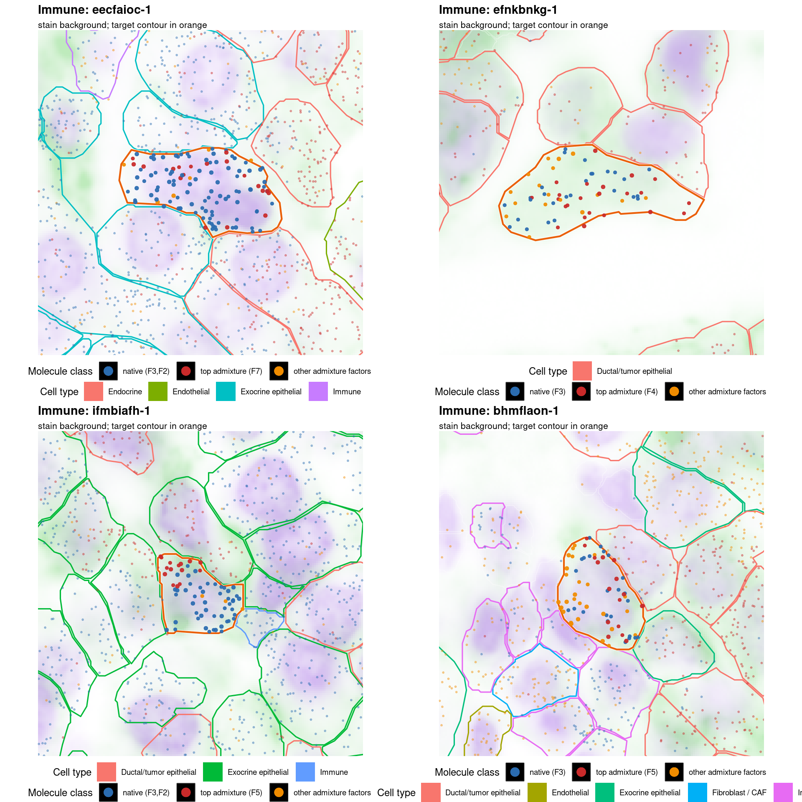

Specific cells can also be plotted directly by ID with `cells =`,
whether or not they would have been auto-selected — useful for following
up on cells noticed in other views.

``` r
print(membrane_score$plot_examples(
  cells = as.character(example_cells$target_cell[1:2]),
  score_annotation = membrane_annotation, cell_data = cell_spatial, ncol = 2))
```

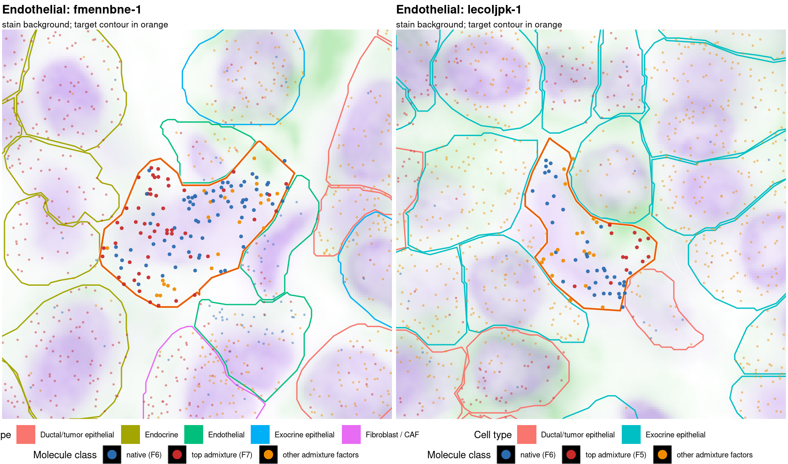

### Membrane Cleanup Diagnostics

The correction step below applies all membrane-derived rules across all
annotated cell types. By default it is a molecule-vote ensemble: up to
10 of the fit’s NMF restarts are scored and vetted independently, and a
molecule is removed when at least 30% of those members remove it (3 of
10 here), which stabilizes the strong seed-dependence of single-fit
corrections (`vote` tunes the threshold; `ensemble = 1` reverts to a
single-fit correction). This creates a corrected run and then collects
the corrected cell-by-gene count matrix that will be used for downstream
diagnostics.

``` r
membrane_correction <- membrane_score$correct(rules = membrane_rules,
  name = "membrane_clean")
```

    ## Ensemble correction over 10 members: molecules removed by >= 3 members (vote >= 0.30) are dropped (1,595,516 molecules).

``` r
membrane_counts <- membrane_correction$counts()

membrane_correction$summary()
```

    ##                 cell_type n_cells n_modified_cells fraction_cells_modified
    ## 1                     all  140335           120290               0.8571632
    ## 2 Ductal/tumor epithelial   29986            29562               0.9858601
    ## 3               Endocrine    2212             2190               0.9900542
    ## 4             Endothelial    7026             6908               0.9832052
    ## 5     Exocrine epithelial   36329            35919               0.9887143
    ## 6        Fibroblast / CAF   28366            26214               0.9241345
    ## 7                  Immune   19251            17208               0.8938756
    ## 8        Mural / pericyte    2553             2289               0.8965922
    ## 9                 unknown   14612                0               0.0000000
    ##   molecules_before molecules_after molecules_removed fraction_molecules_removed
    ## 1          6186500         4590984           1595516                  0.2579029
    ## 2          1918375         1360394            557981                  0.2908613
    ## 3           125632           96599             29033                  0.2310956
    ## 4           318282          211937            106345                  0.3341219
    ## 5          2085030         1474120            610910                  0.2929982
    ## 6          1092917          908656            184261                  0.1685956
    ## 7           507146          411675             95471                  0.1882515
    ## 8            56812           45297             11515                  0.2026861
    ## 9            82306           82306                 0                  0.0000000
    ##   median_removed_per_modified_cell median_fraction_removed_per_modified_cell
    ## 1                                8                                 0.1818182
    ## 2                               12                                 0.1967213
    ## 3                               10                                 0.2045455
    ## 4                               10                                 0.2713165
    ## 5                               13                                 0.2142857
    ## 6                                4                                 0.1333333
    ## 7                                4                                 0.1587302
    ## 8                                4                                 0.1818182
    ## 9                                0                                 0.0000000

The next step is illustrative: repeat the same
tumor-versus-adjacent-normal DE comparison on the corrected counts,
limited to the two diagnostic cell types defined above. This lets us
inspect how membrane-based cleanup changes the example DE signal.

``` r
membrane_de <- celladmix_de_by_group(membrane_counts, cell_spatial,
  subset_by = "merged_annotation", subsets = diagnostic_cell_types,
  group_by = "domain_label", contrast = c("tumor", "adjacent_normal"))
```

This boxplot summarizes the number and fraction of molecules removed per
cell. It is a coarse sanity check: very large shifts indicate aggressive
cleanup, while near-zero shifts indicate that few rules applied to the
dataset.

``` r
membrane_correction$plot_removed_molecules()
```

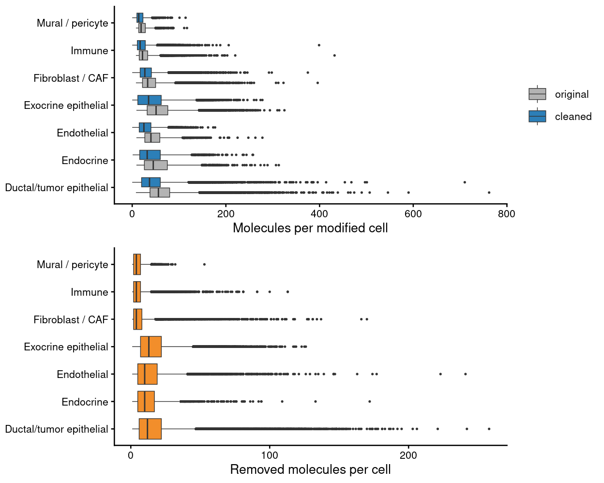

The audit provides the direct verification: per-pair cleanup sensitivity
against the admixture estimates, the own-marker false-removal rate
(removal of near-surely-genuine molecules), and a warning for any
detected pair no removal rule covers — here it flags the uncovered
stromal/immune pairs, the largest being immune → fibroblast (\~173k
estimated molecules); the dataset’s biggest leakage flow, exocrine →
ductal, is covered by the membrane rules.

``` r
membrane_report <- audit$evaluate(membrane_correction)
```

    ## Warning: Detected ~64,367 admixed molecules from Exocrine epithelial into
    ## Immune, but no removal rule covers this pair

    ## Warning: Detected ~36,376 admixed molecules from Fibroblast / CAF into
    ## Endothelial, but no removal rule covers this pair

    ## Warning: Detected ~90,518 admixed molecules from Fibroblast / CAF into Immune,
    ## but no removal rule covers this pair

    ## Warning: Detected ~6,458 admixed molecules from Fibroblast / CAF into Mural /
    ## pericyte, but no removal rule covers this pair

    ## Warning: Detected ~173,342 admixed molecules from Immune into Fibroblast / CAF,
    ## but no removal rule covers this pair

    ## Warning: Detected ~12,962 admixed molecules from Mural / pericyte into
    ## Endothelial, but no removal rule covers this pair

    ## Warning: Detected ~11,396 admixed molecules from Mural / pericyte into
    ## Fibroblast / CAF, but no removal rule covers this pair

    ## Warning: Detected ~5,936 admixed molecules from Mural / pericyte into Immune,
    ## but no removal rule covers this pair

``` r
membrane_report$summary()
```

    ## $detected_pairs
    ## [1] 39
    ## 
    ## $estimated_admixed_molecules
    ## [1] 1454078
    ## 
    ## $leakage_removed_overall
    ## [1] 0.5824762
    ## 
    ## $median_pair_sensitivity
    ## [1] 0.9923732
    ## 
    ## $own_marker_false_removal
    ## [1] 0.03254766
    ## 
    ## $worst_false_removal
    ## [1] "Exocrine epithelial"

``` r
membrane_report$plot_cleanup()
```

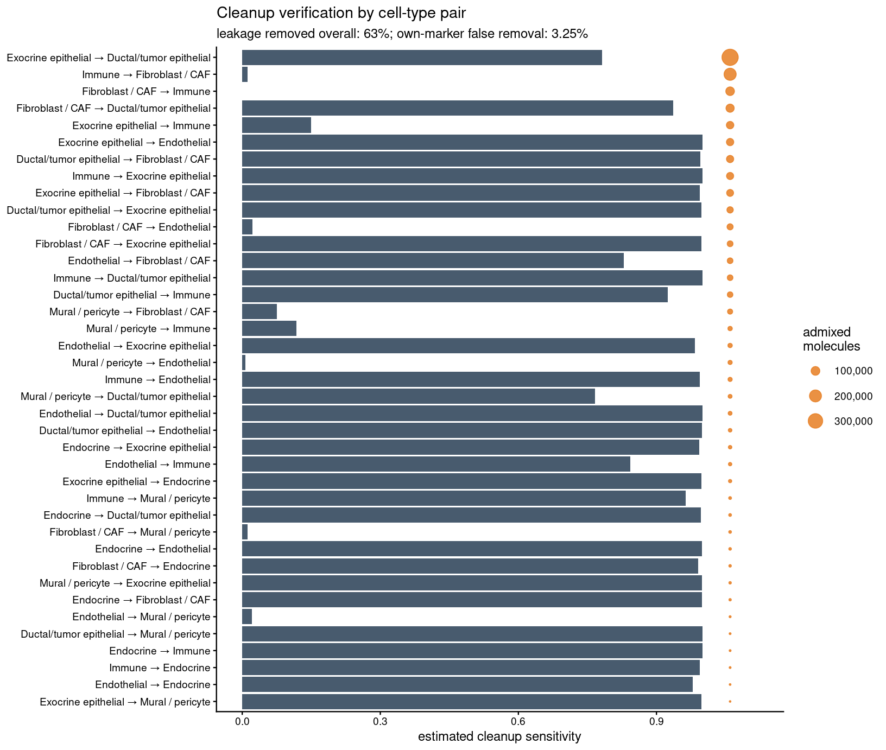

Overlaying the corrected counts on the exposure profiles shows the
cleanup geometrically — first pooled over all detected pairs, then for
one pair:

``` r
cowplot::plot_grid(
  audit$plot_exposure(correction = membrane_correction),
  audit$plot_exposure("Exocrine epithelial", "Endothelial",
    correction = membrane_correction),
  ncol = 2, align = "hv", axis = "tblr")
```

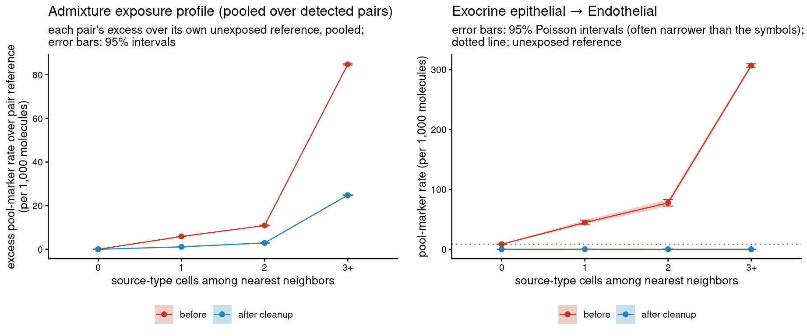

The volcano plots show the same tumor-versus-adjacent-normal DE
comparison before and after cleanup. The goal is to check whether
highlighted source-marker genes become less prominent after removing
putative admixture molecules.

``` r
for (target_type in diagnostic_cell_types) {
  p_before <- celladmix_plot_volcano(diagnostic_de_original[[target_type]],
    markers = source_marker_sets, title = paste(target_type, "before cleanup")) +
    ggplot2::theme(legend.position = "none")
  p_after <- celladmix_plot_volcano(membrane_de[[target_type]],
    markers = source_marker_sets, title = paste(target_type, "after membrane cleanup"))
  print(cowplot::plot_grid(plotlist = list(p_before, p_after),
    ncol = 2, align = "hv", axis = "tblr"))
}
```

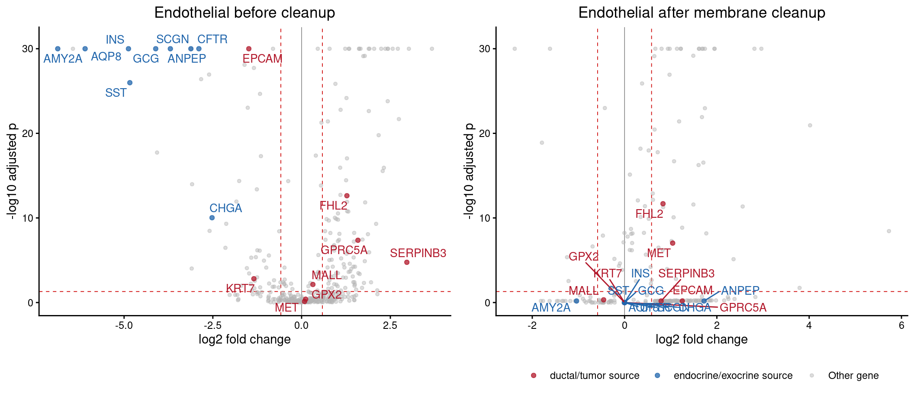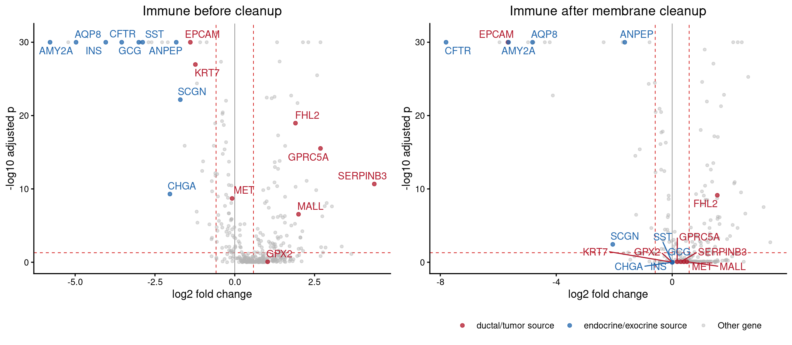

The scatter plots below compare each gene’s adjusted DE significance
before and after cleanup. Genes below the diagonal are less significant
after correction; highlighted markers show whether expected source
signatures are reduced in the diagnostic target cell types.

``` r
plots <- lapply(diagnostic_cell_types, function(target_type) {
  celladmix_plot_de_shift(diagnostic_de_original[[target_type]], membrane_de[[target_type]],
    markers = source_marker_sets, title = paste("Membrane", target_type, "p-value shift"))
})
cowplot::plot_grid(plotlist = plots, ncol = length(plots), align = "hv", axis = "tblr")
```

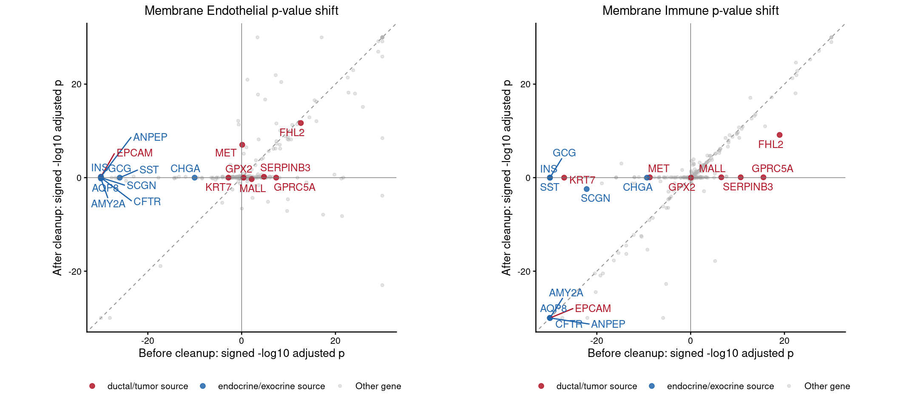

## Bridge Scoring

Bridge scoring uses molecule adjacency across candidate cell pairs
rather than the stain image. It is useful when a source cell is visible
and physically adjacent to target molecules — and it is the method to
reach for on datasets without usable stains. Its contact-based statistic
pairs best with the `ls_nmf` factorization, whose concentrated
per-cell-type factors carry the bridge test’s evidence (see
[docs/benchmarks.md](../../docs/benchmarks.md)), so the rules below are
derived from the `fit_ls` comparison fit.

``` r
bridge_score <- fit_ls$score_bridge()
bridge_rules <- bridge_score$rules(p_thresh = p_thresh)
factor_source_score_ls <- fit_ls$score_factor_sources(counts = original_counts)

head(bridge_rules[, c("factor", "source_cell_type", "target_cell_type", "p_value")])
```

    ##   factor    source_cell_type        target_cell_type      p_value
    ## 1      1 Exocrine epithelial Ductal/tumor epithelial 5.626363e-02
    ## 2      1 Exocrine epithelial        Mural / pericyte 3.345508e-02
    ## 3      2    Fibroblast / CAF Ductal/tumor epithelial 1.049775e-10
    ## 4      2    Fibroblast / CAF               Endocrine 1.219512e-02
    ## 5      2    Fibroblast / CAF             Endothelial 2.762706e-03
    ## 6      2    Fibroblast / CAF     Exocrine epithelial 1.756719e-02

``` r
bridge_score$plot_heatmap(p_thresh = p_thresh,
  source_prior = factor_source_score_ls)
```

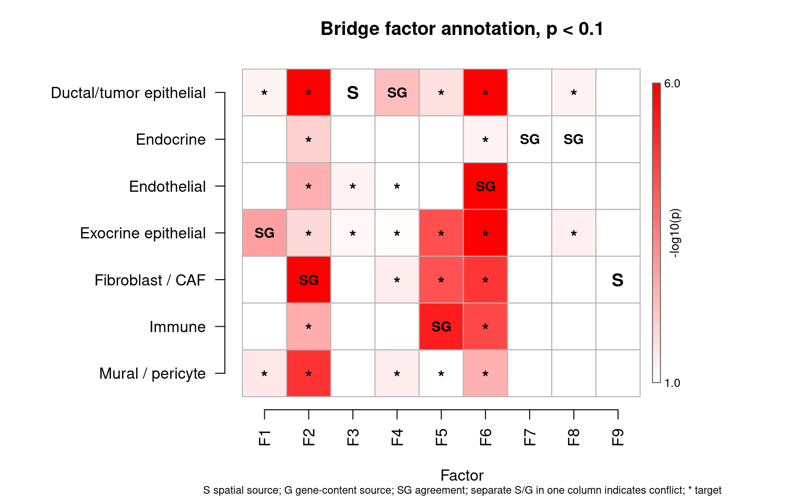

``` r
bridge_score$plot_pairs()
```

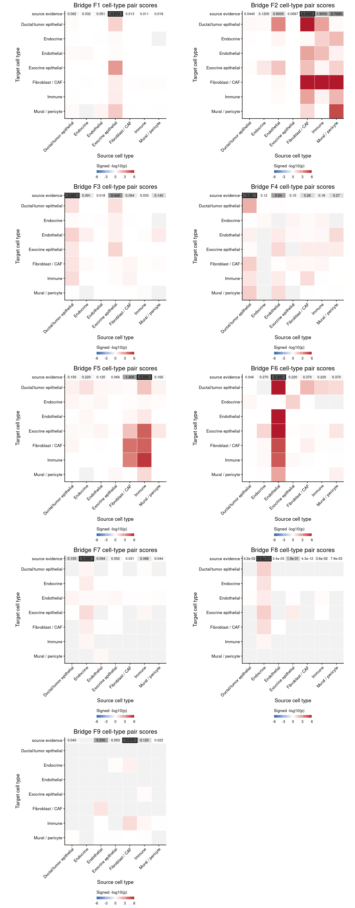

The correction step below applies all bridge-derived rules across all
annotated cell types. As above, the downstream diagnostic plots focus
only on the illustrative endothelial and immune target cells.

``` r
bridge_correction <- bridge_score$correct(rules = bridge_rules,
  name = "bridge_clean")
```

    ## Ensemble correction over 10 members: molecules removed by >= 3 members (vote >= 0.30) are dropped (703,467 molecules).

``` r
bridge_counts <- bridge_correction$counts()
bridge_de <- celladmix_de_by_group(bridge_counts, cell_spatial,
  subset_by = "merged_annotation", subsets = diagnostic_cell_types,
  group_by = "domain_label", contrast = c("tumor", "adjacent_normal"))

bridge_correction$summary()
```

    ##                 cell_type n_cells n_modified_cells fraction_cells_modified
    ## 1                     all  140335            84931               0.6052018
    ## 2 Ductal/tumor epithelial   29986            24066               0.8025745
    ## 3               Endocrine    2212              830               0.3752260
    ## 4             Endothelial    7026             5228               0.7440934
    ## 5     Exocrine epithelial   36329            27467               0.7560626
    ## 6        Fibroblast / CAF   28366            14366               0.5064514
    ## 7                  Immune   19251            11558               0.6003844
    ## 8        Mural / pericyte    2553             1416               0.5546416
    ## 9                 unknown   14612                0               0.0000000
    ##   molecules_before molecules_after molecules_removed fraction_molecules_removed
    ## 1          6186500         5483033            703467                 0.11371001
    ## 2          1918375         1545486            372889                 0.19437753
    ## 3           125632          122747              2885                 0.02296389
    ## 4           318282          262963             55319                 0.17380499
    ## 5          2085030         1965037            119993                 0.05754977
    ## 6          1092917         1043786             49131                 0.04495401
    ## 7           507146          413549             93597                 0.18455632
    ## 8            56812           47159              9653                 0.16991129
    ## 9            82306           82306                 0                 0.00000000
    ##   median_removed_per_modified_cell median_fraction_removed_per_modified_cell
    ## 1                                3                                0.06122449
    ## 2                                4                                0.06250000
    ## 3                                2                                0.04138128
    ## 4                                4                                0.09523810
    ## 5                                3                                0.04918033
    ## 6                                2                                0.04761905
    ## 7                                3                                0.15384615
    ## 8                                2                                0.11396104
    ## 9                                0                                0.00000000

``` r
bridge_correction$plot_removed_molecules()
```

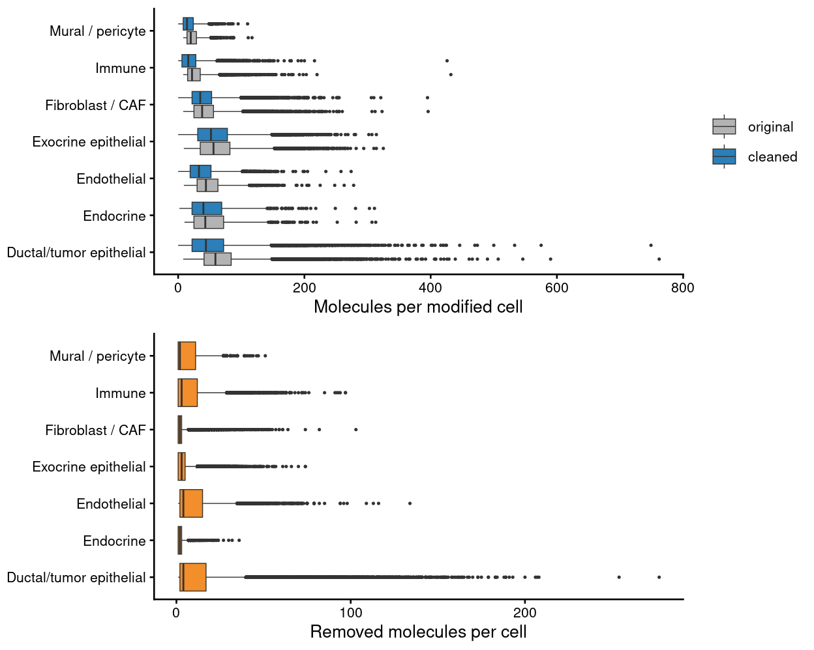

``` r
bridge_report <- audit$evaluate(bridge_correction)
bridge_report$summary()
```

    ## $detected_pairs
    ## [1] 39
    ## 
    ## $estimated_admixed_molecules
    ## [1] 1454078
    ## 
    ## $leakage_removed_overall
    ## [1] 0.4251015
    ## 
    ## $median_pair_sensitivity
    ## [1] 0.5392955
    ## 
    ## $own_marker_false_removal
    ## [1] 0.00416416
    ## 
    ## $worst_false_removal
    ## [1] "Immune"

``` r
bridge_report$plot_cleanup()
```

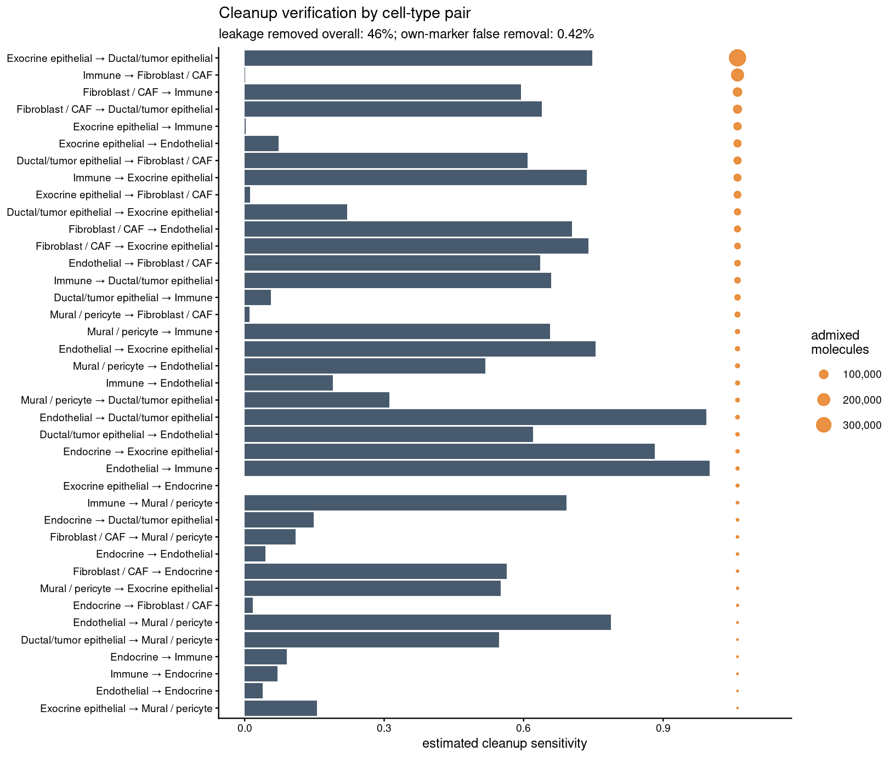

``` r
audit$plot_exposure(correction = bridge_correction)
```

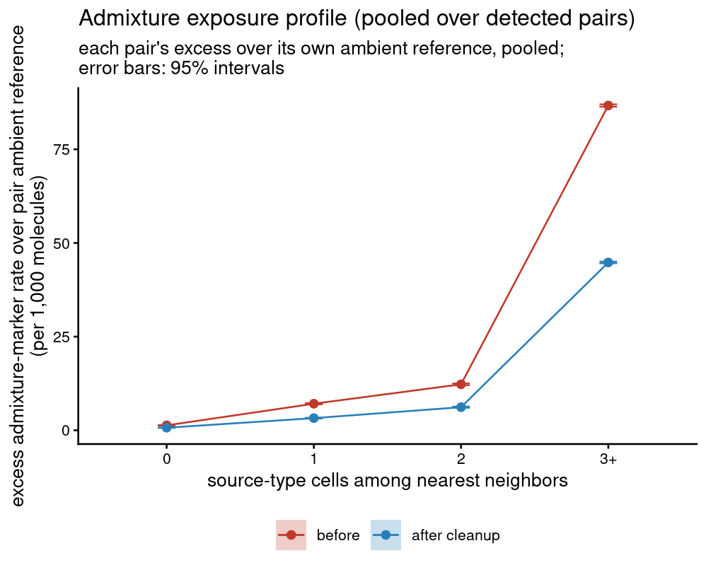

``` r
for (target_type in diagnostic_cell_types) {
  p_before <- celladmix_plot_volcano(diagnostic_de_original[[target_type]],
    markers = source_marker_sets, title = paste(target_type, "before cleanup")) +
    ggplot2::theme(legend.position = "none")
  p_after <- celladmix_plot_volcano(bridge_de[[target_type]],
    markers = source_marker_sets, title = paste(target_type, "after bridge cleanup"))
  print(cowplot::plot_grid(plotlist = list(p_before, p_after),
    ncol = 2, align = "hv", axis = "tblr"))
}
```

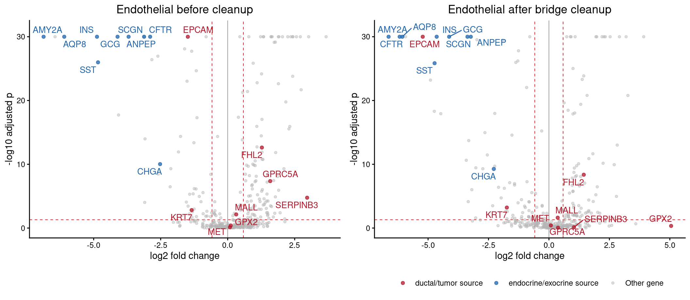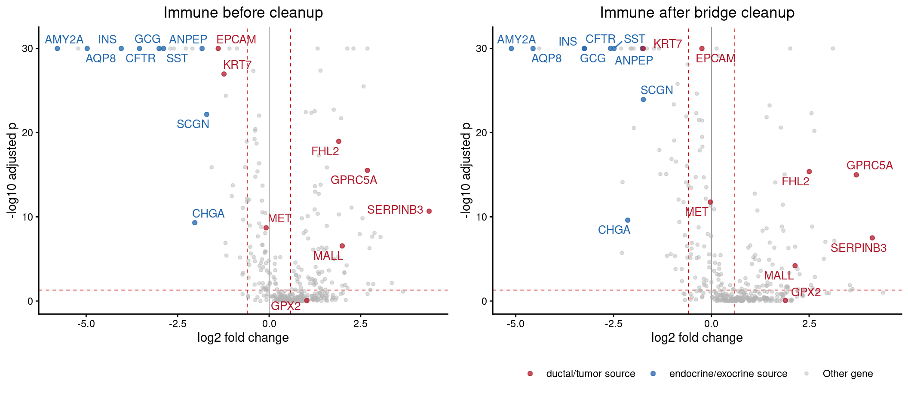

``` r
plots <- lapply(diagnostic_cell_types, function(target_type) {
  celladmix_plot_de_shift(diagnostic_de_original[[target_type]], bridge_de[[target_type]],
    markers = source_marker_sets, title = paste("Bridge", target_type, "p-value shift"))
})
cowplot::plot_grid(plotlist = plots, ncol = length(plots), align = "hv", axis = "tblr")
```

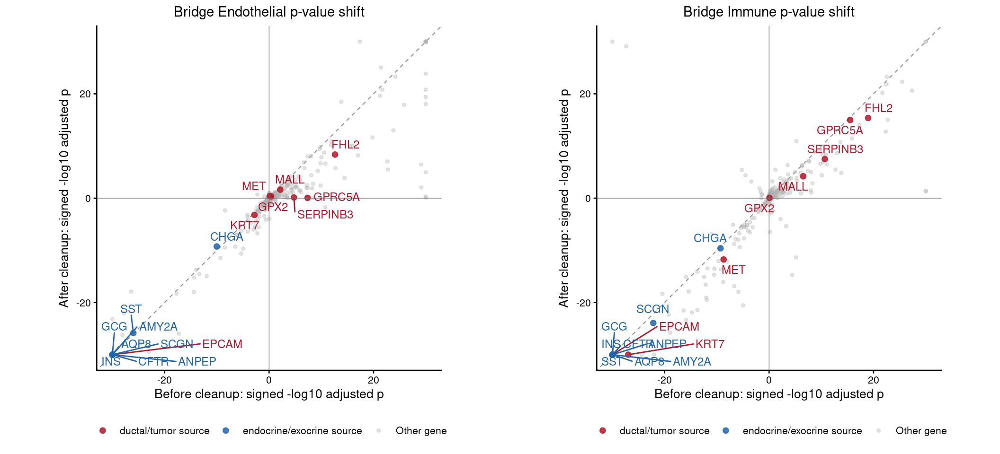

## Score Comparison

The bottom-line comparison is how much of the estimated admixture each
correction removed, with each method running on its recommended
factorization: membrane on `invsqrt_kl`, bridge on `ls_nmf`. The audit
sums the admixed-molecule estimates over all detected cell-type pairs
and expresses them as a share of all molecules in the dataset — the
uncorrected bar is the estimated admixture burden itself, and each
correction’s bar is what remains:

``` r
audit$plot_remaining(list(
  `membrane\n(invsqrt_kl)` = membrane_correction,
  `bridge\n(ls_nmf)` = bridge_correction))
```

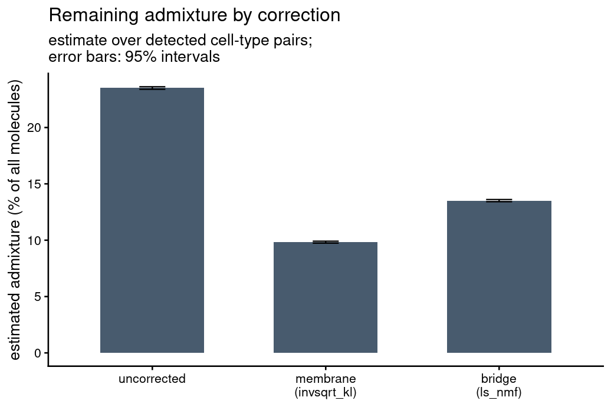

## Cell-State UMAP Before and After Cleanup

As a compact global diagnostic, compute cell-state UMAPs from sparse
cell-level counts on the original data and after each correction. The
embeddings are computed independently, so exact coordinates are not
meant to align; the comparison asks whether corrected counts produce
clearer separation between the annotated cell types.

``` r
state_cells_max <- 5000
original_state <- ds$cell_state_umap(cells_max = state_cells_max)
membrane_state <- membrane_correction$cell_state_umap(cells_max = state_cells_max)
bridge_state <- bridge_correction$cell_state_umap(cells_max = state_cells_max)

cell_type_levels <- sort(unique(cell_annotation))
cell_type_palette <- setNames(
  grDevices::hcl.colors(length(cell_type_levels), "Dark 3"), cell_type_levels)
for (frame_name in c("original_state", "membrane_state", "bridge_state")) {
  frame <- get(frame_name)
  frame$cell_type <- factor(frame$cell_type, levels = cell_type_levels)
  assign(frame_name, frame)
}
```

``` r
state_umap_limits <- function(...) {
  frames <- list(...)
  x <- unlist(lapply(frames, `[[`, "umap_1"))
  y <- unlist(lapply(frames, `[[`, "umap_2"))
  span <- max(diff(range(x, na.rm = TRUE)), diff(range(y, na.rm = TRUE)))
  xmid <- mean(range(x, na.rm = TRUE))
  ymid <- mean(range(y, na.rm = TRUE))
  pad <- span * 0.04
  list(xlim = xmid + c(-1, 1) * (span / 2 + pad),
    ylim = ymid + c(-1, 1) * (span / 2 + pad))
}

plot_state_umap <- function(df, title, limits, legend = FALSE) {
  ggplot(df, aes(umap_1, umap_2, color = cell_type)) +
    geom_point(size = 0.55, alpha = 0.75) +
    coord_equal(xlim = limits$xlim, ylim = limits$ylim) +
    scale_color_manual(values = cell_type_palette, drop = FALSE) +
    labs(title = title, x = "UMAP 1", y = "UMAP 2", color = "Cell type") +
    theme_classic(base_size = 10) +
    guides(color = guide_legend(override.aes = list(size = 3.2, alpha = 1))) +
    theme(legend.position = if (legend) "right" else "none")
}

limits <- state_umap_limits(original_state, membrane_state, bridge_state)
shared_legend <- cowplot::get_legend(
  plot_state_umap(original_state, "", limits, legend = TRUE))
cowplot::plot_grid(plotlist = list(
  plot_state_umap(original_state, "Original counts", limits),
  plot_state_umap(membrane_state, "Membrane-corrected (invsqrt_kl)", limits),
  plot_state_umap(bridge_state, "Bridge-corrected (ls_nmf)", limits),
  shared_legend
), ncol = 4, rel_widths = c(1, 1, 1, 0.42), align = "hv", axis = "tblr")
```

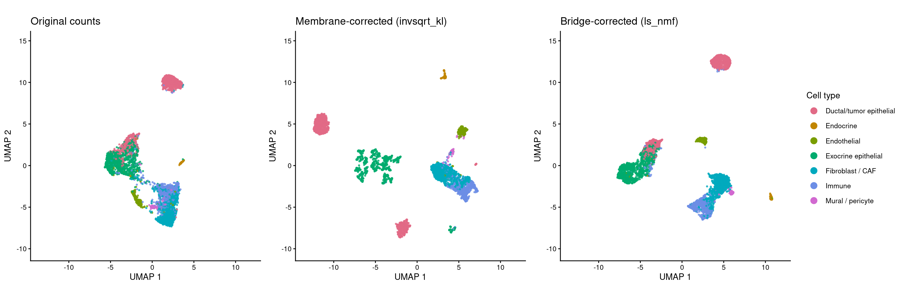
