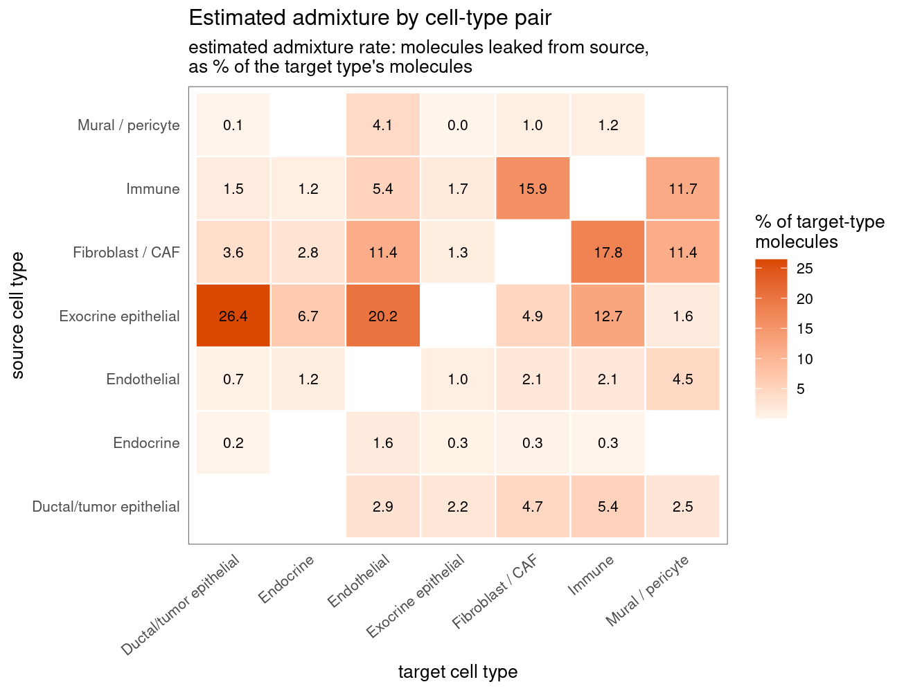
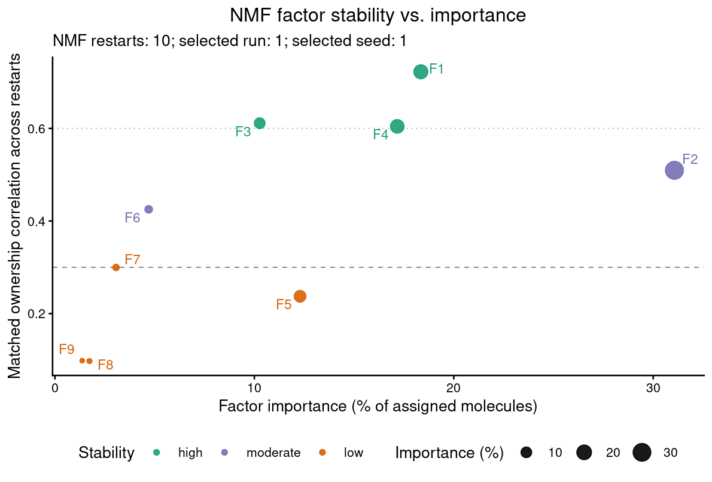
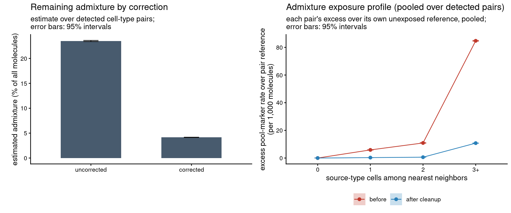

cellAdmix Quickstart: Admixture Correction on Xenium Pancreas
================

-   <a href="#how-much-admixture-is-there"
    id="toc-how-much-admixture-is-there">How much admixture is there?</a>
-   <a href="#correct" id="toc-correct">Correct</a>
-   <a href="#verify" id="toc-verify">Verify</a>
-   <a href="#use-the-corrected-counts"
    id="toc-use-the-corrected-counts">Use the corrected counts</a>

This is the compact version of the recommended cellAdmix workflow:
estimate how much admixture the dataset carries, correct it, and verify
the result. Inputs are the Xenium output bundle (`data/`) and a
cell-type annotation (see the [full
tutorial](pancreas_membrane_scoring_clean.md) for download instructions
and a walkthrough of the intermediate diagnostics; see
[docs/benchmarks.md](../../docs/benchmarks.md) for how the settings
below were chosen).

``` r
annotation <- read.csv(file.path("annotations", "annotation.csv.gz"))
cell_annotation <- setNames(annotation$merged_annotation, annotation$cell_id)

ds <- cellAdmix("data", output_dir = "out", annotation = cell_annotation)
fit <- ds$fit(nmf_variant = "invsqrt_kl")
```

    ## Reusing cached run fit_manual_rank9_invsqrt_kl (parameters match)

For membrane-stained data, membrane scoring with the `invsqrt_kl`
factorization removes the most admixture in our benchmarks; on data
without stains, use `fit$score_bridge()` with the default `ls_nmf`
factorization instead.

## How much admixture is there?

The audit estimates, for every ordered cell-type pair, the admixture
rate — what share of the target type’s molecules leaked in from the
source — using only the spatial exposure structure, before any
correction:

``` r
audit <- fit$audit_admixture()
audit$plot_map()
```



## Correct

A quick look at restart reproducibility. `invsqrt_kl` trades some
restart stability for sharper loadings, so a mix of stable and unstable
factors is expected; the ensemble correction below absorbs the seed
dependence:

``` r
fit$plot_stability()
```



Scoring turns factors into removal rules, and correction removes the
matching molecules by a vote across the fit’s NMF restarts: up to 10
restarts are scored and vetted independently (including the
native-factor false-positive check), and a molecule is removed when at
least 30% of those members remove it — 3 of 10 by default. The vote
stabilizes the seed-dependence of single-fit corrections and
consistently reaches the upper range of the individual restarts in our
benchmarks:

``` r
score <- fit$score_membrane()
correction <- score$correct()
```

    ## Ensemble correction over 10 members: molecules removed by >= 3 members (vote >= 0.30) are dropped (1,990,063 molecules).

## Verify

The audit re-measures the same exposure gradients on the corrected
counts. The report gives per-pair cleanup sensitivity, the own-marker
false-removal rate (how much almost-surely-genuine expression was lost),
and warns about any detected pair the rules did not cover:

``` r
report <- audit$evaluate(correction)
```

    ## Warning: Detected ~64,367 admixed molecules from Exocrine epithelial into
    ## Immune, but no removal rule covers this pair

    ## Warning: Detected ~36,376 admixed molecules from Fibroblast / CAF into
    ## Endothelial, but no removal rule covers this pair

    ## Warning: Detected ~90,518 admixed molecules from Fibroblast / CAF into Immune,
    ## but no removal rule covers this pair

    ## Warning: Detected ~6,458 admixed molecules from Fibroblast / CAF into Mural /
    ## pericyte, but no removal rule covers this pair

    ## Warning: Detected ~173,342 admixed molecules from Immune into Fibroblast / CAF,
    ## but no removal rule covers this pair

    ## Warning: Detected ~12,962 admixed molecules from Mural / pericyte into
    ## Endothelial, but no removal rule covers this pair

    ## Warning: Detected ~11,396 admixed molecules from Mural / pericyte into
    ## Fibroblast / CAF, but no removal rule covers this pair

    ## Warning: Detected ~5,936 admixed molecules from Mural / pericyte into Immune,
    ## but no removal rule covers this pair

``` r
report$summary()
```

    ## $detected_pairs
    ## [1] 39
    ## 
    ## $estimated_admixed_molecules
    ## [1] 1454078
    ## 
    ## $leakage_removed_overall
    ## [1] 0.823401
    ## 
    ## $median_pair_sensitivity
    ## [1] 0.9976617
    ## 
    ## $own_marker_false_removal
    ## [1] 0.03695972
    ## 
    ## $worst_false_removal
    ## [1] "Exocrine epithelial"

``` r
cowplot::plot_grid(
  audit$plot_remaining(list(corrected = correction)),
  audit$plot_exposure(correction = correction),
  ncol = 2, align = "hv", axis = "tblr")
```



## Use the corrected counts

``` r
corrected_counts <- correction$counts()
dim(corrected_counts)
```

    ## [1]    377 140335

`corrected_counts` is a sparse genes × cells matrix ready for downstream
analysis; `celladmix_add_to_seurat()` and the SpatialData helpers attach
it to existing objects.
