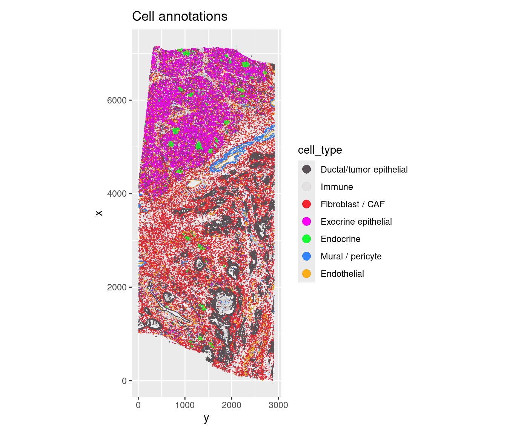
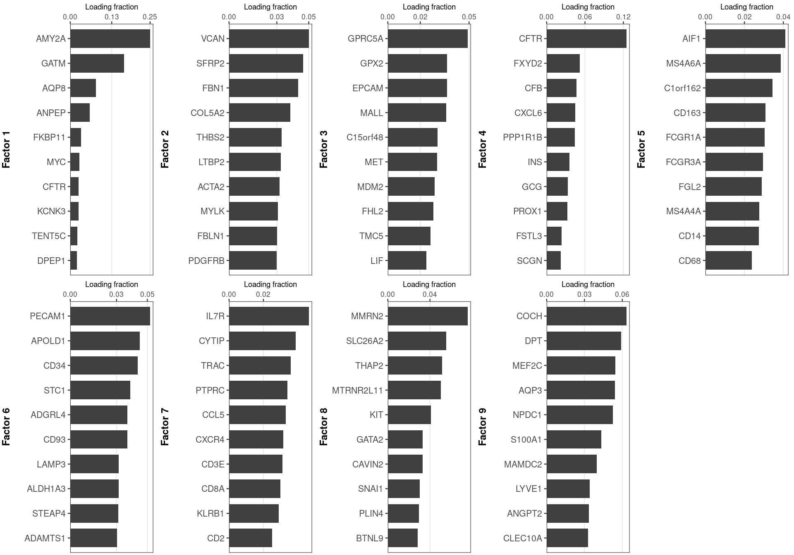
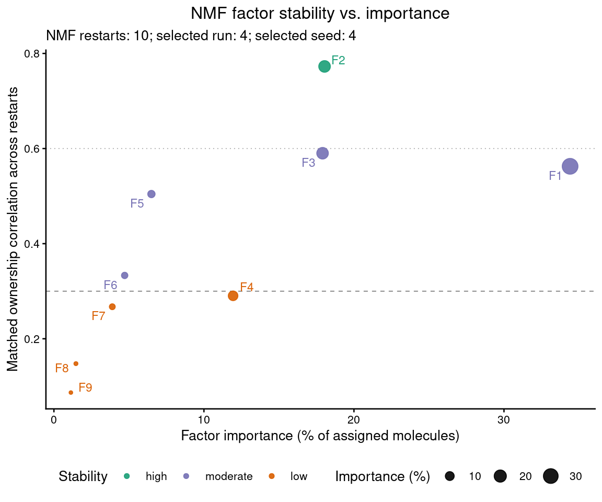
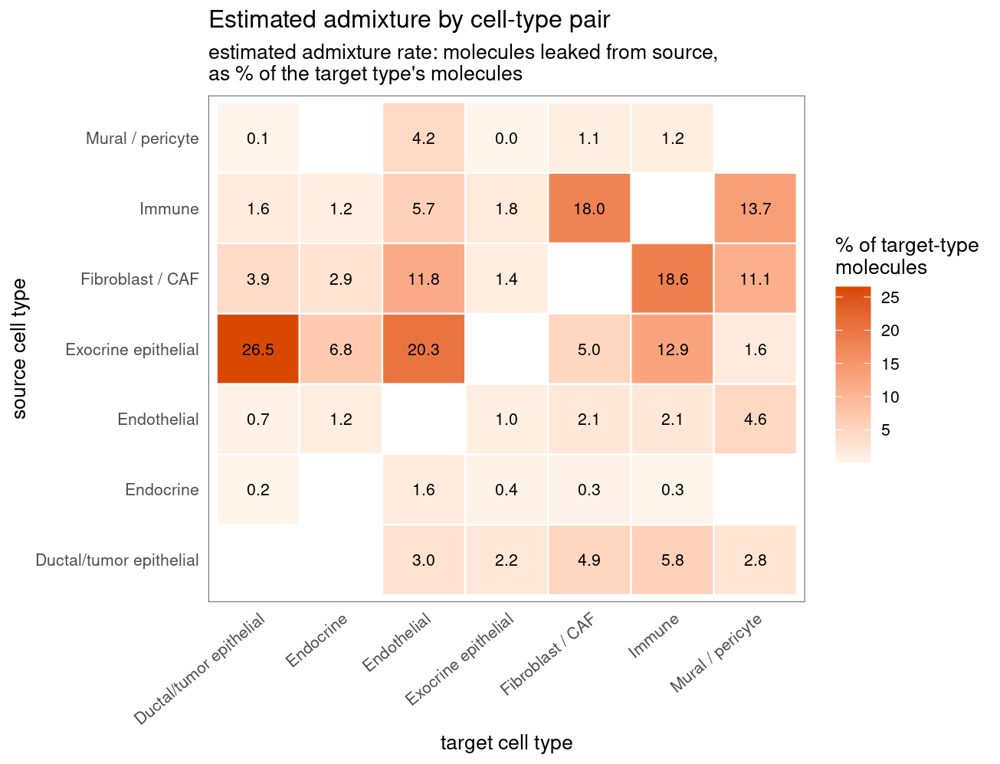
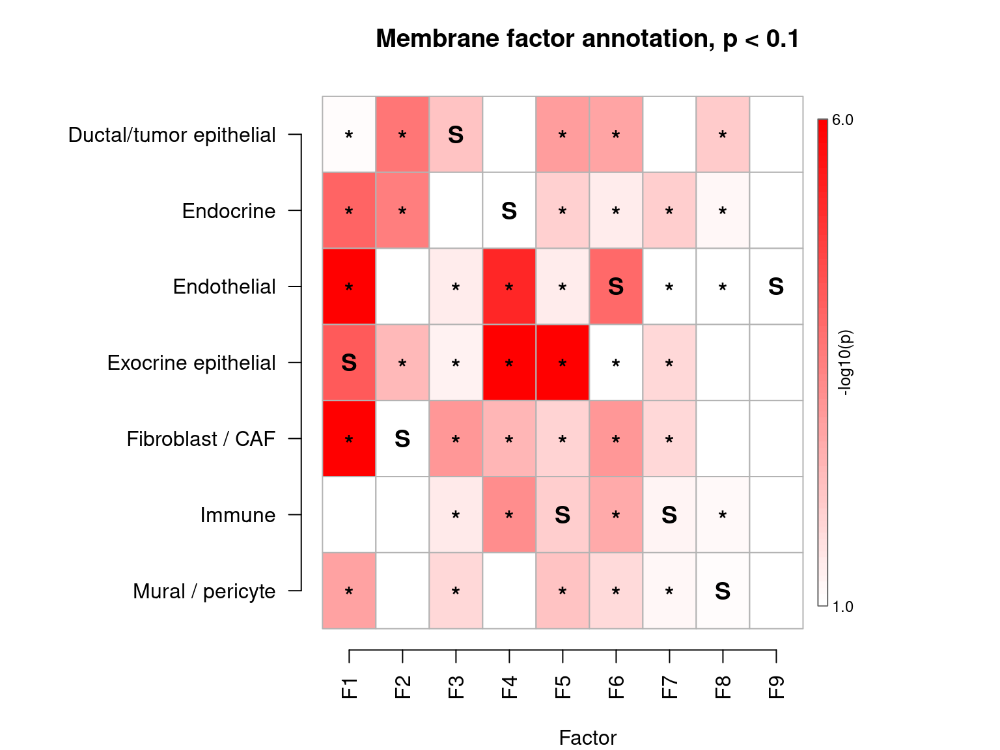
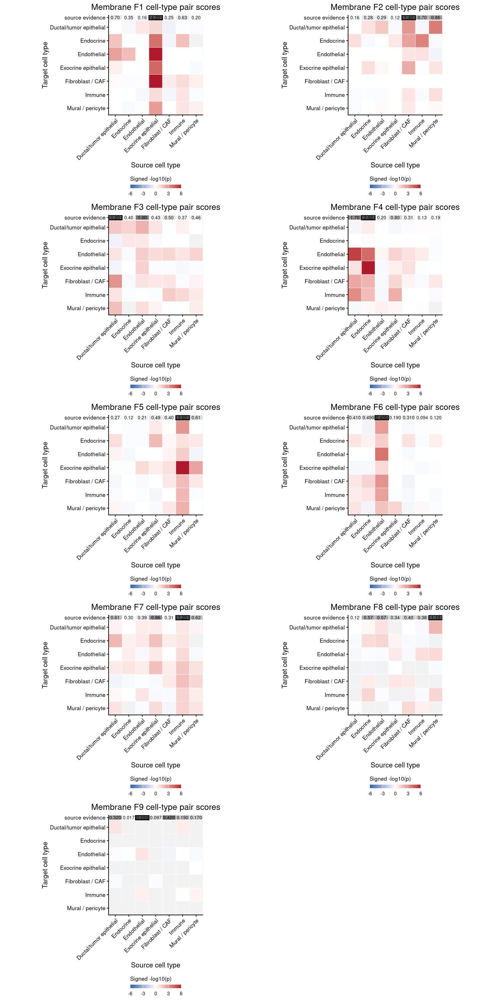
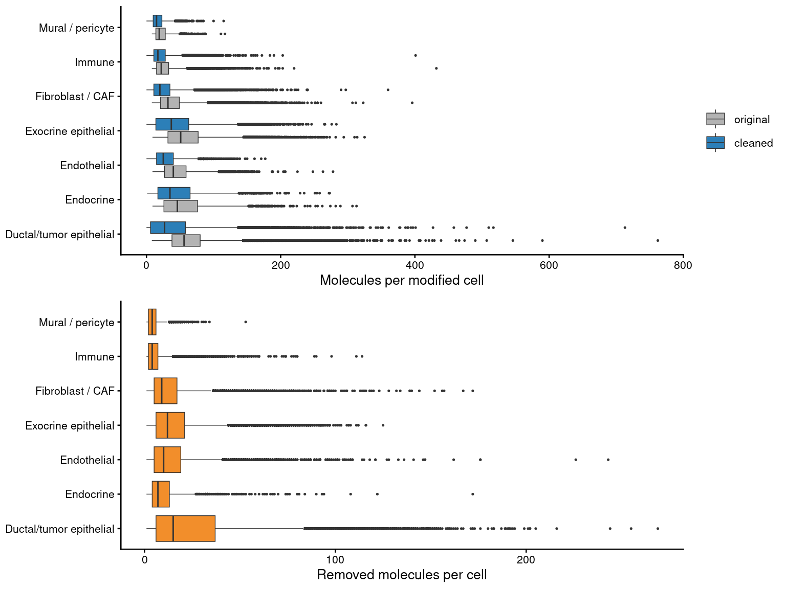
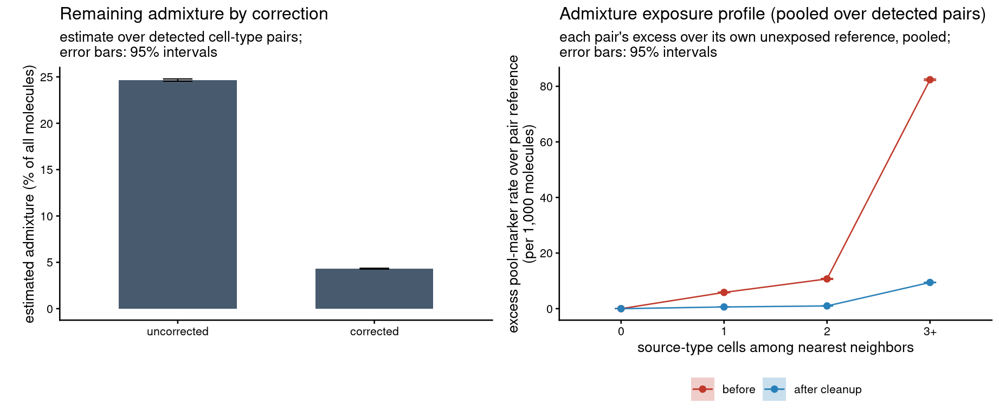

cellAdmix with a Seurat Xenium Object
================

-   <a href="#overview" id="toc-overview">Overview</a>
-   <a href="#input-data" id="toc-input-data">Input Data</a>
-   <a href="#load-xenium-into-seurat" id="toc-load-xenium-into-seurat">Load
    Xenium into Seurat</a>
-   <a href="#construct-celladmix-dataset"
    id="toc-construct-celladmix-dataset">Construct cellAdmix Dataset</a>
-   <a href="#fit-molecular-factors" id="toc-fit-molecular-factors">Fit
    Molecular Factors</a>
-   <a href="#admixture-audit" id="toc-admixture-audit">Admixture Audit</a>
-   <a href="#membrane-based-scoring"
    id="toc-membrane-based-scoring">Membrane-Based Scoring</a>
-   <a href="#correct-counts" id="toc-correct-counts">Correct Counts</a>
-   <a href="#add-results-back-to-seurat"
    id="toc-add-results-back-to-seurat">Add Results Back to Seurat</a>

``` r
knitr::opts_chunk$set(echo = TRUE, message = TRUE, warning = TRUE,
  fig.width = 8, fig.height = 6, dpi = 96, fig.retina = 2)

library(Seurat)
library(cellAdmixCore)
library(ggplot2)
library(cowplot)
```

## Overview

This example shows how to use cellAdmix when the cell-level analysis is
managed in Seurat. Seurat defines the active cells, active genes, cell
annotations, and downstream object that users keep working with.
cellAdmix uses the original Xenium bundle as a molecule-complete backing
source, fits molecular admixture factors, scores likely source/target
relationships, removes putative admixture molecules, and writes
corrected counts back into the Seurat object as a new assay.

The core workflow is:

``` r
seu <- LoadXenium("data", molecule.coordinates = FALSE)
seu$cell_type <- ...

ds <- cellAdmix(seu, xenium_dir = "data", output_dir = "out",
  annotation = "cell_type")
fit <- ds$fit(nmf_variant = "invsqrt_kl")
score <- fit$score_membrane()
correction <- score$correct()

seu <- celladmix_add_to_seurat(seu, fit = fit, score = score,
  correction = correction, corrected_assay = "cellAdmix")
```

We use `molecule.coordinates = FALSE` when loading Seurat because
cellAdmix reads the complete transcript table directly from the Xenium
bundle. This avoids duplicating all molecules in R memory and preserves
Xenium fields that Seurat’s molecule object does not keep.

## Input Data

This example uses the 10x Genomics [FFPE human pancreas Xenium
dataset](https://www.10xgenomics.com/datasets/ffpe-human-pancreas-with-xenium-multimodal-cell-segmentation-1-standard).
Download and unpack the bundle into a folder named `data` next to this
notebook:

``` bash
curl -O https://cf.10xgenomics.com/samples/xenium/2.0.0/Xenium_V1_human_Pancreas_FFPE/Xenium_V1_human_Pancreas_FFPE_outs.zip
unzip Xenium_V1_human_Pancreas_FFPE_outs.zip
mv outs data
```

The quick cell-type annotations used here are for demonstration only.
They were derived from a lightweight clustering/marker workflow and are
intentionally not treated as a curated reference. In a normal Seurat
analysis, these labels would usually come from standard Seurat
clustering, marker inspection, reference mapping, or another annotation
workflow. Here we load predetermined labels only to keep the example
focused on cellAdmix integration. Place `annotation.csv.gz` in an
`annotations` folder next to this notebook.

``` r
data_dir <- "data"
annotation_file <- file.path("annotations", "annotation.csv.gz")

stopifnot(dir.exists(data_dir))
stopifnot(file.exists(annotation_file))
```

## Load Xenium into Seurat

We first create a normal Seurat object from the Xenium output. This is
where a typical Seurat workflow would do QC, subsetting, normalization,
clustering, and manual or automated annotation. In this tutorial, we
keep that part minimal and attach the precomputed example annotations.

The annotation file is a gzip-compressed CSV with one row per cell. We
use `cell_id` to match rows to Seurat cells, and `merged_annotation` as
the cell-type label that will be stored in `seu$cell_type`.

``` r
seu <- LoadXenium(data_dir, fov = "fov", assay = "Xenium",
  molecule.coordinates = FALSE)
```

    ## Cell_seg columns: cell_id, x_centroid, y_centroid, transcript_counts, control_probe_counts, control_codeword_counts, unassigned_codeword_counts, deprecated_codeword_counts, total_counts, cell_area, nucleus_area

    ## Adding default segmentation_method = 'cell'

    ## 10X data contains more than one type and is being returned as a list containing matrices of each type.

    ## Warning: Feature names cannot have underscores ('_'), replacing with dashes
    ## ('-')
    ## Warning: Feature names cannot have underscores ('_'), replacing with dashes
    ## ('-')
    ## Warning: Feature names cannot have underscores ('_'), replacing with dashes
    ## ('-')
    ## Warning: Feature names cannot have underscores ('_'), replacing with dashes
    ## ('-')
    ## Warning: Feature names cannot have underscores ('_'), replacing with dashes
    ## ('-')
    ## Warning: Feature names cannot have underscores ('_'), replacing with dashes
    ## ('-')

``` r
annotation <- read.csv(gzfile(annotation_file), stringsAsFactors = FALSE)
rownames(annotation) <- annotation$cell_id
seu$cell_type <- annotation[colnames(seu), "merged_annotation"]
seu <- subset(seu, cells = colnames(seu)[!is.na(seu$cell_type)])
```

    ## Warning: Not validating Centroids objects

    ## Warning: Not validating Centroids objects

    ## Warning: Not validating FOV objects
    ## Not validating FOV objects
    ## Not validating FOV objects

    ## Warning: Not validating Seurat objects

``` r
table(seu$cell_type)
```

    ## 
    ## Ductal/tumor epithelial               Endocrine             Endothelial 
    ##                   29986                    2212                    7026 
    ##     Exocrine epithelial        Fibroblast / CAF                  Immune 
    ##                   36329                   28366                   19251 
    ##        Mural / pericyte 
    ##                    2553

The Seurat object now defines the active analysis universe. If the
object had already been subsetted to particular cells or genes, the
cellAdmix adapter would pass those active cell and feature IDs as
filters to the Xenium-backed store.

``` r
ImageDimPlot(seu, fov = "fov", group.by = "cell_type",
  axes = TRUE, cols = "polychrome", dark.background = FALSE,
  border.color = "grey30", border.size = 0.03, alpha = 0.9) +
  ggtitle("Cell annotations")
```



## Construct cellAdmix Dataset

The constructor below is the main integration point. The first argument
is the Seurat object, while `xenium_dir` points to the original Xenium
bundle. The annotation argument names a Seurat metadata field. We do not
need to specify `assay` or `image` here because the defaults are
inferred from the Seurat object. The output directory stores the
cellAdmix project cache: encoded molecules, factorization output,
scores, correction results, and any reusable intermediate files.

cellAdmix can work with Seurat without loading molecule coordinates into
R memory, but it still needs a molecule-complete backing source for the
core fit/score/correct workflow. For Xenium data, that source is the
original bundle passed as `xenium_dir`; without it, the analysis is
limited to Seurat-side metadata/visualization or adding previously
computed cellAdmix results back to the object.

``` r
output_dir <- "out_seurat"
num_threads <- min(10, parallel::detectCores())

ds <- cellAdmix(seu, xenium_dir = data_dir, output_dir = output_dir,
  annotation = "cell_type", num_threads = num_threads)

ds
```

    ## cellAdmix dataset
    ##   format: xenium 
    ##   output cache: configured
    ##   threads: 10 
    ##   molecules: transcripts.parquet 
    ##   cells: cells.parquet 
    ##   annotation:cell_type (125723 cells, 7 labels)

## Fit Molecular Factors

`fit()` samples neighborhood composition vectors from molecules inside
cells and fits NMF factors. The default rank is chosen from the number
of annotation classes. Multiple random/cluster-initialized NMF runs are
run in parallel by default, and the lowest-loss solution is retained.
Because this membrane-stained dataset will be cleaned with membrane
scoring, we fit the `invsqrt_kl` variant, the recommended pairing for
membrane scoring (see [docs/benchmarks.md](../../docs/benchmarks.md)).

``` r
fit <- ds$fit(nmf_variant = "invsqrt_kl", verbose = TRUE)
```

    ## Reusing cached run fit_cell_type_rank9_invsqrt_kl (parameters match)

``` r
fit
```

    ## cellAdmix fit
    ##   run: fit_cell_type_rank9_invsqrt_kl 
    ##   annotation: cell_type 
    ##   rank: 9 
    ##   NMF: invsqrt_kl 
    ##   molecule scoring: gene_loadings 
    ##   cells: 125723 
    ##   transcripts: 6104194

Top factor-loading genes help interpret each factor. The stability plot
shows whether important factors were consistently recovered across NMF
restarts. Factor importance (the x-axis, echoed by dot size) is the
share of all assigned molecules that carry the factor’s label, so large
dots mark factors that dominate the tissue-wide signal.

``` r
fit$plot_loadings()
```



``` r
fit$plot_stability()
```



## Admixture Audit

The audit estimates, before any correction, each ordered cell-type
pair’s admixture rate — the percent of the target type’s molecules that
leaked in from the source — using only the spatial exposure structure of
the data. It frames what the correction below should fix.

``` r
audit <- fit$audit_admixture()
audit$plot_map()
```



## Membrane-Based Scoring

This Xenium run includes membrane staining, so we use membrane scoring.
The score summarizes which factor-cell-type combinations look more
consistent with external admixture than with native signal.

``` r
membrane_score <- fit$score_membrane(verbose = TRUE)
```

    ## [INFO 13:29:15 +1.079s] Loaded membrane run data: molecules=6104194, cells=125723 (1.079s)
    ## [INFO 13:29:15 +1.080s] Starting membrane test: molecules=6104194, cells=125723 (0.000s)
    ## [INFO 13:29:15 +1.080s] Opened membrane image: width=34155, height=13770 (0.000s)
    ## [INFO 13:29:16 +1.307s] Prepared membrane data: cell_types=7, factors=9, active_cells=125723, typed_active_cells=125723 (0.227s)
    ## [INFO 13:29:17 +2.427s] Discovered membrane candidates: pairs=18940 (1.120s)
    ## [INFO 13:29:27 +13.025s] Scored membrane candidates: score_rows=34873 (10.597s)
    ## [INFO 13:29:27 +13.031s] Summarized membrane scores: summaries=384 (0.006s)
    ## [INFO 13:29:27 +13.031s] Finished membrane test: summaries=384 (11.951s)
    ## [INFO 13:29:28 +13.222s] Ran membrane test: score_rows=34873, summaries=384 (12.142s)
    ## [INFO 13:29:28 +13.286s] Wrote membrane outputs (0.065s)
    ## [INFO 13:29:28 +13.329s] Materialized membrane results for R (0.043s)

The heatmap is a compact factor-by-cell-type summary of putative source
and admixture labels.

``` r
p_thresh <- 0.1
membrane_score$plot_heatmap(p_thresh = p_thresh)
```



The pair plots show, for each factor, which target cell types have
significant evidence of admixture from each candidate source cell type.
The source evidence bar above each matrix summarizes which cell types
best explain the factor.

``` r
membrane_score$plot_pairs()
```



Correction rules are the source-factor-target combinations that pass the
threshold and will be used to remove molecules from target cells.

``` r
membrane_rules <- membrane_score$rules(p_thresh = p_thresh)
head(membrane_rules[, c("factor", "source_cell_type", "target_cell_type", "p_value")])
```

    ##   factor    source_cell_type        target_cell_type      p_value
    ## 1      1 Exocrine epithelial Ductal/tumor epithelial 8.113050e-02
    ## 2      1 Exocrine epithelial               Endocrine 9.638812e-05
    ## 3      1 Exocrine epithelial             Endothelial 2.125595e-07
    ## 4      1 Exocrine epithelial        Fibroblast / CAF 3.010084e-10
    ## 5      1 Exocrine epithelial        Mural / pericyte 1.577997e-03
    ## 6      2    Fibroblast / CAF Ductal/tumor epithelial 2.132644e-04

## Correct Counts

The correction step removes molecules assigned to significant admixture
factors in their target cell types, by default as a molecule-vote
ensemble over up to 10 of the fit’s NMF restarts (a molecule is removed
when at least 30% of the independently scored members remove it — 3 of
10 by default). The result is persisted on disk and can be collected as
a sparse gene-by-cell matrix.

``` r
membrane_correction <- membrane_score$correct(rules = membrane_rules,
  name = "membrane_clean")
```

    ## Ensemble correction over 10 members: molecules removed by >= 3 members (vote >= 0.30) are dropped (1,894,615 molecules).

``` r
membrane_correction$summary()
```

    ##                 cell_type n_cells n_modified_cells fraction_cells_modified
    ## 1                     all  125723           121610               0.9672852
    ## 2 Ductal/tumor epithelial   29986            29473               0.9828920
    ## 3               Endocrine    2212             2135               0.9651899
    ## 4             Endothelial    7026             6923               0.9853402
    ## 5     Exocrine epithelial   36329            35872               0.9874205
    ## 6        Fibroblast / CAF   28366            27813               0.9805048
    ## 7                  Immune   19251            17125               0.8895642
    ## 8        Mural / pericyte    2553             2269               0.8887583
    ##   molecules_before molecules_after molecules_removed fraction_molecules_removed
    ## 1          6104194         4209579           1894615                  0.3103792
    ## 2          1918375         1175067            743308                  0.3874675
    ## 3           125632          103499             22133                  0.1761733
    ## 4           318282          210809            107473                  0.3376660
    ## 5          2085030         1518584            566446                  0.2716728
    ## 6          1092917          740120            352797                  0.3228031
    ## 7           507146          415758             91388                  0.1802006
    ## 8            56812           45742             11070                  0.1948532
    ##   median_removed_per_modified_cell median_fraction_removed_per_modified_cell
    ## 1                                9                                 0.2166667
    ## 2                               15                                 0.2592593
    ## 3                                7                                 0.1521739
    ## 4                               10                                 0.2727273
    ## 5                               12                                 0.2000000
    ## 6                                9                                 0.2835821
    ## 7                                4                                 0.1538462
    ## 8                                4                                 0.1694915

The molecule-removal plot is a basic diagnostic for how much correction
was applied across cell types. Large removals should be inspected
carefully.

``` r
membrane_correction$plot_removed_molecules()
```



The audit verifies the cleanup against the same exposure measurements:
the report gives per-pair sensitivity and the own-marker false-removal
rate, and the panels show the estimated admixture remaining and the
pooled exposure profile before and after cleanup.

``` r
report <- audit$evaluate(membrane_correction)
```

    ## Warning: Detected ~3,030 admixed molecules from Endocrine into Ductal/tumor
    ## epithelial, but no removal rule covers this pair

    ## Warning: Detected ~65,266 admixed molecules from Exocrine epithelial into
    ## Immune, but no removal rule covers this pair

    ## Warning: Detected ~37,616 admixed molecules from Fibroblast / CAF into
    ## Endothelial, but no removal rule covers this pair

    ## Warning: Detected ~94,156 admixed molecules from Fibroblast / CAF into Immune,
    ## but no removal rule covers this pair

    ## Warning: Detected ~6,281 admixed molecules from Fibroblast / CAF into Mural /
    ## pericyte, but no removal rule covers this pair

    ## Warning: Detected ~13,399 admixed molecules from Mural / pericyte into
    ## Endothelial, but no removal rule covers this pair

    ## Warning: Detected ~12,150 admixed molecules from Mural / pericyte into
    ## Fibroblast / CAF, but no removal rule covers this pair

``` r
report$summary()
```

    ## $detected_pairs
    ## [1] 39
    ## 
    ## $estimated_admixed_molecules
    ## [1] 1505210
    ## 
    ## $leakage_removed_overall
    ## [1] 0.8254954
    ## 
    ## $median_pair_sensitivity
    ## [1] 0.9913663
    ## 
    ## $own_marker_false_removal
    ## [1] 0.02776138
    ## 
    ## $worst_false_removal
    ## [1] "Exocrine epithelial"

``` r
cowplot::plot_grid(
  audit$plot_remaining(list(corrected = membrane_correction)),
  audit$plot_exposure(correction = membrane_correction),
  ncol = 2, align = "hv", axis = "tblr")
```



## Add Results Back to Seurat

Finally, we attach cellAdmix outputs to the Seurat object. Factor
fractions and correction summaries are added to metadata. Corrected
counts are added as a new `cellAdmix` assay, leaving the original
`Xenium` assay unchanged.

``` r
seu <- celladmix_add_to_seurat(seu, fit = fit, score = membrane_score,
  correction = membrane_correction, corrected_assay = "cellAdmix")

SeuratObject::Assays(seu)
```

    ## [1] "Xenium"          "BlankCodeword"   "ControlCodeword" "ControlProbe"   
    ## [5] "cellAdmix"

``` r
grep("^celladmix_", colnames(seu[[]]), value = TRUE)
```

    ##  [1] "celladmix_dominant_factor"                  
    ##  [2] "celladmix_factor_1_fraction"                
    ##  [3] "celladmix_factor_2_fraction"                
    ##  [4] "celladmix_factor_3_fraction"                
    ##  [5] "celladmix_factor_4_fraction"                
    ##  [6] "celladmix_factor_5_fraction"                
    ##  [7] "celladmix_factor_6_fraction"                
    ##  [8] "celladmix_factor_7_fraction"                
    ##  [9] "celladmix_factor_8_fraction"                
    ## [10] "celladmix_factor_9_fraction"                
    ## [11] "celladmix_membrane_clean_n_removed"         
    ## [12] "celladmix_membrane_clean_fraction_removed"  
    ## [13] "celladmix_membrane_clean_n_molecules_before"
    ## [14] "celladmix_membrane_clean_n_molecules_after"

``` r
dim(seu[["cellAdmix"]])
```

    ## [1]    377 125723

At this point, downstream Seurat analyses can compare the original
`Xenium` assay with the corrected `cellAdmix` assay, or use the added
cellAdmix metadata for factor-aware visualization and diagnostics.
